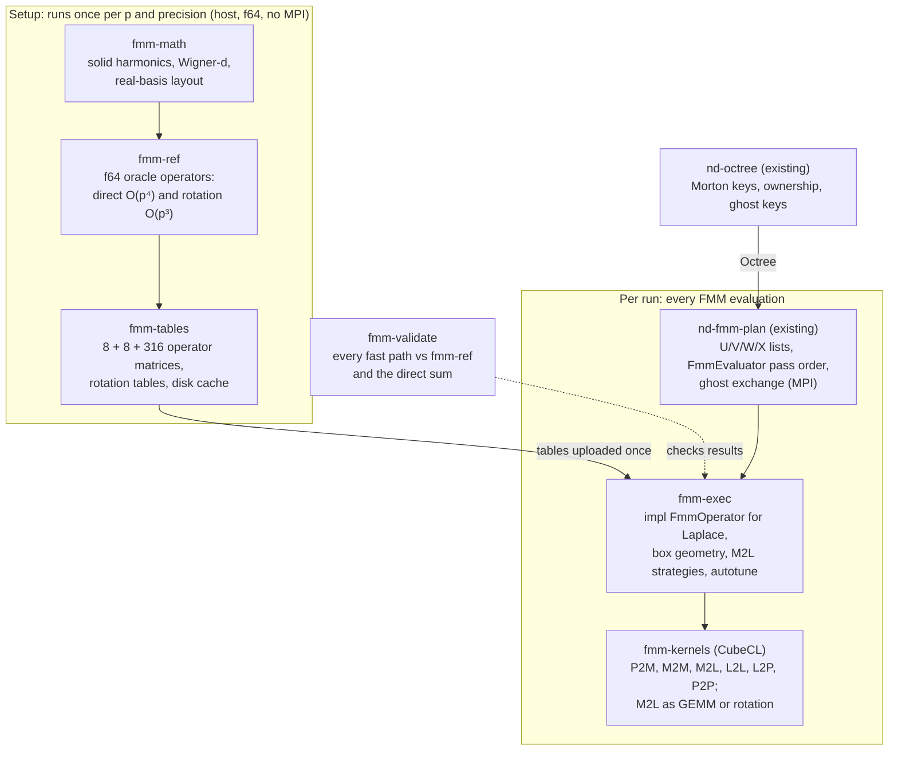
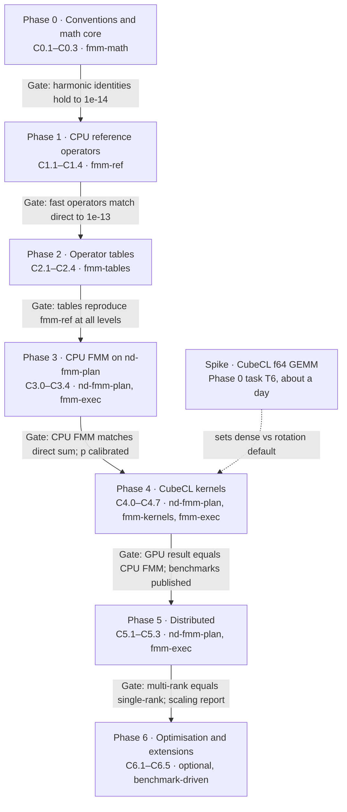

# Laplace FMM in 3D: Transfer Operators and Implementation Plan (Rust + CubeCL)

As of 2026-09-29. Sections 1, 5, 7 and 9 were revised the same day after reading the
`octree` and `fmm-plan` sources (details in `docs/design/workspace-structure.md` §1.1).

> Where this document and `docs/CONVENTIONS.md` differ (normalisation, phases, scaling),
> **the conventions file takes precedence.** In particular, CONVENTIONS §3.7 refines the
> scaling of Section 2.4 below.

Recommendation in one line: build on real-valued, scaled solid spherical harmonics;
implement every operator first as a direct O(p⁴) f64 CPU oracle, then ship
rotation-based O(p³) operators and precomputed, level-independent M2L matrices executed
as batched GEMM through CubeCL, with plane-wave (exponential) M2L as an optional later
optimisation.

## 1. Purpose, scope and assumptions

This document has two jobs. It surveys the operator families that define the state of
the art for the analytic 3D Laplace FMM, and it turns a chosen strategy into components
small enough to hand to Claude Code one at a time.

**In scope**

- Kernel G(x, y) = 1 / (4π |x − y|), charges (monopoles) first, dipoles as a later extension.
- Outputs: potential and gradient (field) at targets; sources and targets may differ.
- All eight transfer operators: P2M, M2M, M2L, L2L, L2P, plus P2L and M2P for adaptive
  trees, and P2P for the near field.
- Precision f64 (reference and high accuracy) and f32 (fast, ≈ 6 digits at best).
- Backends via CubeCL (CUDA, ROCm/HIP, wgpu, CPU), plus a plain-Rust CPU reference.

**Provided by the existing `nd-octree` and `nd-fmm-plan` crates** (checked in the
repository)

- **Boxes.** Boxes are `u64` Morton keys at levels 0–16 of an adaptive, complete,
  2:1-balanced tree. The domain is cubic when it comes from
  `compute_global_bounding_box`; the Laplace operator must check this for a
  user-supplied box. There is no integer box index, and the octree
  does not group boxes by level. `nd-fmm-plan` stores per-level data contiguously
  (`LevelData`), with a fixed number of values per box on each level.
- **Particles.** The octree stores no points. `points_to_morton` bins them into keys, and
  the application keeps and redistributes its own point data. `nd-fmm-plan` currently
  holds a fixed number of source and target values per leaf, so variable leaf occupancy
  is not supported yet.
- **Interaction lists.** `nd-fmm-plan`'s `InteractionManager` builds U, V, W and X for
  every non-ghost key. `v_list_by_direction` groups V-list pairs by the 316 offsets.
- **Distribution.** `nd-fmm-plan`'s `FmmEvaluator` runs the whole distributed pass
  order over an `FmmOperator` trait with all eight operators, one pair of boxes at a
  time. This includes exchanging ghost sources (for U and X) and ghost multipoles (for V
  and W). It also computes the replicated coarse (`Global`) levels on every rank. This
  covers what the original plan called the locally essential tree (LET) exchange.

**Out of scope**

- Tree construction, partitioning and load balancing (`nd-octree`).
- Interaction lists, pass order and ghost exchange as such (`nd-fmm-plan`). This plan
  only lists the extensions it needs from that crate (Section 5.2).
- Kernel-independent FMM, Helmholtz and Stokes kernels (the design keeps a kernel trait
  so they can be added).
- Periodic boundary conditions (noted as a future extension in Section 9).

## 2. Mathematical foundations

Everything below rests on one identity: the Laplace kernel separates into products of
regular and irregular solid harmonics, and all eight operators are consequences of that
separation plus the addition theorems.

### 2.1 Solid harmonics and the separation identity

We want φ(xᵢ) = Σⱼ qⱼ G(xᵢ, yⱼ). With spherical coordinates (r, θ, ϕ) and associated
Legendre functions Pₙᵐ, a convenient (Racah-type) normalisation is:

```math
R_n^m(\mathbf{r}) = \frac{r^n}{(n+m)!}\, P_n^{m}(\cos\theta)\, e^{i m \phi}, \qquad
I_n^m(\mathbf{r}) = \frac{(n-m)!}{r^{n+1}}\, P_n^{m}(\cos\theta)\, e^{i m \phi}
```

For |y| < |x| this gives the separation identity:

```math
\frac{1}{|\mathbf{x}-\mathbf{y}|} = \sum_{n=0}^{\infty} \sum_{m=-n}^{n} \overline{R_n^m(\mathbf{y})}\, I_n^m(\mathbf{x})
```

This normalisation keeps the translation formulas free of factorial weights. The price
is that the handling of negative m (the Condon–Shortley phase, and whether R₋ₘ equals
(−1)ᵐ times the conjugate of Rₘ) must be fixed once and tested. Phase 0 pins it down
(see `docs/CONVENTIONS.md`); the formulas below are written up to those
convention-dependent signs.

### 2.2 Expansions

A box with centre c and half-width r has multipole and local coefficients:

```math
M_n^m(\mathbf{c}) = \sum_j q_j\, \overline{R_n^m(\mathbf{y}_j-\mathbf{c})}, \qquad
\phi(\mathbf{x}) \approx \tfrac{1}{4\pi}\sum_{n\le p}\sum_m M_n^m\, I_n^m(\mathbf{x}-\mathbf{c})
```

```math
L_n^m(\mathbf{c}) = \sum_j q_j\, \overline{I_n^m(\mathbf{y}_j-\mathbf{c})}, \qquad
\phi(\mathbf{x}) \approx \tfrac{1}{4\pi}\sum_{n\le p}\sum_m L_n^m\, R_n^m(\mathbf{x}-\mathbf{c})
```

A truncation order p gives (p+1)² complex coefficients. For real charges, the
coefficient with −m is the (phase-adjusted) conjugate of the one with +m, so (p+1)² real
numbers suffice. The gradient needs no new machinery: ∇Rₙᵐ is a short linear
combination of Rₙ₋₁ with orders m−1, m, m+1.

### 2.3 Translation theorems

With t the shift vector between centres, the three translations are:

```math
\text{M2M:}\quad M_n^m(\mathbf{c}') = \sum_{k=0}^{n}\sum_{l} \overline{R_k^l(\mathbf{t})}\, M_{n-k}^{m-l}(\mathbf{c})
```

```math
\text{L2L:}\quad L_j^i(\mathbf{c}') = \sum_{n=j}^{p}\sum_{m} R_{n-j}^{m-i}(\mathbf{t})\, L_n^m(\mathbf{c})
```

```math
\text{M2L:}\quad L_j^i(\mathbf{c}') = \sum_{n=0}^{p}\sum_{m} \sigma_{n}\, I_{j+n}^{\,i+m}(\mathbf{t})^{\ast}\, M_n^m(\mathbf{c})
```

Here σₙ is a sign (typically (−1)ⁿ) and the star marks a convention-dependent
conjugation. M2M and L2L are truncated convolutions over (n, m); M2L is a correlation
that needs irregular harmonics up to degree 2p. Each is O(p⁴) when evaluated directly.

### 2.4 Scaling and level independence

> Refined by CONVENTIONS §3.7: stored local coefficients use L̃ = L · rⁿ⁺¹, which makes
> M2L level-independent with no extra 1/r factor.

The kernel is homogeneous of degree −1, so Iₙᵐ(λt) = λ⁻⁽ⁿ⁺¹⁾ Iₙᵐ(t) and
Rₙᵐ(λt) = λⁿ Rₙᵐ(t). Store scaled coefficients M̃ₙᵐ = Mₙᵐ / rⁿ and L̃ₙᵐ = Lₙᵐ · rⁿ,
with r the box half-width.

Two things follow. The scaled coefficients stay O(1) at every level, which matters for
f32. And every translation operator for a given relative box offset is the same matrix
at every level, up to one scalar factor 1/r for M2L. Precompute once, reuse on all levels.

### 2.5 Operators and interaction lists

| Operator | Maps | Used for | Direct cost |
| --- | --- | --- | --- |
| P2M | leaf particles → multipole | upward pass, leaves | O(N_leaf · p²) |
| M2M | 8 children → parent multipole | upward pass | O(p⁴) per child |
| M2L | multipole → local | V list (well-separated, same level) | O(p⁴) per pair |
| L2L | parent local → 8 children | downward pass | O(p⁴) per child |
| L2P | local → target potentials, gradients | leaves | O(N_leaf · p²) |
| M2P | multipole → targets | W list (adaptive) | O(N_leaf · p²) per pair |
| P2L | sources → local | X list (adaptive) | O(N_leaf · p²) per pair |
| P2P | sources → targets directly | U list (near field) | O(N_s · N_t) per pair |

On a uniform level each box has at most 27 near neighbours (self included) and at most
189 V-list boxes. The V-list offsets range over 7³ − 3³ = 316 distinct vectors
(`nd_fmm_plan::interaction_manager::V_LIST_DIRECTIONS`, offset = target − source in
level index units). Under the 48-element cube symmetry group they reduce to 16
equivalence classes. The adaptive lists U, V, W and X follow Cheng, Greengard and
Rokhlin (1999); `nd-fmm-plan`'s `InteractionManager` implements them, with the
definitions in its module documentation.

Accuracy: for the standard one-box separation, the classical bound for evaluating a
multipole expansion decays like (√3 / (4 − √3))ᵖ ≈ 0.76ᵖ; the M2L-to-local step has a
somewhat worse worst-case ratio. Observed errors are usually much better than the bound,
so the plan calibrates p against accuracy empirically (Section 8).

## 3. State of the art: translation operator families

For the analytic Laplace FMM, two O(p³) families dominate: rotation-based translation
and plane-wave (exponential) M2L. On modern hardware a third option matters as much as
asymptotics: precomputed dense operators applied as batched matrix–matrix products,
because they turn a bandwidth-bound step into a compute-bound one.

Notation: p is the maximum degree, so an expansion has (p+1)² coefficients. Gumerov and
Duraiswami use a truncation number P with P² coefficients, so their P equals p+1 here.

### 3.1 Direct translation matrices ("Method 0")

The original Greengard–Rokhlin (1987) operators apply the addition theorems of Section
2.3 as dense (p+1)² × (p+1)² matrices, O(p⁴) per translation. The Epton–Dembart (1995)
normalisation makes the matrix entries simply solid harmonics of the shift vector.

- Strengths: simplest to derive and test; exact reference for every faster method.
- Weakness: at matched accuracy it is several times slower than O(p³) methods beyond low
  accuracy ([Gumerov & Duraiswami 2005](http://users.umiacs.umd.edu/~ramanid/pubs/Gumerov_Duraiswami_TR_4701.pdf)).
- Role here: the f64 oracle, and the source from which dense precomputed M2L matrices
  are built (Section 3.6).

### 3.2 Rotation–coaxial translation–rotation ("point-and-shoot")

White and Head-Gordon (1996) rotate the frame so that the shift vector lies on the
z-axis, translate along z, and rotate back. Rotation keeps degree n fixed and mixes only
orders m within a degree, so it costs Σ(2n+1)² ≈ (4/3)p³. A coaxial translation keeps m
fixed and costs about (2/3)p³ for M2L.

- Totals for real-valued expansions: roughly (10/3)P³ per M2L and 3P³ per M2M or L2L
  ([Gumerov & Duraiswami 2005](http://users.umiacs.umd.edu/~ramanid/pubs/Gumerov_Duraiswami_TR_4701.pdf)).
- Rotation matrices factor as a diagonal phase in the azimuth times a real Wigner-d
  matrix in the polar angle. The Wigner-d entries come from stable recursions
  (Gumerov–Duraiswami 2003; Dachsel 2006) rather than from explicit formulas, which lose
  accuracy at high degree.
- On a uniform level the V list needs only a small set of distinct polar angles and
  translation distances, so all rotation and coaxial matrices can be precomputed at
  modest memory cost.
- Memory: only the expansions themselves dominate; this is the leanest O(p³) method.

### 3.3 Plane-wave (exponential) M2L

Greengard and Rokhlin (1997) and Cheng, Greengard and Rokhlin (1999) represent the far
field in each of six directions (±x, ±y, ±z) as a sum of decaying exponentials. In that
representation M2L is diagonal: each translation is an elementwise multiply.

- Pipeline: multipole → exponential (O(p³) per box per direction, with rotations for the
  x and y directions), diagonal exponential → exponential translations,
  exponential → local.
- "Merge-and-shift" accumulates children's exponential expansions at the parent before
  shifting, cutting the effective number of translations well below 189 per box.
- Accuracy is set by fixed quadrature tables (for example 8, 17 and 26 quadrature levels
  reaching about 1.6e-3, 1.3e-6 and 1.1e-9). Increasing p beyond the quadrature's limit
  brings no gain.
- Measured trade-off: at matched accuracy it ran within about 25% of point-and-shoot in
  either direction, winning only for large N at high accuracy, while using about 2.5×
  the memory ([Gumerov & Duraiswami 2005](http://users.umiacs.umd.edu/~ramanid/pubs/Gumerov_Duraiswami_TR_4701.pdf)).
- Production reference: FMMLIB3D and its successor FMM3D (Flatiron Institute).

### 3.4 FFT and structured-matrix M2L

The M2L matrices have Toeplitz/Hankel structure in (n, m), which Elliott and Board
(1996) exploited with FFTs for O(p² log p) per translation. The asymptotic constant is
large, and in practice these methods lose to O(p³) methods for the p values Laplace
problems use (below about 25), with added numerical stability concerns. Not recommended
for this library.

### 3.5 Cartesian Taylor and traceless-tensor expansions

Cartesian multipoles avoid special functions: coefficients are moments of monomials, and
translations are sums over multi-indices. Naively they cost O(p⁶); traceless or detracer
formulations (for example Shanker and Huang's accelerated Cartesian expansions) bring
this to O(p⁴) or better.

- Strengths: simple, branch-free code with no Legendre recursions; very efficient at low
  order (p ≤ 4–6) on GPUs. Common in molecular dynamics and astrophysics treecodes.
- Weakness: loses to spherical harmonics at moderate and high accuracy.
- Role here: optional low-accuracy f32 path; not on the critical path.

### 3.6 Precomputed dense operators, batched as BLAS-3

For a translation-invariant, homogeneous kernel, the M2L operator depends only on the
relative box offset. On a uniform level there are 316 offsets (16 up to cube symmetry),
and after the scaling of Section 2.4 the same matrices serve every level.

- Batching: group all (source, target) pairs by offset, stack the source multipoles as
  columns, and apply one matrix to all of them. That is a GEMM with thousands of
  columns, which is compute-bound on GPUs; a per-pair matrix–vector product is
  bandwidth-bound.
- Compression: an SVD of the operators stacked across offsets gives a shared low-rank
  basis, reducing flops and storage (Fong and Darve 2009; Messner, Schanz and Darve 2012
  also introduced the 316-to-16 symmetry reduction and BLAS-3 blocking).
- GPU evidence: Takahashi, Cecka, Fong and Darve (2012) compared M2L strategies on GPUs,
  and Kailasa, Betcke and El Kazdadi showed a BLAS-based M2L with randomised low-rank
  compression competitive with FFT-based M2L, more portable and simpler, at the cost of
  longer setup ([ACM TOMS](https://doi.org/10.1145/3820372),
  [arXiv 2408.07436](https://arxiv.org/pdf/2408.07436)).
- Cost: O(p⁴) flops per pair before compression, but at high arithmetic intensity.
  Storage for 316 dense f64 matrices is about 25 MB at p = 9 and about 400 MB at p = 19;
  symmetry or compression brings the high-order case down to tens of MB.

### 3.7 Context: kernel-independent and emerging methods

These are not analytic, but they define the performance bar and offer reusable
architecture:

- Kernel-independent FMM (Ying, Biros and Zorin 2004) with FFT-based M2L in PVFMM
  (Malhotra and Biros 2015) and ExaFMM-t (Wang, Yokota and Barba 2021).
- [kifmm-rs](https://joss.theoj.org/papers/10.21105/joss.07124.pdf) (Kailasa 2025), a
  Rust kernel-independent FMM with switchable FFT and BLAS M2L. Its trait design and
  benchmarks are a useful Rust reference point.
- The dual-space multilevel kernel-splitting (DMK) framework of Jiang and Greengard,
  which replaces multipole translations with short Fourier representations at each level
  ([summary](https://www.citedrive.com/en/discovery/a-dualspace-multilevel-kernelsplitting-framework-for-discrete-and-continuous-convolution)).
  Worth watching as a possible successor, out of scope for this plan.

## 4. Comparison and recommended strategy

Default GPU path: precomputed, level-independent dense M2L applied as batched GEMM up to
moderate p, with rotation-based O(p³) M2L for high p or tight memory, and CubeCL
autotune choosing between them per device, precision and p.

| Method | M2L cost per pair | Per-box conversion | Precomputed data | GPU fit | Accuracy control | Role in this library |
| --- | --- | --- | --- | --- | --- | --- |
| Direct matrices | O(p⁴), bandwidth-bound per pair | none | none (or 316 matrices) | poor unless batched | exact truncation at p | f64 oracle; source of dense tables |
| Dense precomputed + GEMM | O(p⁴) flops, compute-bound | none | 316 × (p+1)⁴ values, or 16 with symmetry | excellent | exact truncation at p | GPU default for p ≲ 12 |
| Dense + SVD compression | O(k²) with k < (p+1)², plus basis changes | O(p² k) | shared bases + small cores | excellent | truncation at p and SVD tolerance | optimisation after the default works |
| Rotation (point-and-shoot) | ≈ (10/3)(p+1)³ | none | rotation and coaxial tables, O(p³) | good; irregular inner loops | exact truncation at p | CPU default; GPU for high p |
| Plane-wave | O(p²) diagonal | O(p³) × 6 directions | quadrature tables; ~2.5× expansion memory | good, complex bookkeeping | fixed quadrature levels | optional phase 6 |
| FFT / Toeplitz | O(p² log p), large constant | FFT setup | FFT plans | fair | stability concerns | not planned |
| Cartesian Taylor | O(p⁴)–O(p⁶) | none | none | excellent at low p | exact truncation at p | optional low-accuracy f32 path |

Why this ordering:

- The M2L step does roughly 189 translations per box against 2 for M2M and L2L, so it
  sets the budget; near-field P2P usually matches it at the optimal leaf size.
- Dense GEMM does about 0.3·p times more flops than rotation at the same p, but runs
  near peak on GPUs, while rotation's short, degree-dependent loops do not. Which wins is
  hardware-dependent, so both are implemented behind one trait and benchmarked.
- Plane-wave M2L buys at most tens of percent on CPUs in careful comparisons, at
  substantial complexity. It stays optional.

Starting points for p (to be recalibrated in Phase 3): relative L2 errors near 1e-4,
1e-7 and 1e-10 were reached with p = 3, 8 and 18 for uniformly random sources
([Gumerov & Duraiswami 2005](http://users.umiacs.umd.edu/~ramanid/pubs/Gumerov_Duraiswami_TR_4701.pdf),
converted to this document's convention). f32 caps usable accuracy near 1e-6, so f32
runs use p ≤ 8.

M2M and L2L use 8 precomputed matrices each (one per child octant), again
level-independent after scaling, applied as batched GEMM on GPU. P2M, L2P, P2L and M2P
evaluate harmonics per particle with recursions, one thread per particle or per target.

## 5. Architecture

The library splits into a pure-Rust math core, a table generator, CubeCL kernels and an
execution crate. The execution crate implements `nd-fmm-plan`'s `FmmOperator` trait for
the Laplace kernel. `nd-fmm-plan` already owns everything tree-shaped on top of the
existing octree: the interaction lists, the pass order and the ghost exchange. The new
crates never re-implement any of that. Each crate can be built and tested alone, which
is what makes the components easy to hand to Claude Code one at a time.



The top band runs once per (p, precision), can be cached on disk, and needs neither MPI
nor the octree. The lower band runs on every evaluation. `nd-fmm-plan` calls the Laplace
operator through `FmmOperator`.

### 5.1 Crates

(Package names and phases are refined in `docs/design/workspace-structure.md`.)

| Crate | Responsibility | Depends on | Precision |
| --- | --- | --- | --- |
| `fmm-math` | Legendre and solid-harmonic recursions, real-basis index layout, normalisation, Wigner-d recursions, factorial tables | none (`num-traits`) | generic f32/f64 |
| `fmm-ref` | CPU reference operators: direct O(p⁴) and rotation O(p³), P2P, direct-sum oracle | `fmm-math` | f64 (f32 for comparison) |
| `fmm-tables` | Builds M2M/L2L (8 each, by `morton::child_index`), M2L (316 or 16 + symmetry, keyed like `V_LIST_DIRECTIONS`), rotation and coaxial tables; SVD compression; versioned on-disk cache | `fmm-ref`, `faer` | built in f64, stored in both |
| `fmm-kernels` | `#[cube]` kernels: P2M, L2P, P2L, M2P, P2P, gather/scatter, M2L-GEMM, M2L-rotation, M2M/L2L | `cubecl`, the CubeCL matmul crate | generic |
| `fmm-exec` | `impl FmmOperator` for Laplace (host per-pair path first, batched and device paths later), box centres and half-widths from Morton keys, device buffers, autotune selection, 1/(4π) | `nd-fmm-plan`, `nd-octree`, `fmm-kernels`, `fmm-tables` | generic |
| `fmm-validate` | Error norms, accuracy sweeps, benchmark harness | all | f64 reference |
| `nd-fmm-plan` (existing) | Interaction lists, distributed pass order, ghost exchange, global coarse levels; needs the extensions of Section 5.2 | `nd-octree`, `mpi`, `rlst` | generic `Value` |

The adapter crate (`fmm-tree`) and the distribution crate (`fmm-dist`) of earlier drafts
are dropped. There is no tree trait to adapt to, and the ghost exchange already exists in
`nd-fmm-plan`.

### 5.2 Core interfaces

```rust
/// Real basis: (p+1)^2 coefficients, index(n, m) = n*n + n + m, m in -n..=n
/// (m < 0 stores the sine part, m > 0 the cosine part). CONVENTIONS §3.6.
pub struct Layout { pub p: u32 }
```

The tree-facing interface already exists: `nd_fmm_plan::fmm::operator::FmmOperator`.
Abridged:

```rust
pub trait FmmOperator {
    type Value: Equivalence + Copy + Default;          // f32/f64 for Laplace
    fn multipole_size(&self, level: usize) -> usize;  // (p+1)^2; may vary by level
    fn local_size(&self, level: usize) -> usize;
    fn source_size(&self) -> usize;                    // fixed per leaf today
    fn target_size(&self) -> usize;
    fn p2m(&self, leaf: MortonKey, sources: &[Self::Value], multipole: &mut [Self::Value]);
    fn m2l(&self, source: MortonKey, target: MortonKey,
           source_multipole: &[Self::Value], target_local: &mut [Self::Value]);
    // m2m, l2l, p2l (X-list), l2p, m2p (W-list), p2p (U-list and self) alike;
    // every operator accumulates (+=) into its output.
}
```

`FmmEvaluator::new(&octree, &InteractionManager::new(&octree), operator)` and
`evaluate()` then run the full distributed pass. The Laplace operator derives geometry
from the key: `morton::decode(key)` gives the level l and the index (i, j, k). With a
cubic domain of side w and lower corner a:

- centre: c = a + (idx + ½) · w / 2^l;
- half-width: r_l = w / 2^(l+1).

The shift for an M2L offset d is c_target − c_source = 2 r_l · d, so a scaled table
keyed by d serves every level.

Extensions needed from `nd-fmm-plan`. These are general, not Laplace-specific, and the
crate already lists them as future work:

1. **Variable-size leaf data** (before Phase 3). Per-leaf offsets for sources and
   targets, because leaf occupancy varies and is unbounded at `max_level`.
2. **Batched operator hooks** (before the Phase 4 GEMM path). Level-wide calls with
   gathered buffer positions:
   - M2M and L2L per (level, child octant);
   - M2L per (level, offset), using `v_list_by_direction`;
   - leaf operators per level.

   The per-pair trait stays as the reference path.
3. **Device-resident buffers and exchange/compute overlap** (Phases 4–5).

The same pattern (a `plan` step on the host, an `apply` step on the device) is intended
for the batched hooks, so the M2L strategies (dense GEMM, compressed GEMM, rotation,
plane-wave) sit behind one interface in `fmm-exec`.

### 5.3 Data layout

- **Coefficients.** `nd-fmm-plan`'s `LevelData` stores one flat buffer per level with
  `multipole_size(level)` values per box. A level's multipoles are therefore already a
  column-major (p+1)² × boxes matrix and directly a GEMM operand. There are separate
  multipole and local buffers.
  - Column order follows insertion (partly `HashMap` order), not Morton order.
  - GEMM plans must gather by `LevelData` position.
  - Making the order Morton is an open question (Section 9.2).
- **Real basis.** Store real solid harmonics (cos mϕ and sin mϕ parts). Every operator
  becomes a real matrix, so kernels need no complex type and real GEMM applies.
- **Scaled coefficients** (Section 2.4, refined by CONVENTIONS §3.7), so tables are
  level-independent and f32 stays in range. This relies on a cubic domain, which
  `compute_global_bounding_box` guarantees.
- **Particles.** The application owns them; the octree stores no points. For sources,
  interleave (x, y, z, q) per particle inside a leaf's source chunk, and keep separate
  target chunks, because `FmmOperator` passes one flat slice per leaf. A true
  structure-of-arrays layout needs the variable-size extension of Section 5.2.
- **M2L plans.** For each level and offset, `v_list_by_direction` yields (target, source)
  key pairs, mapped to parallel arrays of source and target column positions. For a fixed
  offset each target has at most one source, so the scatter-add after a GEMM has no write
  conflicts within that batch, and no atomics are needed.

## 6. CubeCL design considerations

Three CubeCL facts shape the design: f64 is not available on every backend, the API is
still changing between minor versions, and its strengths (comptime specialisation,
vectorised lines, autotune, a tuned matmul engine) favour a GEMM-centred M2L.

### 6.1 Version and backend facts (as of this document)

- Latest stable release is v0.10.0 (May 2026); v0.11.0-pre.1 (July 2026) includes a
  frontend "mega-refactor" and re-adds f64 support for CUDA
  ([release notes](https://github.com/tracel-ai/cubecl/releases)). Pin one version for
  the whole workspace and upgrade deliberately.
- Backends: CUDA, ROCm/HIP, Vulkan (SPIR-V), WebGPU (WGSL), Metal and a CPU runtime,
  with the caveat that not all platforms support the same features
  ([crate docs](https://lib.rs/crates/cubecl-std)).
- The matmul engine uses tensor cores, double buffering and vectorisation across CUDA,
  ROCm, WebGPU, Metal and Vulkan ([Burn blog](https://burn.dev/blog/)). Newer READMEs
  point to a separate kernel collection (cubek); confirm the crate name at the pinned
  version.

### 6.2 Precision policy

- f64 path: CUDA and HIP (and the CPU runtime). WGSL and Metal generally lack f64, so
  f64 must be a compile-time capability check, not an assumption.
- f32 path: every backend, p ≤ 8, scaled coefficients mandatory.
- Tables are always computed in f64 on the host (`fmm-tables`) and down-cast when stored.
- Tensor-core GEMM paths target low-precision inputs (f16, bf16, tf32); verify that an
  f64 GEMM path exists and performs, and keep a hand-written tiled f64 GEMM kernel as
  fallback.

### 6.3 No complex numbers

CubeCL kernels work on real scalars. The real solid-harmonic basis of Section 5.3 makes
every operator a real matrix, which avoids a complex type entirely. The rotation path
keeps its azimuthal phase factors as explicit cos/sin pairs.

### 6.4 Kernel mapping

| Operator | Parallel unit | Comptime parameters | Notes |
| --- | --- | --- | --- |
| P2M | one cube per leaf, one unit per particle, reduction in shared memory | p | harmonics by recursion in registers; plane (warp) reductions |
| M2M | one unit per parent coefficient block, or batched GEMM per octant | p | 8 child-octant matrices; gather children, no atomics |
| M2L (dense) | batched GEMM per offset | p, tile sizes | gather → GEMM → conflict-free scatter-add; later fuse gather into the GEMM loads |
| M2L (rotation) | one cube per (target, source) pair or per target | p | rotation, coaxial and inverse rotation as three small dense per-degree products in shared memory |
| L2L | batched GEMM per octant | p | mirror of M2M |
| L2P, M2P | one unit per target | p | evaluate harmonics and gradients by recursion |
| P2L | one cube per target box | p | rare; only on adaptive trees |
| P2P | one cube per target leaf, source leaves tiled through shared memory | tile size | usually the largest single cost; vectorise with lines; rsqrt |

### 6.5 Batching and launch overhead

- One launch per (level, offset) gives 316 launches per level. Prefer a single launch
  per level with the offset as a grid dimension, or a grouped-GEMM kernel.
- A variant worth benchmarking: multiply all multipoles of a level by the stacked 316
  operators in one large GEMM, then reduce per target. It maximises GEMM size at the
  cost of 316× temporary memory, so it must be chunked by boxes.
- Top levels have few boxes; run them on the host or merge them into one launch.
- Use CubeCL streams to overlap P2P (independent of the far field) with the upward and
  downward passes.

### 6.6 Avoiding atomics

Atomic float adds differ across backends, so the design avoids them: M2M and L2L gather
rather than scatter, per-offset M2L batches are conflict-free by construction, and P2P
is target-centric. Where a reduction is unavoidable, use shared-memory or plane
reductions.

### 6.7 Autotune

Register the M2L strategies (dense GEMM, compressed GEMM, rotation) and P2P tile sizes
as autotune candidates keyed by (backend, precision, p, boxes per level). Persist the
tuning cache so production runs do not re-tune.

## 7. Phased implementation plan

Seven phases, each ending in a gate that must pass before the next starts: conventions,
CPU reference, tables, CPU FMM, CubeCL kernels, distribution, optimisation. Every
component below is sized to be one Claude Code task with a testable acceptance criterion.



Phases run in order, with two exceptions:

- Phase 6 items can start as soon as the component they build on (usually C4.5) has
  passed its own test.
- C5.1 can start right after C3.3. `FmmEvaluator` is distributed from the start, so the
  host path already runs on several ranks.

Components marked *(nd-fmm-plan)* are general extensions of that crate. They are done
under its own `CLAUDE.md` rules and are checked with its `IndexFmm` test operator
before any Laplace code uses them.

### Phase 0: conventions and math core (`fmm-math`)

| ID | Component | Acceptance criterion | Depends on | Status |
| --- | --- | --- | --- | --- |
| C0.1 | Conventions spec: real basis, normalisation, phase for negative m, index layout, scaling, kernel constant 1/(4π) | written spec checked in; every later test cites it | none | Draft in `docs/CONVENTIONS.md`; sign-off in Phase 0 task T2 |
| C0.2 | Associated Legendre and regular/irregular solid harmonics with gradients, f32/f64 | match high-precision fixtures to relative 1e-14 up to p = 30; separation identity holds to 1e-14 | C0.1 | Not started |
| C0.3 | Wigner-d rotation matrices by stable recursion | orthogonality error below 1e-13 up to p = 30; rotated expansion equals re-expansion in rotated frame | C0.2 | Not started |

### Phase 1: CPU reference operators (`fmm-ref`)

| ID | Component | Acceptance criterion | Depends on | Status |
| --- | --- | --- | --- | --- |
| C1.1 | P2M, L2P (potential and gradient), P2L, M2P | single-source error decays geometrically in p at the rate of Section 2.5 | C0.2 | Not started |
| C1.2 | Direct O(p⁴) M2M, L2L, M2L | M2M after P2M equals P2M at the parent to 1e-14; same for L2L; M2L matches direct sum to the truncation bound | C1.1 | Not started |
| C1.3 | Rotation-based O(p³) M2M, L2L, M2L | agrees with C1.2 to relative 1e-13 for p ≤ 20 | C0.3, C1.2 | Not started |
| C1.4 | P2P and direct-sum oracle (self-interaction excluded) | exact against brute force on small sets; handles coincident source and target | C0.1 | Not started |

### Phase 2: operator tables (`fmm-tables`)

| ID | Component | Acceptance criterion | Depends on | Status |
| --- | --- | --- | --- | --- |
| C2.1 | M2M and L2L matrices for the 8 octants, scaled | applying the table equals C1.2 to 1e-14 at every level | C1.2 | Not started |
| C2.2 | M2L matrices for the 316 offsets, level scaling, optional 16-class symmetry | table result equals C1.2 for all offsets and three levels | C1.2 | Not started |
| C2.3 | Rotation and coaxial tables for the uniform V list | table-driven rotation M2L equals C1.3 | C1.3 | Not started |
| C2.4 | Versioned on-disk cache keyed by p, precision and convention version | cold build vs cache load bit-identical; stale version rejected | C2.1–C2.3 | Not started |

### Phase 3: CPU FMM on `nd-fmm-plan` (`fmm-exec` host path)

| ID | Component | Acceptance criterion | Depends on | Status |
| --- | --- | --- | --- | --- |
| C3.0 | *(nd-fmm-plan)* Variable-size source and target data per leaf (per-leaf offsets in `LevelData`, exchange of variable-size ghost chunks) | `IndexFmm` with random per-leaf counts passes `mpi_regressions` on 1, 2 and 4 ranks; existing scenarios unchanged | none | Not started |
| C3.1 | Laplace `FmmOperator` (host, per pair): box centre and half-width from Morton keys and the cubic domain, tables looked up by `child_index` and V-list offset | each operator equals the `fmm-ref` result for the same geometry at three levels; non-cubic domain rejected | C2.2, C3.0 | Not started |
| C3.2 | Uniform-tree FMM through `FmmEvaluator`, one rank | relative L2 error vs direct sum within 2× of the single-translation prediction, N = 10⁵ | C3.1, C1.4 | Not started |
| C3.3 | Adaptive trees (W and X paths: M2P, P2L); lists come from `InteractionManager` | same accuracy on clustered distributions (e.g. Plummer, sphere surface) | C3.2 | Not started |
| C3.4 | Accuracy calibration: p vs error for f64 and f32 | published table of p for 1e-3 to 1e-12 targets | C3.3 | Not started |

The per-pair path runs serially on each rank. Host parallelism beyond MPI ranks comes
with the batched hooks of C4.0, which a rayon host backend can use as well.

### Phase 4: CubeCL kernels (`fmm-kernels`, `fmm-exec` device path)

| ID | Component | Acceptance criterion | Depends on | Status |
| --- | --- | --- | --- | --- |
| C4.0 | *(nd-fmm-plan)* Batched operator hooks: M2M/L2L per (level, octant), M2L per (level, offset) from `v_list_by_direction`, leaf operators per level, all with gathered `LevelData` positions | `IndexFmm` through the batched hooks equals the per-pair result on 1, 2 and 4 ranks; each target has at most one source per offset | C3.0 | Not started |
| C4.1 | Device buffers, plan and table upload, precision capability check | round-trip upload/download exact; f64 refused cleanly where unsupported | C3.1, C4.0 | Not started |
| C4.2 | P2P kernel (shared-memory tiling) | matches C1.4 to precision; reaches a stated fraction of peak | C4.1 | Not started |
| C4.3 | P2M and L2P kernels | match C1.1 to precision | C4.1 | Not started |
| C4.4 | M2M and L2L as batched GEMM | match C2.1 per level | C4.1 | Not started |
| C4.5 | M2L dense: gather, GEMM, conflict-free scatter-add | matches C2.2; profiled GEMM efficiency reported | C4.4 | Not started |
| C4.6 | M2L rotation kernel | matches C2.3; timing vs C4.5 across p | C4.1 | Not started |
| C4.7 | Autotune registration and persistent cache | picks the fastest strategy per (backend, precision, p) | C4.5, C4.6 | Not started |

### Phase 5: distributed (`nd-fmm-plan`, `fmm-exec`)

The ghost exchange itself already exists in `FmmEvaluator`, so there is no `fmm-dist`
crate. This phase validates the Laplace operator on several ranks and adds overlap.

| ID | Component | Acceptance criterion | Depends on | Status |
| --- | --- | --- | --- | --- |
| C5.1 | Multi-rank Laplace FMM through the existing exchange (ghost sources for U/X, ghost multipoles for V/W, replicated global levels) | distributed result equals single-rank result to precision on 2, 4 and 8 ranks; host path first, device path after C4.7 | C3.3 (host), C4.7 (device) | Not started |
| C5.2 | *(nd-fmm-plan)* Overlap of exchanges with P2P and the local upward pass; device-resident ghost buffers | communication hidden for the benchmark case | C5.1 | Not started |
| C5.3 | Weak and strong scaling runs | scaling report checked in | C5.2 | Not started |

### Phase 6: optimisation and extensions

| ID | Component | Acceptance criterion | Depends on | Status |
| --- | --- | --- | --- | --- |
| C6.1 | Fuse gather into GEMM loads | faster than C4.5 at equal accuracy | C4.5 | Not started |
| C6.2 | SVD-compressed M2L | error within tolerance; memory and time reported vs dense | C2.2, C4.5 | Not started |
| C6.3 | Multiple right-hand sides (charge vectors as extra GEMM columns) | throughput per RHS improves with batch size | C4.5 | Not started |
| C6.4 | Dipole sources and other source types | matches direct sum | C3.2 | Not started |
| C6.5 | Plane-wave M2L (optional) | beats C4.5/C4.6 on some configuration, else dropped | C4.7 | Not started |

## 8. Validation and benchmarking

Every fast path is checked against a slower path that is already trusted: identities
check the math, the direct O(p⁴) operators check the fast operators, the CPU FMM checks
the GPU FMM, and the direct sum checks everything.

### 8.1 Test layers

| Layer | What it checks | Oracle | Where it runs |
| --- | --- | --- | --- |
| Math identities | separation identity, addition theorems, rotation orthogonality, harmonicity (Laplacian of each harmonic is zero) | analytic identities, high-precision fixtures | CI, CPU |
| Operator | each operator in isolation, including commuting chains such as M2M after P2M equals P2M at the parent | direct O(p⁴) operators, exact 1/r | CI, CPU |
| Strategy equivalence | dense GEMM, rotation and (later) compressed and plane-wave M2L give the same locals | `fmm-ref` | CI (CubeCL CPU runtime), nightly GPU |
| End-to-end | full FMM vs direct sum over sampled targets | f64 direct sum | CI small N, nightly large N |
| Cross-backend | CUDA, HIP, wgpu and CPU runtimes agree to precision | CPU FMM | nightly |
| Topology | pass order, ghost exchange, lists, and the `nd-fmm-plan` extensions (C3.0, C4.0, C5.2) | `IndexFmm` (every leaf receives every leaf index exactly once), brute-force list oracle | CI on one rank; 2 and 4 ranks by hand |
| Distributed | multi-rank result equals single-rank result | single-rank FMM | nightly, 2 to 8 ranks |

Use property-based tests (e.g. `proptest`) for random points, offsets and levels, so
convention errors show up without hand-picked cases.

The root CI workflow runs everything on a single MPI rank. No nightly or multi-rank job
exists yet: `run-examples` runs weekly at 3 ranks and covers only `nd-octree`'s
examples. The nightly, GPU and multi-rank rows above need a new workflow or a
self-hosted runner. Until then they are run by hand, following `fmm-plan/CLAUDE.md`.

### 8.2 Error metrics and workloads

- Report relative L2 and relative max error of potential and gradient, over at least
  1,000 random targets once N makes a full direct sum too slow.
- Distributions: uniform cube, points on a sphere surface, a Plummer-like clustered
  cloud, and a few tight Gaussian clusters. The last three exercise the adaptive W and X
  lists.
- Sweep p for each distribution and precision to produce the calibration table of C3.4.

### 8.3 Performance measurement

- Time each stage separately (P2M, M2M, M2L, L2L, L2P, P2P, communication) and report
  achieved GFLOP/s and GB/s against device peak.
- Tune leaf size so the near field and far field are roughly balanced, the optimum in
  the classical cost model.
- Compare at matched accuracy against FMM3D (analytic Laplace), and against ExaFMM-t and
  kifmm-rs as kernel-independent baselines.
- Keep a small benchmark in CI on the CPU runtime to catch performance regressions, and
  full GPU benchmarks nightly.

## 9. Risks, open questions and working with Claude Code

The two risks most likely to cost weeks are a silent sign or phase convention error and
weak f64 GEMM performance in CubeCL. Both are cheap to retire early: the first with C0.1
and identity tests, the second with a one-day spike before Phase 4.

### 9.1 Risks

| Risk | Impact | Mitigation |
| --- | --- | --- |
| Sign or phase convention error in harmonics or translations | wrong results that still converge in p, found late | single conventions spec (C0.1); identity and commutation tests; cross-check against FMM3D |
| f64 GEMM slow or unavailable in the CubeCL matmul engine | dense M2L loses its advantage in f64 | spike early: time an f64 GEMM of shape (p+1)² × (p+1)² × 10⁴ on the target GPU; keep the rotation path and a hand-written tiled kernel |
| CubeCL API churn between minor versions | rework of kernels | pin one version; keep CubeCL-specific code inside `fmm-kernels` behind thin wrappers |
| f64 missing on some backends (WGSL, Metal) | f64 features unavailable there | capability check at start-up; f32 path with scaled coefficients |
| Dense M2L memory at high p (~400 MB at p = 19) | out of memory next to large particle sets | symmetry reduction, SVD compression, or rotation M2L above a p threshold |
| Launch overhead on small top levels | GPU idle, poor scaling at small N | host execution or merged launches for top levels |
| Adaptive-list edge cases (W, X lists, level jumps) | accuracy loss on clustered data | lists already checked against a brute-force oracle in `nd-fmm-plan`; clustered test distributions in C3.3 |
| `nd-fmm-plan` extensions (C3.0, C4.0) delayed or shaped for one kernel | Phase 3 and the GEMM path are blocked | specify them as general extensions checked with `IndexFmm`; keep the per-pair path as fallback and reference |
| Per-pair `FmmOperator` calls with `HashMap` lookups too slow even on CPU | Phase 3 timings meaningless | Phase 3 gates on accuracy only; performance is measured on the batched path (C4.0 onwards) |
| MPI required by every crate above the tables | tests need an MPI runtime; MPI can be initialised once per test executable | keep `fmm-math`, `fmm-ref` and `fmm-tables` MPI-free; follow the one-MPI-test-per-executable rule of the existing crates |

### 9.2 Open questions

- *Answered:* the octree gives only same-level neighbours and parent/child helpers.
  `nd-fmm-plan`'s `InteractionManager` builds U, V, W and X (Section 1).
- Should `LevelData` order the boxes of a level in Morton order rather than insertion
  order, for reproducible sums and cache-friendly gathers (Section 5.3)?
- Should the box geometry conventions go into `docs/CONVENTIONS.md` before Phase 2? These
  are the child index 4x + 2y + z and the offset sign target − source, which both
  follow `nd-octree` and `nd-fmm-plan`.
- Which GPUs matter most (NVIDIA, AMD, Apple, or all)? This decides whether f64 is a
  first-class target.
- What accuracy range and N per GPU are typical for your applications?
- Outputs needed: potential only, gradient, or also Hessians?
- Should the 1/(4π) factor be part of the kernel or left to the caller? (Provisionally
  decided in CONVENTIONS §3.1: applied once by `nd-fmm-exec`.)
- Are periodic boundary conditions or other kernels (Helmholtz, Yukawa) likely later?
  `nd-fmm-plan` is already kernel-agnostic; the M2L strategy interface in `fmm-exec`
  and the table generator should stay kernel-generic too.

### 9.3 Handing components to Claude Code

- The root `CLAUDE.md` (added with these documents) points to the conventions spec,
  build and test commands, and the rule that every fast path is tested against a slower
  trusted path. Add the pinned CubeCL version when T6 fixes it.
- Tasks inside `nd-octree` or `nd-fmm-plan` also follow that crate's own `CLAUDE.md`,
  which covers MPI discipline, multi-rank runs and the checks to report.
- One component ID per task and per pull request; put the component's row from Section
  7 plus the relevant section of this document into the prompt.
- Ask for tests first, derived from the acceptance criterion, then the implementation.
- Give Claude Code a way to verify its work: the test command, a fixture file, and for
  kernels the CPU-runtime test that runs without a GPU.

A task prompt can follow this template:

```markdown
Task: C1.3 — rotation-based M2M, L2L and M2L in fmm-ref
Read first: CONVENTIONS.md; design doc Sections 2.3 and 3.2
Inputs/outputs: fn m2l_rotation(layout: Layout, shift: [f64; 3], m: &[f64], l: &mut [f64])
Must pass: agrees with m2l_direct to relative 1e-13 for p in 0..=20 over random shifts
           (property test, 200 cases); cost scales as O(p^3) in the benchmark
Out of scope: GPU code, tables, caching
Done when: tests pass, cargo clippy clean, doc comments cite the equations used
```

## 10. References

### Sources consulted for this document

- N. A. Gumerov, R. Duraiswami (2005). [Comparison of the efficiency of translation operators used in the fast multipole method for the 3D Laplace equation](http://users.umiacs.umd.edu/~ramanid/pubs/Gumerov_Duraiswami_TR_4701.pdf). UMD CS-TR-4701 / UMIACS-TR-2005-09.
- S. Kailasa, T. Betcke, S. El Kazdadi. [M2L translation operators for kernel-independent fast multipole methods on modern architectures](https://doi.org/10.1145/3820372). ACM Transactions on Mathematical Software; preprint [arXiv 2408.07436](https://arxiv.org/pdf/2408.07436).
- S. Kailasa (2025). [kifmm-rs: a kernel-independent fast multipole framework in Rust](https://joss.theoj.org/papers/10.21105/joss.07124.pdf). JOSS 10(110), 7124.
- tracel-ai. [CubeCL releases](https://github.com/tracel-ai/cubecl/releases) (v0.10.0, v0.11.0-pre.1); [CubeCL crate documentation](https://lib.rs/crates/cubecl-std); [Burn blog](https://burn.dev/blog/).
- S. Jiang, L. Greengard. [A dual-space multilevel kernel-splitting framework for discrete and continuous convolution](https://www.citedrive.com/en/discovery/a-dualspace-multilevel-kernelsplitting-framework-for-discrete-and-continuous-convolution).

### Core literature (bibliographic details from the reference lists above)

- L. Greengard, V. Rokhlin (1987). A fast algorithm for particle simulations. J. Comput. Phys. 73, 325–348.
- M. A. Epton, B. Dembart (1995). Multipole translation theory for the three-dimensional Laplace and Helmholtz equations. SIAM J. Sci. Comput. 16, 865–897.
- W. D. Elliott, J. A. Board (1996). Fast Fourier transform accelerated fast multipole algorithm. SIAM J. Sci. Comput. 17(2), 398–415.
- C. A. White, M. Head-Gordon (1996). Rotating around the quartic angular momentum barrier in fast multipole method calculations. J. Chem. Phys. 105, 5061–5067.
- L. Greengard, V. Rokhlin (1997). A new version of the fast multipole method for the Laplace equation in three dimensions. Acta Numerica 6, 229–269.
- H. Cheng, L. Greengard, V. Rokhlin (1999). A fast adaptive multipole algorithm in three dimensions. J. Comput. Phys. 155, 468–498.
- N. A. Gumerov, R. Duraiswami (2003). Recursions for the computation of multipole translation and rotation coefficients for the 3-D Helmholtz equation. SIAM J. Sci. Comput. 25, 1344–1381.
- N. A. Gumerov, R. Duraiswami (2008). Fast multipole methods on graphics processors. J. Comput. Phys. 227, 8290–8313.
- D. Malhotra, G. Biros (2015). PVFMM: a parallel kernel independent FMM for particle and volume potentials. Commun. Comput. Phys. 18(3), 808–830.
- T. Wang, R. Yokota, L. A. Barba (2021). ExaFMM: a high-performance fast multipole method library with C++ and Python interfaces. JOSS.

### Further reading (cited from memory; verify details before citing)

- H. Dachsel (2006). Corrected rotation algorithm for real spherical harmonics. J. Chem. Phys.
- L. Ying, G. Biros, D. Zorin (2004). A kernel-independent adaptive fast multipole algorithm in two and three dimensions. J. Comput. Phys.
- W. Fong, E. Darve (2009). The black-box fast multipole method. J. Comput. Phys.
- M. Messner, M. Schanz, E. Darve (2012). Fast directional multilevel summation / optimized M2L kernels for the Chebyshev interpolation based FMM. J. Comput. Phys.
- T. Takahashi, C. Cecka, W. Fong, E. Darve (2012). Optimizing the multipole-to-local operator in the fast multipole method for graphical processing units. Int. J. Numer. Methods Eng.
- B. Shanker, H. Huang (2007). Accelerated Cartesian expansions. J. Comput. Phys.
- W. Dehnen (2014). A fast multipole method for stellar dynamics. Comput. Astrophys. Cosmol.
- FMM3D, Flatiron Institute: production analytic Laplace and Helmholtz FMM (successor of FMMLIB3D).
