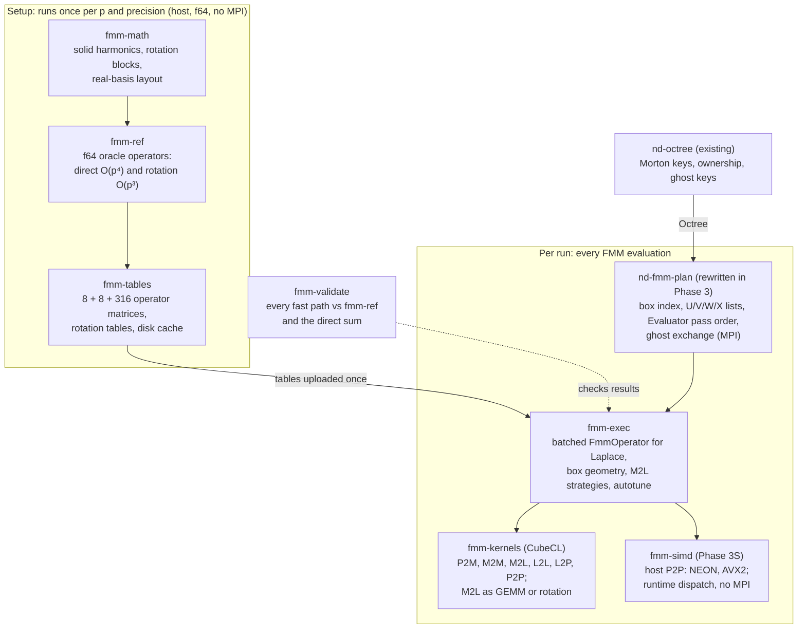
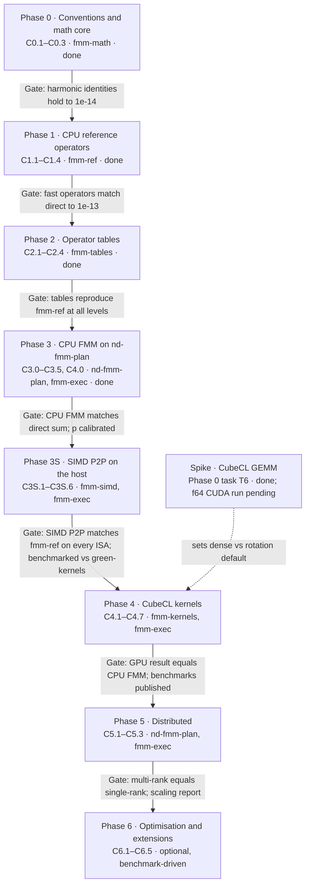

# Laplace FMM in 3D: Transfer Operators and Implementation Plan (Rust + CubeCL)

As of 2026-09-29. Sections 1, 5, 7 and 9 were revised the same day after reading the
`octree` and `fmm-plan` sources (details in `docs/design/workspace-structure.md` §1.1).
Revised again at the end of Phase 0 (Sections 2, 3.2, 4, 5, 6, 7, 8 and 9): the
conventions are fixed, `nd-fmm-math` is implemented, and the CubeCL GEMM spike
(`spikes/cubecl-gemm/SPIKE_REPORT.md`) has set the provisional M2L defaults.
Revised again at the end of Phase 1 (Sections 2.1, 2.3, 7 and 9.1): the translation
formulas are fixed in CONVENTIONS §3.11, and `nd-fmm-ref` and `nd-fmm-validate` are
implemented.
Revised again at the end of Phase 3 (2026-10-02; Sections 1, 2.5, 4, 5, 6.8 (new), 7,
9.1 and 9.2): `nd-fmm-plan` is rewritten with a Morton-ordered box index, index-based
lists, variable-size leaf data and a level-batched operator interface
([fmm-plan-redesign.md](fmm-plan-redesign.md)); leaf data are leaf-scaled
(CONVENTIONS §3.13); the host FMM in `nd-fmm-exec` is checked on uniform and adaptive
trees, threaded with rayon, and p is calibrated against accuracy.
Revised again after Phase 3 (2026-10-02; Sections 1, 5, 5.1, 7, 8.1, 8.3, 9.1, 9.2
and 10): a new Phase 3S, hand-written SIMD P2P on the host (NEON and AVX2 + FMA in a
new crate `nd-fmm-simd`, benchmarked against green-kernels; AVX-512 deferred), runs between
Phase 3 and Phase 4. Its design is [simd-p2p.md](simd-p2p.md); its tasks are in
docs/phase3s/. The numbers of the later phases are unchanged.
Revised at the end of Phase 3S (2026-10-03; Sections 5.1, 7, 8.3, 9.1 and 9.2):
`nd-fmm-simd` runs P2P on NEON (`sqrt` and division, which the spike found faster than
the estimate there) and on AVX2 + FMA (estimate and polynomial correction), and is the
default P2P of `nd-fmm-exec`. On the Apple M3 Max it is 3–8× faster than
`nd_fmm_ref::p2p` and 1.2–1.8× faster than green-kernels, and it speeds up a one-thread
evaluation 1.4–2.5× at p = 3 and 1.05–1.2× at p = 8. The default leaf size stays 64.
x86_64 is checked for correctness in CI and was never timed.

> Where this document and `docs/CONVENTIONS.md` differ (normalisation, phases, scaling),
> **the conventions file takes precedence.** Section 2.4 below now follows the scaling of
> CONVENTIONS §3.7.

Recommendation in one line: build on real-valued, scaled solid spherical harmonics;
implement every operator first as a direct O(p⁴) f64 CPU oracle, then ship
rotation-based O(p³) operators and precomputed, level-independent M2L matrices executed
as batched GEMM through CubeCL, with plane-wave (exponential) M2L as an optional later
optimisation.

## 1. Purpose, scope and assumptions

This document has two jobs. It surveys the operator families that define the state of
the art for the analytic 3D Laplace FMM, and it turns a chosen strategy into components
small enough to hand to Claude Code one at a time.

**In scope**

- Kernel G(x, y) = 1 / (4π |x − y|), charges (monopoles) first, dipoles as a later extension.
- Outputs: potential and gradient (field) at targets; sources and targets may differ.
- All eight transfer operators: P2M, M2M, M2L, L2L, L2P, plus P2L and M2P for adaptive
  trees, and P2P for the near field.
- Precision f64 (reference and high accuracy) and f32 (fast, ≈ 6 digits at best).
- Backends via CubeCL (CUDA, ROCm/HIP, wgpu, Metal, CPU), plus a plain-Rust CPU
  reference and a host path whose near field (P2P) uses hand-written SIMD kernels for
  aarch64 NEON and x86_64 AVX2 + FMA (Phase 3S; AVX-512 later).

**Provided by the existing `nd-octree` and `nd-fmm-plan` crates** (checked in the
repository; `nd-fmm-plan` as rewritten in Phase 3,
[fmm-plan-redesign.md](fmm-plan-redesign.md))

- **Boxes.** Boxes are `u64` Morton keys at levels 0–16 of an adaptive, complete,
  2:1-balanced tree. The domain is cubic when it comes from
  `compute_global_bounding_box`; the Laplace operator must check this for a
  user-supplied box. The octree has no integer box index and does not group boxes by
  level. `nd-fmm-plan` numbers the boxes a rank holds on each level 0..n in Morton order
  (`BoxIndex`) and stores per-level data contiguously by that index (`LevelBuffers`).
- **Particles.** The octree stores no points. `points_to_morton` bins them into keys, and
  the application keeps and redistributes its own point data. `nd-fmm-plan` holds leaf
  data in CSR stores with a variable number of points per leaf, zero included.
- **Interaction lists.** `nd-fmm-plan`'s `Plan` builds U, V, W and X for every
  non-ghost box as index arrays, by target (CSR) and grouped by the 316 V-list offsets
  and the 8 child octants.
- **Distribution.** `nd-fmm-plan`'s `Evaluator` runs the whole distributed pass order
  over a level-batched `FmmOperator` trait with all eight operators, one call per level
  and kind. This includes exchanging ghost sources (for U and X) and ghost multipoles
  (for V and W). It also computes the replicated coarse (`Global`) levels on every
  rank. This covers what the original plan called the locally essential tree (LET)
  exchange.

**Out of scope**

- Tree construction, partitioning and load balancing (`nd-octree`).
- Interaction lists, pass order and ghost exchange as such (`nd-fmm-plan`). This plan
  only lists the extensions it needs from that crate (Section 5.2).
- Kernel-independent FMM, Helmholtz and Stokes kernels (the design keeps a kernel trait
  so they can be added).
- Periodic boundary conditions (noted as a future extension in Section 9).

## 2. Mathematical foundations

Everything below rests on one identity: the Laplace kernel separates into products of
regular and irregular solid harmonics, and all eight operators are consequences of that
separation plus the addition theorems.

### 2.1 Solid harmonics and the separation identity

We want φ(xᵢ) = Σⱼ qⱼ G(xᵢ, yⱼ). With spherical coordinates (r, θ, ϕ) and associated
Legendre functions Pₙᵐ, a convenient (Racah-type) normalisation is:

```math
R_n^m(\mathbf{r}) = \frac{r^n}{(n+m)!}\, P_n^{m}(\cos\theta)\, e^{i m \phi}, \qquad
I_n^m(\mathbf{r}) = \frac{(n-m)!}{r^{n+1}}\, P_n^{m}(\cos\theta)\, e^{i m \phi}
```

For |y| < |x| this gives the separation identity:

```math
\frac{1}{|\mathbf{x}-\mathbf{y}|} = \sum_{n=0}^{\infty} \sum_{m=-n}^{n} \overline{R_n^m(\mathbf{y})}\, I_n^m(\mathbf{x})
```

This normalisation keeps the translation formulas free of factorial weights. The price
is that the handling of negative m (the Condon–Shortley phase, and whether R₋ₘ equals
(−1)ᵐ times the conjugate of Rₘ) must be fixed once and tested. Phase 0 pinned it down
in CONVENTIONS §3.3: Pₙᵐ without the Condon–Shortley phase, and
Xₙ⁻ᵐ = (−1)ᵐ conj(Xₙᵐ) for both families. The separation identity above, the
expansions of Section 2.2 and the regular addition theorem (CONVENTIONS §3.4) hold
exactly under these choices and are tested in `nd-fmm-math`. Phase 1 fixed the signs
and shift directions of the translation formulas of Section 2.3 in CONVENTIONS §3.11,
and `nd-fmm-ref` tests them (C1.2, C1.3).

### 2.2 Expansions

A box with centre c and half-width r has multipole and local coefficients:

```math
M_n^m(\mathbf{c}) = \sum_j q_j\, \overline{R_n^m(\mathbf{y}_j-\mathbf{c})}, \qquad
\phi(\mathbf{x}) \approx \tfrac{1}{4\pi}\sum_{n\le p}\sum_m M_n^m\, I_n^m(\mathbf{x}-\mathbf{c})
```

```math
L_n^m(\mathbf{c}) = \sum_j q_j\, \overline{I_n^m(\mathbf{y}_j-\mathbf{c})}, \qquad
\phi(\mathbf{x}) \approx \tfrac{1}{4\pi}\sum_{n\le p}\sum_m L_n^m\, R_n^m(\mathbf{x}-\mathbf{c})
```

The 1/(4π) is shown for the physical potential only. Coefficients, operators and tables
expand 1/|x − y|; `nd-fmm-exec` applies 1/(4π) once when producing output
(CONVENTIONS §3.1).

A truncation order p gives (p+1)² complex coefficients. For real charges, the
coefficient with −m is Mₙ⁻ᵐ = (−1)ᵐ conj(Mₙᵐ), so (p+1)² real numbers suffice
(CONVENTIONS §3.6). The gradient needs no new machinery. ∇Rₙᵐ is a short linear
combination of Rₙ₋₁ with orders m−1, m, m+1, and ∇Iₙᵐ one of Iₙ₊₁ with the same orders
(the irregular ladder, derived in `nd_fmm_math::harmonics::irregular_grad`). So the
gradient of a degree-p local expansion (L2P) needs only degrees below p, while that of a
degree-p multipole expansion (M2P) needs Iₚ₊₁, which `nd-fmm-math` forms on the fly.

### 2.3 Translation theorems

From an expansion about c to one about c′, with the shift vector t = c − c′ for M2M
and t = c′ − c for L2L and M2L, the three translations are:

```math
\text{M2M:}\quad M_n^m(\mathbf{c}') = \sum_{k=0}^{n}\sum_{l} \overline{R_k^l(\mathbf{t})}\, M_{n-k}^{m-l}(\mathbf{c})
```

```math
\text{L2L:}\quad L_j^i(\mathbf{c}') = \sum_{n=j}^{p}\sum_{m} R_{n-j}^{m-i}(\mathbf{t})\, L_n^m(\mathbf{c})
```

```math
\text{M2L:}\quad L_j^i(\mathbf{c}') = (-1)^{j+i} \sum_{n=0}^{p}\sum_{m} I_{n+j}^{\,m-i}(\mathbf{t})\, M_n^m(\mathbf{c})
```

M2M and L2L are truncated convolutions over (n, m); M2L is a correlation that needs
irregular harmonics up to degree 2p. Each is O(p⁴) when evaluated directly.

These are the unscaled forms; the scaled forms of CONVENTIONS §3.11 reduce to them for
r = r′ = 1. §3.11 is the exact statement that the code implements: shift vectors,
radius factors, the real-storage order sums, the coaxial forms, the rotation rule for
coefficients and the M2L truncation bound.
`tools/fixtures/check_translations.py` checks each of them in mpmath at 40 digits.

### 2.4 Scaling and level independence

The kernel is homogeneous of degree −1, so Iₙᵐ(λt) = λ⁻⁽ⁿ⁺¹⁾ Iₙᵐ(t) and
Rₙᵐ(λt) = λⁿ Rₙᵐ(t). Store scaled coefficients M̃ₙᵐ = Mₙᵐ / rⁿ and
L̃ₙᵐ = Lₙᵐ · rⁿ⁺¹, with r the box half-width (CONVENTIONS §3.7). In scaled coordinates
u = (y − c)/r and v = (x − c)/r this reads

```math
\tilde M_n^m = \sum_j q_j\, \overline{R_n^m(\mathbf{u}_j)}, \quad
\tilde L_n^m = \sum_j q_j\, \overline{I_n^m(\mathbf{u}_j)}, \quad
\phi(\mathbf{x}) \approx \frac{1}{r}\sum_{n\le p}\sum_m \tilde M_n^m I_n^m(\mathbf{v})
\ \text{or}\ \frac{1}{r}\sum_{n\le p}\sum_m \tilde L_n^m R_n^m(\mathbf{v})
```

Two things follow. The scaled coefficients stay O(1) at every level, which matters for
f32. And every translation operator for a given relative box offset is the same matrix
at every level, with no scalar factor: M2L, M2M and L2L tables are all
level-independent. Precompute once, reuse on all levels. The one remaining factor, 1/r
(and 1/r² for gradients), is applied at leaf evaluation (L2P, M2P), where r is known.

(An earlier draft stored L̃ = L · rⁿ, which left a factor 1/r on every M2L. Phase 0
adopted the rⁿ⁺¹ scaling of CONVENTIONS §3.7 instead.)

### 2.5 Operators and interaction lists

| Operator | Maps | Used for | Direct cost |
| --- | --- | --- | --- |
| P2M | leaf particles → multipole | upward pass, leaves | O(N_leaf · p²) |
| M2M | 8 children → parent multipole | upward pass | O(p⁴) per child |
| M2L | multipole → local | V list (well-separated, same level) | O(p⁴) per pair |
| L2L | parent local → 8 children | downward pass | O(p⁴) per child |
| L2P | local → target potentials, gradients | leaves | O(N_leaf · p²) |
| M2P | multipole → targets | W list (adaptive) | O(N_leaf · p²) per pair |
| P2L | sources → local | X list (adaptive) | O(N_leaf · p²) per pair |
| P2P | sources → targets directly | U list (near field) | O(N_s · N_t) per pair |

On a uniform level each box has at most 27 near neighbours (self included) and at most
189 V-list boxes. The V-list offsets range over 7³ − 3³ = 316 distinct vectors
(`nd_fmm_plan::interaction_manager::V_LIST_DIRECTIONS`, offset = target − source in
level index units). Under the 48-element cube symmetry group they reduce to 16
equivalence classes. The adaptive lists U, V, W and X follow Cheng, Greengard and
Rokhlin (1999); `nd-fmm-plan` implements them (the per-key rule in
`interaction_manager`, the index lists in `lists`), with the definitions in its module
documentation.

Accuracy: for the standard one-box separation, the classical bound for evaluating a
multipole expansion decays like (√3 / (4 − √3))ᵖ ≈ 0.76ᵖ; the M2L-to-local step has a
somewhat worse worst-case ratio. Observed errors are usually much better than the bound,
so the plan calibrates p against accuracy empirically (Section 8).

## 3. State of the art: translation operator families

For the analytic Laplace FMM, two O(p³) families dominate: rotation-based translation
and plane-wave (exponential) M2L. On modern hardware a third option matters as much as
asymptotics: precomputed dense operators applied as batched matrix–matrix products,
because they turn a bandwidth-bound step into a compute-bound one.

Notation: p is the maximum degree, so an expansion has (p+1)² coefficients. Gumerov and
Duraiswami use a truncation number P with P² coefficients, so their P equals p+1 here.

### 3.1 Direct translation matrices ("Method 0")

The original Greengard–Rokhlin (1987) operators apply the addition theorems of Section
2.3 as dense (p+1)² × (p+1)² matrices, O(p⁴) per translation. The Epton–Dembart (1995)
normalisation makes the matrix entries simply solid harmonics of the shift vector.

- Strengths: simplest to derive and test; exact reference for every faster method.
- Weakness: at matched accuracy it is several times slower than O(p³) methods beyond low
  accuracy ([Gumerov & Duraiswami 2005](http://users.umiacs.umd.edu/~ramanid/pubs/Gumerov_Duraiswami_TR_4701.pdf)).
- Role here: the f64 oracle, and the source from which dense precomputed M2L matrices
  are built (Section 3.6).

### 3.2 Rotation–coaxial translation–rotation ("point-and-shoot")

White and Head-Gordon (1996) rotate the frame so that the shift vector lies on the
z-axis, translate along z, and rotate back. Rotation keeps degree n fixed and mixes only
orders m within a degree, so it costs Σ(2n+1)² ≈ (4/3)p³. A coaxial translation keeps m
fixed and costs about (2/3)p³ for M2L.

- Totals for real-valued expansions: roughly (10/3)P³ per M2L and 3P³ per M2M or L2L
  ([Gumerov & Duraiswami 2005](http://users.umiacs.umd.edu/~ramanid/pubs/Gumerov_Duraiswami_TR_4701.pdf)).
- Rotation matrices factor as a diagonal phase in the azimuth times a real Wigner-d
  matrix in the polar angle. The Wigner-d entries come from stable recursions
  (Gumerov–Duraiswami 2003; Dachsel 2006) rather than from explicit formulas, which lose
  accuracy at high degree.
- Phase 0 chose a different recursion: `nd_fmm_math::rotation::blocks` builds the full
  real per-degree blocks Dⁿ(Q) for an arbitrary rotation Q directly, by the
  Ivanic–Ruedenberg recursion (1996, erratum 1998) rederived for the Racah-normalised
  basis from the gradient ladder. The azimuth-phase × Wigner-d factorisation is still
  available by composing blocks of z-y-z Euler rotations (the homomorphism
  Dⁿ(Q₁Q₂) = Dⁿ(Q₁)Dⁿ(Q₂) is tested). A z-rotation block acts on each (+m, −m) pair as
  a plane rotation by mα.
- In real storage the blocks are not orthogonal. N Dⁿ N⁻¹ is, with the diagonal N of
  CONVENTIONS §3.8. Irregular harmonics rotate with S Dⁿ S⁻¹
  (`rotation::to_irregular`).
- On a uniform level the V list needs only a small set of distinct polar angles and
  translation distances, so all rotation and coaxial matrices can be precomputed at
  modest memory cost.
- Memory: only the expansions themselves dominate; this is the leanest O(p³) method.

### 3.3 Plane-wave (exponential) M2L

Greengard and Rokhlin (1997) and Cheng, Greengard and Rokhlin (1999) represent the far
field in each of six directions (±x, ±y, ±z) as a sum of decaying exponentials. In that
representation M2L is diagonal: each translation is an elementwise multiply.

- Pipeline: multipole → exponential (O(p³) per box per direction, with rotations for the
  x and y directions), diagonal exponential → exponential translations,
  exponential → local.
- "Merge-and-shift" accumulates children's exponential expansions at the parent before
  shifting, cutting the effective number of translations well below 189 per box.
- Accuracy is set by fixed quadrature tables (for example 8, 17 and 26 quadrature levels
  reaching about 1.6e-3, 1.3e-6 and 1.1e-9). Increasing p beyond the quadrature's limit
  brings no gain.
- Measured trade-off: at matched accuracy it ran within about 25% of point-and-shoot in
  either direction, winning only for large N at high accuracy, while using about 2.5×
  the memory ([Gumerov & Duraiswami 2005](http://users.umiacs.umd.edu/~ramanid/pubs/Gumerov_Duraiswami_TR_4701.pdf)).
- Production reference: FMMLIB3D and its successor FMM3D (Flatiron Institute).

### 3.4 FFT and structured-matrix M2L

The M2L matrices have Toeplitz/Hankel structure in (n, m), which Elliott and Board
(1996) exploited with FFTs for O(p² log p) per translation. The asymptotic constant is
large, and in practice these methods lose to O(p³) methods for the p values Laplace
problems use (below about 25), with added numerical stability concerns. Not recommended
for this library.

### 3.5 Cartesian Taylor and traceless-tensor expansions

Cartesian multipoles avoid special functions: coefficients are moments of monomials, and
translations are sums over multi-indices. Naively they cost O(p⁶); traceless or detracer
formulations (for example Shanker and Huang's accelerated Cartesian expansions) bring
this to O(p⁴) or better.

- Strengths: simple, branch-free code with no Legendre recursions; very efficient at low
  order (p ≤ 4–6) on GPUs. Common in molecular dynamics and astrophysics treecodes.
- Weakness: loses to spherical harmonics at moderate and high accuracy.
- Role here: optional low-accuracy f32 path; not on the critical path.

### 3.6 Precomputed dense operators, batched as BLAS-3

For a translation-invariant, homogeneous kernel, the M2L operator depends only on the
relative box offset. On a uniform level there are 316 offsets (16 up to cube symmetry),
and after the scaling of Section 2.4 the same matrices serve every level.

- Batching: group all (source, target) pairs by offset, stack the source multipoles as
  columns, and apply one matrix to all of them. That is a GEMM with thousands of
  columns, which is compute-bound on GPUs; a per-pair matrix–vector product is
  bandwidth-bound.
- Compression: an SVD of the operators stacked across offsets gives a shared low-rank
  basis, reducing flops and storage (Fong and Darve 2009; Messner, Schanz and Darve 2012
  also introduced the 316-to-16 symmetry reduction and BLAS-3 blocking).
- GPU evidence: Takahashi, Cecka, Fong and Darve (2012) compared M2L strategies on GPUs,
  and Kailasa, Betcke and El Kazdadi showed a BLAS-based M2L with randomised low-rank
  compression competitive with FFT-based M2L, more portable and simpler, at the cost of
  longer setup ([ACM TOMS](https://doi.org/10.1145/3820372),
  [arXiv 2408.07436](https://arxiv.org/pdf/2408.07436)).
- Cost: O(p⁴) flops per pair before compression, but at high arithmetic intensity.
  Storage for 316 dense f64 matrices is about 25 MB at p = 9 and about 400 MB at p = 19;
  symmetry or compression brings the high-order case down to tens of MB.

### 3.7 Context: kernel-independent and emerging methods

These are not analytic, but they define the performance bar and offer reusable
architecture:

- Kernel-independent FMM (Ying, Biros and Zorin 2004) with FFT-based M2L in PVFMM
  (Malhotra and Biros 2015) and ExaFMM-t (Wang, Yokota and Barba 2021).
- [kifmm-rs](https://joss.theoj.org/papers/10.21105/joss.07124.pdf) (Kailasa 2025), a
  Rust kernel-independent FMM with switchable FFT and BLAS M2L. Its trait design and
  benchmarks are a useful Rust reference point.
- The dual-space multilevel kernel-splitting (DMK) framework of Jiang and Greengard,
  which replaces multipole translations with short Fourier representations at each level
  ([summary](https://www.citedrive.com/en/discovery/a-dualspace-multilevel-kernelsplitting-framework-for-discrete-and-continuous-convolution)).
  Worth watching as a possible successor, out of scope for this plan.

## 4. Comparison and recommended strategy

Default GPU path: precomputed, level-independent dense M2L applied as batched GEMM up to
moderate p, with rotation-based O(p³) M2L for high p or tight memory, and CubeCL
autotune choosing between them per device, precision and p.

The Phase 0 spike (task T6, `spikes/cubecl-gemm/SPIKE_REPORT.md`) put numbers on
"moderate p":

- **f32, measured on an Apple M3 Max GPU (Metal):** dense GEMM is the default for the
  whole f32 range (p ≤ 8).
  - The library matmul (`cubek-matmul`, `Strategy::Auto`, simdgroup-matrix CMMA)
    reaches 3.5–4.4 TFLOP/s, about 24–31% of peak, for p ≥ 8 and B ≥ 10⁴ columns.
  - Below Nc = (p+1)² ≈ 64 the library cannot use CMMA and falls back to a scalar path
    (0.3 TFLOP/s at p = 4). A hand-written kernel with p as a comptime parameter reaches
    3.0 TFLOP/s there, at the memory roofline.
  - Phase 4 therefore needs both: the library for p ≥ 8, a hand-written kernel for
    small p. Rotation would have to reach 10–14% of f32 peak to compete.
- **f64 on A100/H100, predicted by a roofline model (not measured):** dense GEMM is the
  provisional default for p ≤ 8 and rotation for p ≥ 12. Autotune sets the crossover,
  expected near p ≈ 10.
  - The break-even rotation efficiency is about 13% of f64 peak at p = 8 and 4–5% at
    p = 12–16.
  - The f64 dense path must be a hand-written kernel. CubeCL has no FP64 tensor-core
    (DMMA) path, and the model puts its scalar library path 2.2–2.6× below the
    hand-written kernel (from their measured efficiencies on Metal).
  - A CUDA measurement before Phase 4 fixes the f64 default is preferred, not required
    (Section 9.2).

| Method | M2L cost per pair | Per-box conversion | Precomputed data | GPU fit | Accuracy control | Role in this library |
| --- | --- | --- | --- | --- | --- | --- |
| Direct matrices | O(p⁴), bandwidth-bound per pair | none | none (or 316 matrices) | poor unless batched | exact truncation at p | f64 oracle; source of dense tables |
| Dense precomputed + GEMM | O(p⁴) flops, compute-bound | none | 316 × (p+1)⁴ values, or 16 with symmetry | excellent | exact truncation at p | GPU default in f32 (p ≤ 8, measured); provisional f64 GPU default for p ≤ 8; CPU per-pair default for p ≤ 8 (Phase 2, measured) |
| Dense + SVD compression | O(k²) with k < (p+1)², plus basis changes | O(p² k) | shared bases + small cores | excellent | truncation at p and SVD tolerance | optimisation after the default works |
| Rotation (point-and-shoot) | ≈ (10/3)(p+1)³ multiply-adds | none | rotation and coaxial tables, O(p³) | good; irregular inner loops | exact truncation at p | CPU per-pair default for p ≥ 10 (Phase 2, measured); provisional f64 GPU default for p ≥ 12 |
| Plane-wave | O(p²) diagonal | O(p³) × 6 directions | quadrature tables; ~2.5× expansion memory | good, complex bookkeeping | fixed quadrature levels | optional phase 6 |
| FFT / Toeplitz | O(p² log p), large constant | FFT setup | FFT plans | fair | stability concerns | not planned |
| Cartesian Taylor | O(p⁴)–O(p⁶) | none | none | excellent at low p | exact truncation at p | optional low-accuracy f32 path |

Why this ordering:

- The M2L step does roughly 189 translations per box against 2 for M2M and L2L, so it
  sets the budget; near-field P2P usually matches it at the optimal leaf size.
- Dense GEMM does about 0.3(p+1) times more flops than rotation at the same p:
  2(p+1)⁴ flops against (10/3)(p+1)³ multiply-adds, i.e. (20/3)(p+1)³ flops. It runs
  near peak on GPUs, while rotation's short, degree-dependent loops do not. Which wins is
  hardware-dependent, so both are implemented behind one trait and benchmarked. (T6
  counted the rotation cost as multiply-adds; counted as flops, every break-even
  efficiency above halves.)
- Plane-wave M2L buys at most tens of percent on CPUs in careful comparisons, at
  substantial complexity. It stays optional.

Starting points for p, calibrated in Phase 3 (C3.4, T12; the full table is in
Section 7, Phase 3). The smallest p whose relative L2 error of φ is below the target,
worst over the four distributions of Section 8.2 (N = 10⁵, adaptive trees with 64
points per leaf, mean over eight charge vectors):

| target | 1e-3 | 1e-4 | 1e-5 | 1e-6 | 1e-7 | 1e-8 | 1e-9 to 1e-12 |
| --- | --- | --- | --- | --- | --- | --- | --- |
| f64, φ | 5 | 7 | 9 | 12 | 15 | 19 | > 20 |
| f64, ∇φ | 4 | 7 | 10 | 13 | 16 | 20 | > 20 |
| f32, φ | 5 | 7 | > 8 | > 8 | > 8 | > 8 | > 8 |
| f32, ∇φ | 4 | 7 | > 8 | > 8 | > 8 | > 8 | > 8 |

- The Gumerov–Duraiswami starting points (relative L2 errors near 1e-4, 1e-7 and 1e-10
  at p = 3, 8 and 18 for uniformly random sources,
  [Gumerov & Duraiswami 2005](http://users.umiacs.umd.edu/~ramanid/pubs/Gumerov_Duraiswami_TR_4701.pdf),
  converted to this document's convention) are not reached here. On the uniform cube,
  p = 3, 8 and 18 give 2.6e-3, 1.8e-5 and 1.0e-8, 26×, 180× and 100× above them.
  That is within 1.5–1.7× of this library's own single-translation error of
  P2M → M2L → L2P over the 316 V-list offsets (Phase 1 T7, re-derived at p = 18 in
  Phase 3 T9). The full FMM follows that error: T9 and T11 traced every part of the
  output to its pair kernels and lists and found no further error source (C3.2, C3.3).
- The error falls by about 2.7 per degree from p = 3 to 8, 2.1 from 8 to 18, and 1.75
  from 18 to 20. Each further digit costs about four degrees near p = 20. Targets of
  1e-9 and below need p > 20, outside the range CONVENTIONS §3.9 tests for M2L.
- In f32 the φ error at p ≤ 8 stays within 5% of f64 on every distribution: truncation,
  not rounding, sets it, so f32 reaches 1e-4 at p = 7 and 1e-5 only on the sphere. The
  f32 rounding floor shows in ∇φ on the sphere surface, 1.1e-5 from p = 5 on, where
  f64 reaches 3.4e-7 at p = 8. f32 runs keep p ≤ 8.

M2M and L2L use 8 precomputed matrices each (one per child octant), again
level-independent after scaling, applied as batched GEMM on GPU. P2M, L2P, P2L and M2P
evaluate harmonics per particle with recursions, one thread per particle or per target.

## 5. Architecture

The library splits into a pure-Rust math core, a table generator, CubeCL kernels and an
execution crate. The execution crate implements `nd-fmm-plan`'s level-batched
`FmmOperator` trait for the Laplace kernel. `nd-fmm-plan` owns everything tree-shaped on
top of the existing octree: the box index, the interaction lists, the pass order and the
ghost exchange. It was rewritten in Phase 3 for this interface
([fmm-plan-redesign.md](fmm-plan-redesign.md)). The new crates never re-implement any of
that. Each crate can be built and tested alone, which
is what makes the components easy to hand to Claude Code one at a time.



The top band runs once per (p, precision), can be cached on disk, and needs neither MPI
nor the octree. The lower band runs on every evaluation. `nd-fmm-plan` calls the Laplace
operator through `FmmOperator`, once per level and operator kind.

### 5.1 Crates

(Package names and phases are refined in `docs/design/workspace-structure.md`.)

| Crate | Responsibility | Depends on | Precision |
| --- | --- | --- | --- |
| `fmm-math` (Phase 0, done) | `RealScalar`, real-basis index layout, regular and irregular solid harmonics with gradients by Cartesian recursion, rotation blocks Dⁿ(Q) for any rotation, `CONVENTION_VERSION` | none (`num-traits`) | generic f32/f64 |
| `fmm-ref` | CPU reference operators: direct O(p⁴) and rotation O(p³), P2P, direct-sum oracle | `fmm-math` | f64 (f32 for comparison) |
| `fmm-tables` | Builds M2M/L2L (8 each, by `morton::child_index`), M2L (316 or 16 + symmetry, keyed like `V_LIST_DIRECTIONS`), rotation and coaxial tables; SVD compression (C6.2, later); versioned on-disk cache | `fmm-ref`, `fmm-math`, `thiserror` (cache errors); `rlst` (without its `mpi` feature) only with SVD compression | built in f64, stored in both |
| `fmm-kernels` | `#[cube]` kernels: P2M, L2P, P2L, M2P, P2P, gather/scatter, M2L-GEMM, M2L-rotation, M2M/L2L | `cubecl`, the CubeCL matmul crate | generic |
| `fmm-exec` (Phase 3: host path done) | `LaplaceOperator<T>`, the batched `FmmOperator` for Laplace: host path target by target with rayon threads (Phase 3), device path later; box geometry from integer Morton keys (CONVENTIONS §3.13); M2L strategy selection; `FmmBuilder` and `Fmm`, which load leaf-scaled points and apply 1/(4π) once; device buffers and autotune later | `nd-fmm-plan`, `nd-octree`, `nd-fmm-tables`, `nd-fmm-ref`, `nd-fmm-math`, `mpi`, `rlst`, `rayon`, `thiserror`; `fmm-simd` from Phase 3S (SIMD P2P); `fmm-kernels` from Phase 4 | generic |
| `fmm-simd` (Phase 3S, done) | Hand-written SIMD kernels for the host path, P2P first: `core::arch` intrinsics for NEON and AVX2 + FMA (AVX-512 deferred), a scalar fallback, runtime ISA dispatch; 1/r by `sqrt` and division on NEON and by the hardware estimate with a polynomial correction on AVX2, within 4 u_T; the signature and semantics of `nd_fmm_ref::p2p` ([simd-p2p.md](simd-p2p.md)) | `nd-fmm-math`, `thiserror`; no MPI | f32, f64 |
| `fmm-validate` | Error norms, point distributions, accuracy sweeps of the operators and of the complete FMM, the calibration of p (C3.4), benchmark harness | all | f64 reference |
| `nd-fmm-plan` (rewritten in Phase 3) | Morton-ordered integer box index, index-based interaction lists (target-centric CSR, and grouped by V-list offset and child octant), level buffers and variable-size CSR leaf stores, ghost exchange, global coarse levels, the level-batched operator interface with a per-pair adapter, the evaluator; designed in [fmm-plan-redesign.md](fmm-plan-redesign.md) | `nd-octree`, `mpi`, `rlst` | generic `Value` |

The adapter crate (`fmm-tree`) and the distribution crate (`fmm-dist`) of earlier drafts
are dropped. There is no tree trait to adapt to, and the ghost exchange already exists in
`nd-fmm-plan`.

### 5.2 Core interfaces

`nd-fmm-math` (Phase 0) provides the layout, harmonics and rotations that every later
crate uses. Every function writes into caller slices and does not allocate:

```rust
/// Real storage, CONVENTIONS §3.6: (p+1)^2 slots, idx(n, m) = n*n + n + m, m in -n..=n.
/// Slot 0 holds the real value, slot +m the real part and slot -m the imaginary part
/// of the order-m quantity.
pub struct Layout { /* p: usize */ }  // new(p), p(), len(), idx(n, m), nm(i), degree(n), degrees()

pub trait RealScalar: Float + FloatConst + Copy + Send + Sync + 'static { /* from_f64, to_f64 */ }

// harmonics: all degrees 0..=p at one point x
fn regular<T: RealScalar>(p: usize, x: [T; 3], out: &mut [T]);
fn irregular<T: RealScalar>(p: usize, x: [T; 3], out: &mut [T]);
fn regular_grad<T: RealScalar>(p: usize, x: [T; 3], value: &mut [T], grad: [&mut [T]; 3]);
fn irregular_grad<T: RealScalar>(p: usize, x: [T; 3], value: &mut [T], grad: [&mut [T]; 3]);

// rotation: per-degree (2n+1)^2 blocks, contiguous, row-major (CONVENTIONS §3.8)
fn blocks<T: RealScalar>(p: usize, q: &[[T; 3]; 3], out: &mut [T]);  // R_n(Qx) = D^n R_n(x)
fn to_irregular<T: RealScalar>(p: usize, blocks: &mut [T]);          // S D^n S^-1, in place
fn euler_zyz<T: RealScalar>(alpha: T, beta: T, gamma: T) -> [[T; 3]; 3];
fn blocks_len(p: usize) -> usize;  fn block_range(n: usize) -> Range<usize>;
```

The gradient functions also write the values, because the ladder needs the
neighbouring degree. There is no separate Legendre module and no factorial table: the
recursions and `to_irregular` use running ratios, so no factorial is ever formed.

The tree-facing interface is `nd_fmm_plan::operator::FmmOperator`. Phase 3 replaced the
per-pair trait of the original crate with a level-batched one
([fmm-plan-redesign.md](fmm-plan-redesign.md) §6; T6, PR #32; the old API was removed in
T7, PR #33). Abridged:

```rust
pub trait FmmSizes {
    type Value: Equivalence + Copy + Default + Send + Sync;  // f32/f64 for Laplace
    fn multipole_size(&self, level: usize) -> usize;        // (p+1)^2; may vary by level
    fn local_size(&self, level: usize) -> usize;
    fn source_point_size(&self) -> usize;                   // per point; counts per leaf vary
    fn target_input_point_size(&self) -> usize;
    fn target_output_point_size(&self) -> usize;
}

pub trait FmmOperator: FmmSizes {
    // One call per level and kind. Each batch holds the level, the `BoxIndex` (keys for
    // geometry), both views of its list, the shared inputs and an exclusive output.
    fn p2m(&mut self, batch: P2m<'_, Self::Value>);
    fn m2l(&mut self, batch: M2l<'_, Self::Value>);  // rows by target; batches by offset
    // m2m (per pass: local, global), l2l, p2l, l2p, m2p, p2p alike;
    // every call adds (+=) into its output, each target in the order of its row.
}
```

- Every batch carries two views of its list (requirement 5 of docs/phase3/README.md):
  - the target-centric CSR rows, which a host operator walks target by target, one
    thread per target with `par_chunks_mut` and no atomics;
  - the groupings by V-list offset (M2L) and by child octant (M2M, L2L), each target
    at most once per batch, for the GEMM path of Phase 4.

  A V row is ordered by offset index and an M2M row by octant, so walking the
  groupings in index order adds each target's contributions in the same order as
  walking the rows.
- `&mut self` lets the operator own its scratch, so it needs no `RefCell`.
- `PairOperator` and the `PerPair<P>` adapter let a simple operator (`IndexFmm`, tests,
  a reference path) implement one method per pair. `LaplaceOperator` implements both,
  and the two paths are bit-identical.
- `Plan::new(&octree)` builds the index and lists. `Evaluator::new(plan, comm, op,
  source_counts, target_counts)` and `evaluate()` then run the distributed pass in six
  public stages (§7 of the redesign), with the same order, global coarse levels and
  ghost exchange as the original crate.

The Laplace operator derives geometry from integer keys (CONVENTIONS §3.13).
`morton::decode(key)` gives the level l and the index (i, j, k). The frame of a box s
seen from box t has centre (c_s − c_t)/r_t and radius r_s/r_t. Both are exact dyadic
rationals formed from the integer indices, in f32 as in f64, so no shift is ever formed
from floating-point centres. The domain enters only when points are loaded and when
output leaves the FMM. Tables are looked up by integer key, never by shift: M2M and L2L
by the octant of the batch, M2L by its offset index.

Extensions of `nd-fmm-plan` that the original design asked for:

1. **Variable-size leaf data.** *Done in Phase 3* (C3.0, T5): three CSR leaf stores
   (sources, target input, target output) with per-leaf counts, zero allowed, and a
   variable-size ghost exchange of sources.
2. **Batched operator hooks.** *Done in Phase 3* (C4.0, absorbed by the rewrite, T6):
   the interface above, with M2M and L2L per (level, octant) and M2L per (level,
   offset) as groupings, and the leaf operators per level. The per-pair adapter stays
   as the reference path.
3. **Device-resident buffers and exchange/compute overlap** (Phases 4–5). The views
   are flat index arrays and every store is one allocation, so both can be uploaded
   once (redesign §10).

The M2L strategies (dense GEMM, compressed GEMM, rotation, plane-wave) sit behind the
batched interface in `fmm-exec`: a strategy plans its gathers from the groupings on the
host and applies them on the device.

### 5.3 Data layout

- **Coefficients.** `nd-fmm-plan`'s `LevelBuffers` hold one buffer per level and kind,
  box i of a level at i · `multipole_size(level)`. A level's multipoles are therefore a
  column-major (p+1)² × boxes matrix and directly a GEMM operand. There are separate
  multipole and local buffers.
  - Columns are in Morton order: on every level, the boxes a rank holds (local,
    `Global` and ghost) are numbered 0..n by their sorted keys (`BoxIndex`, Phase 3 T4).
    The numbering is deterministic for a fixed tree and number of ranks (Section 9.2).
  - GEMM plans gather by box index, which the groupings of Section 5.2 give directly.
- **Real basis.** Store the real and imaginary parts of the m ≥ 0 coefficients
  (CONVENTIONS §3.6). Every operator becomes a real matrix, so kernels need no complex
  type and real GEMM applies. Two consequences for operators built on this storage:
  evaluation doubles the m > 0 terms and subtracts the Im·Im products (§3.6), and the
  matrices are not orthogonal in this storage. Rotation blocks become orthogonal only
  after the diagonal scaling N of §3.8.
- **Scaled coefficients** (Section 2.4, refined by CONVENTIONS §3.7), so tables are
  level-independent and f32 stays in range. This relies on a cubic domain, which
  `compute_global_bounding_box` guarantees.
- **Particles: leaf-scaled data** (CONVENTIONS §3.13, signed off on 2026-10-01; this
  replaces the interleaved absolute (x, y, z, q) of earlier drafts). The application
  owns the points; the octree stores none. `Fmm` sorts them into leaf order once and
  writes them into the CSR leaf stores of `nd-fmm-plan`:
  - a point x in leaf b is stored as u = (x − c_b)/r_b ∈ [−1, 1]³, computed in f64 from
    the user's coordinates and the domain, then rounded to T;
  - a source chunk of n points holds the n coordinate triples, then the n charges, so
    `as_chunks::<3>()` gives `[[T; 3]]` without copying;
  - target positions live in the target-input store, in the same leaf-scaled form;
  - the target output holds φ̂ = r_t Σ q/|x − y| and, with gradients,
    ĝ = r_t² ∇ₓ Σ q/|x − y|. `Fmm` applies φ = φ̂ / (4π r_t) and ∇φ = ĝ / (4π r_t²)
    once, on the way out.

  A shift formed from floating-point centres would carry a relative error of
  ε |c| / r_l, up to 6.5e4 ε at level 16 (four digits in f32). With leaf-scaled data and
  the relative frames of Section 5.2, P2M, L2P, P2L and M2P call `nd_fmm_ref::leaf`
  unchanged; only P2P between two different leaves maps its sources into scratch.
- **M2L plans.** For each level and offset, the M2L grouping (`lists::VList`) holds
  parallel arrays of target and source box indices. For a fixed offset each target has
  at most one source, so the scatter-add after a GEMM has no write conflicts within
  that batch, and no atomics are needed.

## 6. CubeCL design considerations

Three CubeCL facts shape the design: f64 is not available on every backend, the API is
still changing between minor versions, and its strengths (comptime specialisation,
vectorised lines, autotune, a tuned matmul engine) favour a GEMM-centred M2L.

### 6.1 Version and backend facts (confirmed by the Phase 0 spike)

- **Pinned:** `cubecl =0.10.0` (latest stable, May 2026), with the matmul engine
  `cubek-matmul =0.2.0` and `cubek-std =0.2.0`, in `[workspace.dependencies]`.
  `cubek-matmul` is the successor of `cubecl-matmul`, whose last release is
  0.9.0-pre.5. Upgrade deliberately, for the whole workspace at once.
- **CubeCL 0.10.0 cannot run f64 on CUDA.** `cubecl-cpp` 0.10.0 removes f64 from the
  CUDA backend's supported types ("Causes CUDA_ERROR_INVALID_VALUE for matmul").
  0.11.0-pre.4 re-enables it; 0.11 also brings a frontend "mega-refactor"
  ([release notes](https://github.com/tracel-ai/cubecl/releases)).
- **No FP64 tensor cores.** Neither 0.10.0 nor 0.11.0-pre.4 has an F64 MMA combination
  (CUDA MMA is F16, BF16 and TF32 only). f64 GEMM runs on plain FMA units, so the A100
  and H100 reach at most their non-tensor-core f64 peak, half the datasheet figure.
- Backends: CUDA, ROCm/HIP, Vulkan (SPIR-V), WebGPU (WGSL), Metal (wgpu with the MSL
  compiler) and a CPU runtime, with the caveat that not all platforms support the same
  features ([crate docs](https://lib.rs/crates/cubecl-std)). Metal reports no f64
  (`supports_type(f64) = false`).
- The matmul engine's CMMA strategies (simdgroup matrices on Metal) need
  Nc = (p+1)² ≳ 64. At p = 4 they are rejected and `Strategy::Auto` falls back to a
  scalar path that is 10× slower than a hand-written kernel.
- The CPU runtime (`cubecl-cpu`, MLIR/LLVM from a `tracel-llvm` bundle downloaded at
  build time) is a correctness backend, not a throughput one:
  - it reproduced every f64 result bit for bit;
  - the library matmul reaches about 1% of CPU peak (hand-written kernels 4–26%);
  - shared-memory kernels are emulated very slowly;
  - some library f32 kernels took over 5 minutes to compile;
  - the default 64 MB worker stack overflows on large shapes (`CUBECL_CPU_STACK_MB`).

### 6.2 Precision policy

- f64 path: CUDA and HIP (and the CPU runtime). WGSL and Metal lack f64, so f64 must
  be a capability check, not an assumption. On the pinned CubeCL 0.10.0, CUDA reports
  f64 unsupported as well. The f64 GPU path therefore needs the pin moved to 0.11 (or a
  confirmed `--force-f64` workaround) before Phase 4 (Section 9.2).
- f32 path: every backend, p ≤ 8, scaled coefficients mandatory.
- Tables are always computed in f64 on the host (`fmm-tables`) and down-cast when stored.
- Tensor-core GEMM paths target low-precision inputs (f16, bf16, tf32). The spike
  confirmed there is no f64 tensor-core path, so the hand-written tiled f64 GEMM kernel
  (p comptime) is the planned f64 dense path, not a fallback.

### 6.3 No complex numbers

CubeCL kernels work on real scalars. The real solid-harmonic basis of Section 5.3 makes
every operator a real matrix, which avoids a complex type entirely. The rotation path
keeps its azimuthal phase factors as explicit cos/sin pairs.

### 6.4 Kernel mapping

| Operator | Parallel unit | Comptime parameters | Notes |
| --- | --- | --- | --- |
| P2M | one cube per leaf, one unit per particle, reduction in shared memory | p | harmonics by recursion in registers; plane (warp) reductions |
| M2M | one unit per parent coefficient block, or batched GEMM per octant | p | 8 child-octant matrices; gather children, no atomics |
| M2L (dense) | batched GEMM per offset | p, tile sizes | gather → GEMM → conflict-free scatter-add; library CMMA for f32 at p ≥ 8, hand-written comptime-p kernel below that and for f64; later fuse gather into the GEMM loads |
| M2L (rotation) | one cube per (target, source) pair or per target | p | rotation, coaxial and inverse rotation as three small dense per-degree products in shared memory |
| L2L | batched GEMM per octant | p | mirror of M2M |
| L2P, M2P | one unit per target | p | evaluate harmonics and gradients by recursion |
| P2L | one cube per target box | p | rare; only on adaptive trees |
| P2P | one cube per target leaf, source leaves tiled through shared memory | tile size | usually the largest single cost; vectorise with lines; rsqrt |

### 6.5 Batching and launch overhead

- One launch per (level, offset) gives 316 launches per level. Prefer a single launch
  per level with the offset as a grid dimension, or a grouped-GEMM kernel.
- A variant worth benchmarking: multiply all multipoles of a level by the stacked 316
  operators in one large GEMM, then reduce per target. It maximises GEMM size at the
  cost of 316× temporary memory, so it must be chunked by boxes.
- The spike found B = 10³ columns launch- and occupancy-limited on Metal (13 MFLOP at
  p = 8 in 9–22 µs), and a host sync costs about 1.5 ms on wgpu/Metal. Batching many
  offsets into one launch and queueing many launches between syncs matter more than
  the GEMM kernel at that size.
- The best cube layout of the hand-written kernel depends on the backend. Spanning a
  row block (coalesced loads of X) wins on Metal, spanning a column strip (X stays in
  cache) on the CPU runtime, by up to 3.4×. Layout is therefore a per-backend choice.
- Top levels have few boxes; run them on the host or merge them into one launch.
- Use CubeCL streams to overlap P2P (independent of the far field) with the upward and
  downward passes.

### 6.6 Avoiding atomics

Atomic float adds differ across backends, so the design avoids them: M2M and L2L gather
rather than scatter, per-offset M2L batches are conflict-free by construction, and P2P
is target-centric. Where a reduction is unavoidable, use shared-memory or plane
reductions.

### 6.7 Autotune

Register the M2L strategies (dense GEMM with the library or the hand-written kernel,
compressed GEMM, rotation), the per-backend cube layouts and P2P tile sizes as autotune
candidates keyed by (backend, precision, p, boxes per level). In f64 the dense/rotation
crossover, provisionally near p ≈ 10 (Section 4), is set here. Persist the
tuning cache so production runs do not re-tune.

### 6.8 Threads and BLAS

Phase 3 threads the host path with rayon inside each rank (C3.5, T10). Nested thread
pools oversubscribe the cores: a GEMM called inside a rayon worker would start its own
BLAS threads on every worker. The rule of docs/phase3/README.md ("Threads and BLAS")
holds for every later phase:

- A matrix product called inside a rayon worker runs single-threaded. Ranks × rayon
  threads × BLAS threads, and any other pool, stay at or below the physical cores.
  Never nest two pools that both fill the machine.
- Large products outside rayon may use BLAS threads.
- The launcher sets BLAS threads through environment variables, before the process
  starts: `OPENBLAS_NUM_THREADS`, `OMP_NUM_THREADS`, `MKL_NUM_THREADS`,
  `BLIS_NUM_THREADS`, and `VECLIB_MAXIMUM_THREADS` for Accelerate on macOS. With Open
  MPI they are passed with `mpirun -x`.
- The library never sets an environment variable. OpenBLAS reads them once at
  initialisation, and Rust 2024 makes `std::env::set_var` unsafe. `Fmm::threading()`
  (`ThreadingReport`) reads and reports them instead, and warns, with more than one
  rayon thread, about a variable that is unset or not 1.

Phase 3 makes no BLAS call in any compute path (T10 audit: `MatrixSet::apply` is a
hand-written loop, `nd-fmm-ref` is plain Rust, `nd-fmm-plan` uses rlst only for its
exchanges, and the release binaries link no BLAS symbol). The rule becomes binding
where later work adds one:

- **Phase 4 host batched path.** A GEMM per (level, offset) or per octant called from
  a rayon worker must run with one BLAS thread. Alternatively the level call runs the
  GEMM outside rayon with BLAS threads, but never both. The first task that calls BLAS
  inside a worker turns the `ThreadingReport` warning into an error, or forces one
  BLAS thread with `rlst::threading::set_blas_threads(1)` before the pool starts.
- **CubeCL CPU runtime (Phase 4).** It has its own worker pool. It counts as a pool
  in the product above, so it must not run inside rayon workers, or rayon must run
  with one thread while it is active.
- **SVD of C6.2.** It runs once at table build, outside rayon, and may use BLAS
  threads. Table builds called from inside a threaded `Fmm` must not.

`rlst::threading::set_blas_threads(n)` (rlst 0.9.0, `src/threading.rs`) finds the
backend itself:

- On Linux and macOS it looks up the thread-control functions at run time with
  `dlsym(RTLD_DEFAULT, …)` among the libraries loaded into the process. That finds a
  dynamically linked OpenBLAS (also the ILP64 `64_` symbols), Intel MKL, BLIS,
  FlexiBLAS, and Accelerate on macOS 15 or later, with no feature.
- A statically linked backend is invisible to that lookup. It needs the matching
  feature (`openblas_threading`, `mkl_threading` or `blis_threading`), which links
  the functions directly and requires the library in the final binary. On other
  targets only the features work. In rlst 0.8.0 the `openblas_set_num_threads`
  declaration sat under `cfg(feature = "mkl_threading")`, so that feature alone
  failed to link; 0.9.0 fixes it.
- With no backend found it returns `BlasThreadingError::NoBackendFound`. The lookup
  is resolved once and cached, so a library loaded later with `dlopen` is missed.
- The setting is process-global for OpenBLAS, MKL, BLIS and FlexiBLAS, and must not
  change while other threads run BLAS. For Accelerate it applies to the **calling
  thread only** (1 means single-threaded, more lets Accelerate choose). On macOS, one
  call on the main thread therefore does not reach the rayon workers; set
  `VECLIB_MAXIMUM_THREADS=1` at launch, or call it on every worker.

The workspace needs no rlst threading feature today, because nothing calls BLAS in a
compute path. The first task that calls `set_blas_threads` needs none either if the
binary links its BLAS dynamically. If it links one statically, it must enable the
matching feature (`openblas_threading` for OpenBLAS), and check `NoBackendFound` on
every target it supports.

## 7. Phased implementation plan

Eight phases, each ending in a gate that must pass before the next starts: conventions,
CPU reference, tables, CPU FMM, host SIMD P2P, CubeCL kernels, distribution,
optimisation. Every component below is sized to be one Claude Code task with a testable
acceptance criterion. The host SIMD phase was added after Phase 3 and is numbered 3S, so
that the phase and component numbers that code and documents already cite (Phase 4,
C4.x to C6.x) keep their meaning.



Phases run in order, with two exceptions:

- Phase 6 items can start as soon as the component they build on (usually C4.5) has
  passed its own test.
- C5.1 can start right after C3.3. The `Evaluator` is distributed from the start; the
  host path needs only the redistribution of points to their owning ranks
  ([fmm-plan-redesign.md](fmm-plan-redesign.md) §9) to run on several ranks. It may
  therefore run alongside Phase 3S. Both change `nd-fmm-exec`, so merge one and rebase
  the other.

Components marked *(nd-fmm-plan)* are general extensions of that crate. They are done
under its own `CLAUDE.md` rules and are checked with its `IndexFmm` test operator
before any Laplace code uses them.

### Phase 0: conventions and math core (`fmm-math`)

| ID | Component | Acceptance criterion | Depends on | Status |
| --- | --- | --- | --- | --- |
| C0.1 | Conventions spec: real basis, normalisation, phase for negative m, index layout, scaling, kernel constant 1/(4π) | written spec checked in; every later test cites it | none | Done (T2): `docs/CONVENTIONS.md` signed off, `CONVENTION_VERSION = 1` frozen and checked against the file by a test |
| C0.2 | Regular and irregular solid harmonics with gradients by Cartesian recursion, f32/f64 | match high-precision fixtures to relative 1e-14 up to p = 30; separation identity holds to 1e-14 | C0.1 | Done (T3, T4); measured below |
| C0.3 | Rotation blocks Dⁿ(Q) for any rotation, by stable recursion | orthogonality error below 1e-13 up to p = 30; rotated expansion equals re-expansion in rotated frame | C0.2 | Done (T5); measured below |

Measured worst errors, from the T4 and T5 test suites (f64 unless stated). The
tolerance column is what the task briefs set and the tests assert:

| Check | Measured | Test tolerance |
| --- | --- | --- |
| Fixtures, set A (10 points, p = 30) | 6e-15 | 1e-13 |
| Fixtures, set B (50 points, p = 8), f32 | 2.5e-6 | 1e-5 |
| Separation identity, 200 pairs, \|y\|/\|x\| ≤ 0.5, p = 30, against the truncated Legendre series | 2.3e-15 | 1e-12 |
| Addition theorem, n ≤ 12, relative to the sum of term magnitudes | 1.5e-15 | 1e-13 |
| Harmonicity, 4th-order finite-difference Laplacian, p = 30 (limited by the difference scheme) | 2.6e-8 | 1e-6 |
| Rotation of regular harmonics, n ≤ 20 / n ≤ 30 | 1.6e-14 / 3.9e-14 | 1e-13 / 1e-11 |
| Rotation of irregular harmonics (S-conjugated blocks), n ≤ 20 / n ≤ 30, orthonormal basis | 2.1e-14 / 3.0e-14 | 1e-13 / 1e-11 |
| Orthogonality of N Dⁿ N⁻¹, n ≤ 30 | 2.6e-14 | 1e-13 |
| Homomorphism Dⁿ(Q₁Q₂) = Dⁿ(Q₁)Dⁿ(Q₂), n ≤ 30 | 2.4e-14 | — |
| Rotation about z | exact zeros off the (+m, −m) pairs, 8e-15 on them | — |

The harmonics meet the gate's 1e-14. The rotation blocks reach 2–4e-14 at n ≤ 30,
slightly above 1e-14 and within the C0.3 criterion. Three lessons carry over to the
acceptance tests of later phases (Section 8.1):

- The separation identity cannot be checked against 1/|x − y| at p = 30 and ratio 0.5,
  because the truncation error itself is 4.7e-10. Compare with a series truncated at
  the same degree, and check that series against the exact value within its bound.
- The addition theorem is ill-conditioned relative to R(a + b) when a and b nearly
  cancel, so errors are measured relative to the sum of the term magnitudes.
- Irregular quantities in raw real storage are badly scaled: the condition number
  reaches 3e8 at n = 30, so even exact blocks fail a raw relative test. Errors are
  measured in the orthonormal basis, with slot m weighted by Nₘ/Sₘ (CONVENTIONS §3.8).

Fixtures come from `tools/fixtures/gen_harmonics.py` (mpmath 1.4.1, pinned, 40-digit
evaluation, regeneration byte-identical). They are 2.8 MB, above the 2 MB first
planned, because the specified point counts at 17 significant digits need that much;
the limit is now 3 MB. `crosscheck_scipy.py` agrees with them to 1.2e-14.

### Phase 1: CPU reference operators (`fmm-ref`)

| ID | Component | Acceptance criterion | Depends on | Status |
| --- | --- | --- | --- | --- |
| C1.1 | P2M, L2P (potential and gradient), P2L, M2P | single-source error decays geometrically in p at the rate of Section 2.5 | C0.2 | Done (T3, PR #8): `nd_fmm_ref::leaf`; measured below |
| C1.2 | Direct O(p⁴) M2M, L2L, M2L | M2M after P2M equals P2M at the parent to 1e-14; same for L2L; M2L matches direct sum to the truncation bound | C1.1 | Done (T5, PR #11): `nd_fmm_ref::direct`, on the formulas of CONVENTIONS §3.11 (T2, PR #10); measured below |
| C1.3 | Rotation-based O(p³) M2M, L2L, M2L | agrees with C1.2 to relative 1e-13 for p ≤ 20 | C0.3, C1.2 | Done (T6, PR #12): `nd_fmm_ref::rotation`; measured below |
| C1.4 | P2P and direct-sum oracle (self-interaction excluded) | exact against brute force on small sets; handles coincident source and target | C0.1 | Done (T4, PR #9): `nd_fmm_ref::p2p`; measured below |

T1 (PR #7) created the crate with `Frame`, and T7 (PR #13) added `nd-fmm-validate` with
the accuracy and timing reports below. T2 added CONVENTIONS §3.11, widened §3.9 to
irregular harmonics up to degree 40 (M2L up to p = 20) and added fixture set C.
`CONVENTION_VERSION` stays 1: no existing convention changed, and §3.10 now covers §3.11.

Measured worst errors, from the T3–T6 test suites (f64 unless stated). Coefficients are
compared per degree in the §3.8 weighting (Nₘ for multipoles, Nₘ/Sₘ for locals);
"terms" means relative to the term magnitudes of the sum that forms the result:

| Check | Error measure | Measured | Test tolerance |
| --- | --- | --- | --- |
| P2M→M2P and P2L→L2P against the same-degree Legendre series, p ≤ 30, potential / gradient | terms / series gradient | 8.8e-15 / 2.2e-14 | 1e-13 / 1e-12 |
| Same chains against exact 1/\|x − y\|, p ≤ 30, potential / gradient | (error − bound) / magnitude | 1.2e-15 / 1.4e-15 | 1e-14 |
| Leaf operators, f32 against f64, p ≤ 8 | relative (L2P, M2P: terms) | 8.9e-7 | 1e-5 |
| `p2p` (f64) against a naive loop | — | bit-identical | bit for bit |
| `direct_sum` against double-double, cancelling sets up to 8192 sources, potential / gradient | Σ\|q\|/r, Σ\|q\|/r² | 4.0e-17 / 7.3e-17 | 1e-15 |
| `direct_sum`, coincident targets and sources, potential / gradient | same | 1.7e-16 / 2.0e-16 | 1e-15 |
| `p2p` f32 against `direct_sum`, potential / gradient | same | 9.3e-8 / 2.3e-7 | 1e-6 |
| Direct M2M after P2M / M2M composition, p ≤ 30 | terms, per degree | 1.2e-15 / 2.1e-15 | 1e-13 |
| Direct L2P∘L2L against L2P / L2L composition, p ≤ 30 | terms, per degree | 1.2e-15 / 5.1e-15 | 1e-13 |
| Direct M2L monopole against P2L, p ≤ 20; z shifts against the coaxial forms | terms, per degree | 7.9e-15; 6.3e-15 | 1e-13 |
| Direct M2L against its §3.11 bounds: coefficients vs P2L / V list vs direct sum / near the convergence limit | error / (bound + floor) | 0.11 / 0.10 / 0.028 | 1 |
| Direct translations, f32 against f64, p ≤ 8 | terms, per degree | 3.9e-7 | 1e-5 |
| Rotation against direct, M2M, L2L and M2L, p ≤ 20 (random frames, octants, all 316 offsets) | terms, per degree | 4.8e-15 (1.1e-14 with the near-axis runs) | 1e-13 |
| Rotation against direct, M2M and L2L, 20 < p ≤ 30 | terms, per degree | 2.6e-14 | 1e-11 |
| Rotation f32 against direct f64, p ≤ 8 | terms, per degree | 3.2e-7 | 1e-5 |

The 1e-13 gates for direct exactness (T5) and for rotation against direct (T6, the
Phase 1 gate) are met relative to the term magnitudes of each §3.11 sum, per degree, in
the §3.8 weighting. They are not met relative to the result's own degree norm, which the
tests print but do not assert. The translations add terms much larger than their
result: a source near the output centre has small high-degree coefficients made of
large, cancelling terms. Relative to the result itself, direct translations measured:

| Direct, own degree norm | p = 12 | p = 16 | p = 20 | p = 25 | p = 30 |
| --- | --- | --- | --- | --- | --- |
| M2M after P2M | 8.3e-15 | 4.7e-14 | 2.0e-13 | 1.1e-12 | 6.2e-12 |
| M2M composition | 1.7e-12 | 4.2e-11 | 8.0e-10 | 5.8e-8 | 6.3e-6 |
| L2L composition | 8.6e-14 | 1.0e-12 | 1.3e-11 | 3.2e-10 | 4.1e-9 |

Rotation against direct reaches 8.9e-13 in that measure (L2L, offset (1, 0, −3), p = 20)
and 5.6e-13 (L2L, octants, r = 2⁻¹⁶, p = 10). Both occur only at degree 0, where the
single weighted value nearly cancels (term scale 1.9e3 and 1.3e4 times the result);
relative to the terms they are 4.8e-16 and 4.4e-17. Rotating that input by exact
quarter turns about z already changes the rotation result by 1.3e-13 to 2.8e-13 in the
strict measure, so this is the method's rounding floor, not a defect.

M2L chain (P2M, direct M2L, L2P) against the direct sum over the V list (T5), relative
to Σ|q|/|x − y|:

| p | 0 | 5 | 10 | 15 | 20 |
| --- | --- | --- | --- | --- | --- |
| Worst error | 3.0e-1 | 7.0e-4 | 3.0e-6 | 5.5e-8 | 8.3e-10 |
| Worst bound | 17 | 14 | 2.3 | 0.33 | 4.5e-2 |

The error decays at a fitted 0.39 per degree, the bound at 0.70. The bound is valid but
loose: at the worst offset it exceeds 1 for p ≤ 12.

Single-translation accuracy (T7, `cargo run --release -p nd-fmm-validate --example
accuracy`). 1,000 sources uniform in a box of half-width 0.5, charges uniform in
[−1, 1); 1,000 targets uniform in the target box, for each of the 316 V-list offsets;
direct M2M, M2L and L2L; relative L2 error of φ against `direct_sum`, over the pooled
targets of all offsets:

| Chain (f64) | p = 3 | p = 8 | p = 18 | p = 20 |
| --- | --- | --- | --- | --- |
| P2M → M2P | 8.95e-4 | 6.53e-6 | 1.35e-9 | 2.75e-10 |
| P2L → L2P | 1.41e-3 | 8.37e-6 | 2.00e-9 | 4.62e-10 |
| P2M → M2L → L2P | 1.77e-3 | 1.08e-5 | 2.71e-9 | 5.35e-10 |

- The M2M and L2L chains reproduce P2M → M2P and P2M → M2L → L2P to all printed digits
  in f64, as they are exact.
- The worst single offset is larger: at p = 20, φ L2 up to 3.26e-9, φ max up to
  5.43e-8 and ∇φ max up to 2.71e-6 (all P2L → L2P).
- f32 matches f64 to 2–3 digits for all p ≤ 8, so truncation dominates there.
- This is the single-translation prediction for C3.2. It sits above the
  Gumerov–Duraiswami starting points of Section 4 (1e-4, 1e-7 and 1e-10 at p = 3, 8
  and 18). Likely reasons are the mixed-sign charges, and that the error is relative to
  the far field of one source box only, with no exact near field in the reference
  norm. C3.2 should compare with the same charge distribution.

Timing (T7, `--example timing`): f64, one thread on an Apple M3 Max, release build,
median of 15 batches of at least 20 ms each. Rotation times include building the
rotation blocks on every call; Phase 2 (C2.3) precomputes them.

| Operator | fitted k in t ∝ pᵏ (p ≥ 8), direct / rotation | rotation faster from | p = 20, direct / rotation |
| --- | --- | --- | --- |
| M2M | 3.55 / 2.70 | between p = 20 and 30 (near tie at 20) | 121.77 / 116.04 µs |
| L2L | 3.60 / 2.71 | p = 30 | 102.79 / 123.45 µs |
| M2L | 3.40 / 2.62 | p = 12 | 203.60 / 124.55 µs |

The exponents sit below 4 and 3 because lower-order terms still matter at p ≤ 30;
rotation scales no worse than p³. At M2M, p = 20, the direct/rotation ratio was 0.97,
1.12 and 1.05 in three runs.

### Phase 2: operator tables (`fmm-tables`)

| ID | Component | Acceptance criterion | Depends on | Status |
| --- | --- | --- | --- | --- |
| C2.1 | M2M and L2L matrices for the 8 octants, scaled | applying the table equals C1.2 to 1e-14 at every level | C1.2 | Done (T3, PR #18): `nd_fmm_tables::octant`, equal to `direct` to 1e-14 on parent levels 0–15 for p ≤ 30; measured below |
| C2.2 | M2L matrices for the 316 offsets, level scaling, optional 16-class symmetry | table result equals C1.2 for all offsets and three levels | C1.2 | Done (T4, PR #19; T5, PR #20): `M2lTables` equal `direct` to 1e-14 for all 316 offsets on levels 2, 9 and 16, p ≤ 20; the 16-class `M2lClasses` reconstructs all 316 matrices to 1e-13; measured below |
| C2.3 | Rotation and coaxial tables for the uniform V list | table-driven rotation M2L equals C1.3 | C1.3 | Done (T6, PR #21): `RotationTables`, M2L, M2M and L2L equal to `nd_fmm_ref::rotation` to 1e-14 and to `direct` to 1e-13, p ≤ 20; measured below |
| C2.4 | Versioned on-disk cache keyed by p, precision and convention version | cold build vs cache load bit-identical; stale version rejected | C2.1–C2.3 | Done (T7, PR #22): `TableCache`, bit-identical round trip for every family in f64 and f32; stale, mismatched and corrupt files rejected; measured below |

T1 (PR #16) created `nd-fmm-tables`. T2 (PR #17) added CONVENTIONS §3.12, on box
geometry and operator tables, and extended the versioning rule of §3.10 to it; §3.12 was
signed off before T3. `CONVENTION_VERSION` stays 1, since no existing convention
changed. T3 to T7 (PRs #18 to #22) built the tables and the cache. T8 added the tables
report and the table path of the accuracy sweep to `nd-fmm-validate`.

- Every table is built in f64 from `nd-fmm-ref` at the canonical frames of §3.12. An
  f32 table is the f64 table rounded entry by entry.
- The crate depends on `nd-fmm-math`, `nd-fmm-ref`, `num-traits` and `thiserror`.
  `rlst` waits for SVD compression (C6.2). The cache uses a hand-written little-endian
  format with an FNV-1a checksum instead of a serialiser.
- It is MPI-free and serial (no rayon). It restates the octant and offset order of
  `nd-octree` and `nd-fmm-plan` instead of importing them; C3.1 checks that they agree.

Tables report (T8, `cargo run --release -p nd-fmm-validate --example tables`): f64, one
thread on an Apple M3 Max, release build, one run. Build times are single serial builds.

| p | M2M + L2L | dense M2L | 16-class M2L | rotation (all three families) |
| --- | --- | --- | --- | --- |
| 4 | 0.27 ms | 8.08 ms | 0.63 ms | 0.34 ms |
| 8 | 5.86 ms | 219.4 ms | 11.8 ms | 1.44 ms |
| 12 | 51.4 ms | 1.78 s | 92.5 ms | 4.19 ms |
| 16 | 216.8 ms | 8.27 s | 422.6 ms | 11.0 ms |
| 20 | 764.6 ms | 28.78 s | 1.46 s | 24.1 ms |
| 30 | 8.18 s | — | — | — |

Memory in f64. The f32 figures are exactly half, since every counted value is stored in
the table's precision. The class form counts the 16 matrices and T_M(P), T_L(P) of the
48 group elements, not its 2.5 kB of indices. The rotation families count blocks and
factors (`ShiftTables::storage_len`), not their few kB of f64 angles and shifts.

| p | M2M or L2L dense (each) | M2L dense | M2L classes | M2M or L2L rotation (each) | M2L rotation |
| --- | --- | --- | --- | --- | --- |
| 4 | 40.0 kB | 1.6 MB | 206.7 kB | 6.0 kB | 132.7 kB |
| 8 | 419.9 kB | 16.6 MB | 1.6 MB | 33.8 kB | 767.0 kB |
| 12 | 1.8 MB | 72.2 MB | 5.9 MB | 100.9 kB | 2.3 MB |
| 16 | 5.3 MB | 211.1 MB | 15.7 MB | 224.7 kB | 5.1 MB |
| 20 | 12.4 MB | 491.6 MB | 34.4 MB | 422.7 kB | 9.7 MB |
| 30 | 59.1 MB | — | — | — | — |

Time per M2L application in µs, the median of 15 batches of at least 20 ms each. A
batch applies all 316 offsets in table order, so each figure is the mean over the V
list, read from memory as a per-pair FMM reads it. "One offset" applies only
(3, −2, 1), whose matrix stays in cache. The `nd-fmm-ref` operators run at the
canonical frames; `rotation` builds its blocks on every call.

| p | dense | dense, one offset | classes | table rotation | `ref::rotation` | `ref::direct` | dense / table rotation |
| --- | --- | --- | --- | --- | --- | --- | --- |
| 2 | 0.029 | 0.039 | 0.071 | 0.089 | 0.521 | 0.165 | 0.33 |
| 4 | 0.113 | 0.110 | 0.253 | 0.251 | 2.101 | 0.968 | 0.45 |
| 6 | 0.355 | 0.276 | 0.621 | 0.546 | 5.175 | 3.348 | 0.65 |
| 8 | 0.942 | 0.692 | 1.441 | 1.009 | 10.449 | 8.658 | 0.93 |
| 10 | 2.053 | 1.585 | 2.930 | 1.685 | 18.493 | 17.401 | 1.22 |
| 12 | 4.030 | 4.060 | 5.422 | 2.649 | 30.368 | 32.200 | 1.52 |
| 16 | 11.839 | 11.833 | 18.014 | 5.610 | 66.310 | 89.337 | 2.11 |
| 20 | 27.343 | 27.314 | 33.437 | 10.530 | 118.227 | 204.051 | 2.60 |

M2M and L2L, dense octant table against table-driven rotation, µs per application (mean
over the 8 octants):

| p | M2M dense | M2M table rotation | L2L dense | L2L table rotation |
| --- | --- | --- | --- | --- |
| 4 | 0.110 | 0.232 | 0.109 | 0.229 |
| 6 | 0.343 | 0.473 | 0.333 | 0.481 |
| 8 | 0.985 | 0.953 | 0.955 | 0.856 |
| 12 | 4.025 | 2.222 | 4.031 | 2.245 |
| 20 | 27.389 | 9.322 | 29.030 | 8.923 |

- Fitted exponents for p ≥ 8, M2L: dense 3.69, classes 3.53, table rotation 2.56,
  `ref::rotation` 2.66, `ref::direct` 3.46. For M2M and L2L: dense 3.65 and 3.73, table
  rotation 2.52 and 2.57.
- Table-driven rotation beats the dense table for p ≥ 10 in M2L (dense wins at p = 8,
  ratio 0.93) and for p ≥ 8 in M2M and L2L. It is 11× faster than `ref::rotation` at
  p = 20, which rebuilds the blocks on every call, and 19× faster than `ref::direct`.
- Across the V list and for a single offset the dense times agree for p ≥ 12, so the
  per-pair product is bound by arithmetic, not by reading the table from memory.
- The class form is slower than table rotation from p = 4 and slower than the dense
  table at every p. It saves memory; it does not save time.

Cache (`TableCache::load_or_build`, f64): cold is build and store in an empty
directory; warm is the median of five loads after the first. The first load after a
store is slower, by 7–36 ms in this run, a one-off cost of the freshly written file. Warm loads run at about
0.85 GB/s, bound by value decoding (about 8× a raw `fs::read`). Every warm load was
bit-identical to the cold build.

| Family | p = 8: file / cold / warm | p = 16: file / cold / warm |
| --- | --- | --- |
| M2M (L2L alike) | 419.9 kB / 11.5 ms / 0.50 ms | 5.3 MB / 128.4 ms / 6.15 ms |
| M2L dense | 16.6 MB / 247.8 ms / 19.9 ms | 211.1 MB / 8.75 s / 258.0 ms |
| M2L classes | 1.6 MB / 20.3 ms / 1.85 ms | 15.7 MB / 452.8 ms / 18.4 ms |
| rotation | 840.8 kB / 8.60 ms / 1.06 ms | 5.6 MB / 25.7 ms / 6.35 ms |

The cache pays off for the dense and class tables, 11–34× over a cold build. For the
rotation tables it gains only 4–8×, since they build in tens of ms.

Table-path accuracy (T8, `--example accuracy -- --tables`): with M2M, M2L and L2L taken
from the dense tables, looked up by child index and offset, every chain reproduces the
single-translation table of Phase 1 above to all printed digits in f64 (900 of 900
cells). In f32, 3 of 360 cells differ in the third digit, for example 6.74e-4 against
6.75e-4 for P2M → M2L → L2P at p = 7. The f32 tables are the rounded f64 tables, while
the reference path computes in f32.

Recommendation for the Phase 3 per-pair CPU M2L (C3.1): the dense table for p ≤ 8 and
table-driven rotation (`RotationTables::m2l`) for p ≥ 10. Between the two measured
degrees they are within about 20%. Rotation also avoids the dense table's memory per
rank: 211 MB at p = 16 and 492 MB at p = 20, against 5.1 MB and 9.7 MB. For M2M and L2L,
rotation wins from p = 8. This holds only for single-threaded per-pair application, one
matrix–vector product or one rotation per pair. The batched GEMM path of Phase 4 applies
one table to thousands of multipoles at high arithmetic intensity, and changes the
comparison (Section 4).

### Phase 3: CPU FMM on `nd-fmm-plan` (`fmm-exec` host path)

| ID | Component | Acceptance criterion | Depends on | Status |
| --- | --- | --- | --- | --- |
| C3.0 | *(nd-fmm-plan)* Variable-size source and target data per leaf; in Phase 3 the rewrite of the crate (Morton-ordered box index, index-based lists, level buffers and CSR leaf stores, variable-size ghost exchange) | `IndexFmm` with random per-leaf counts passes `mpi_regressions` on 1, 2 and 4 ranks; existing scenarios unchanged | none | Done as the rewrite (T1, PR #25: [fmm-plan-redesign.md](fmm-plan-redesign.md), signed off; T4–T7, PRs #30–#33): requirements 1–10 of docs/phase3/README.md met; every `mpi_regressions` scenario passes its brute-force list oracle on 1, 2 and 4 ranks; `IndexFmm` passes with counts of one and with seeded variable counts (zeros included) and equalled the old evaluator on every scenario before T7 removed the old API |
| C4.0 | *(nd-fmm-plan)* Batched operator hooks, moved here from Phase 4 | every batched call honours its grouping; the per-pair adapter equals the batched path for `IndexFmm` | C3.0 | Done in Phase 3, absorbed by the rewrite (T6, PR #32): the level-batched `FmmOperator` of Section 5.2 with both views, `PairOperator` and `PerPair`; each target at most once per (level, offset), complete octant batches, adapter equal to the batched path |
| C3.1 | Laplace `FmmOperator` (host, level-batched): geometry from integer Morton keys (CONVENTIONS §3.13), tables looked up by octant and V-list offset index | each operator equals the `fmm-ref` result for the same geometry at three levels; non-cubic domain rejected | C2.2, C3.0 | Done (T3, PR #29: geometry; T8, PR #34: `LaplaceOperator<T>`): on levels 2, 9 and 16, M2M, L2L and M2L equal `direct` to 2.8e-15 or better with `Dense` (bound 1e-14) and to 5.8e-15 or better with `Classes` and `Rotation` (1e-13); the leaf operators and P2P to 4.0e-16 or better (1e-13); the table order of `nd-fmm-tables`, `nd-octree` and `nd-fmm-plan` agrees; the batched and per-pair paths are bit-identical |
| C3.2 | Uniform-tree FMM through the `Evaluator`, one rank | relative L2 error vs direct sum within 2× of the single-translation prediction, N = 10⁵ | C3.1, C1.4 | Done (T9, PR #35): `FmmBuilder`, `Fmm`, `Output`; 1.50×, 1.64× and 1.63× the prediction at p = 3, 8 and 18 (table below) |
| C3.3 | Adaptive trees (W and X paths: M2P, P2L); lists from `nd-fmm-plan`'s `Plan` | same accuracy on clustered distributions (e.g. Plummer, sphere surface) | C3.2 | Done (T11, PR #38): sphere surface, Plummer sphere and Gaussian clusters at 0.40–1.26× the uniform-tree error (gate 2×) |
| C3.4 | Accuracy calibration: p vs error for f64 and f32 | published table of p for 1e-3 to 1e-12 targets | C3.3 | Done (T12): the calibration table below; Section 4 holds its summary |
| C3.5 | Host threading with rayon inside each rank (new in Phase 3) | output bit-identical to the serial path for 1, 2, 4 and 8 threads on every C3.2 and C3.3 scenario, f32 and f64 | C3.2 | Done (T10, PR #36; T11): `FmmBuilder::threads(n)`, default 1, a pool owned by the `Fmm`; every `mpi_exec` scenario bit-identical at 2, 4 and 8 threads (the p = 8 runs of T11 at one thread in debug, covered at N = 10⁵ by the ignored `adaptive.rs`); speed-up below |

The host path runs each level call target by target through the target-centric rows,
each target's contributions in the order of its row, with per-thread scratch built at
construction. With `threads(n)`, rayon splits the target loop of each level call; every
target sees the same accumulation order, so the output is bit-identical for any number
of threads. Worker threads never call MPI, and with more than one thread `build`
requires MPI at `Threading::Funneled`. Phase 3 calls no BLAS routine (Section 6.8).

Every figure below is from one rank of an Apple M3 Max (12 performance and 4
efficiency cores, 64 GB), release build, with every BLAS thread variable set to 1.
Errors are relative L2 (and max) errors against `direct_sum` in f64 at 1,000 sampled
targets, as the root mean square over eight charge vectors uniform in [−1, 1)
(docs/phase3/README.md, "Error measures"). Timings are wall times, reported and never
asserted.

**C3.2, uniform tree** (T9, `fmm_accuracy`): N = 10⁵ uniform in [−1, 1)³, a uniform
level-4 tree (4,096 leaves, 8–44 points each, 640,584 V pairs), one thread.

| precision | p | strategy | φ L2 | φ max | ∇φ L2 | prediction | φ L2 / prediction | evaluate (ms) |
| --- | --- | --- | --- | --- | --- | --- | --- | --- |
| f64 | 3 | Dense | 2.650e-3 | 4.292e-3 | 2.748e-3 | 1.77e-3 | 1.50 | 197 |
| f64 | 8 | Dense | 1.776e-5 | 4.515e-5 | 3.406e-5 | 1.08e-5 | 1.64 | 952 |
| f64 | 18 | Rotation | 1.099e-8 | 6.777e-8 | 3.662e-8 | 6.74e-9 | 1.63 | 5,587 |
| f32 | 3 | Dense | 2.650e-3 | 4.292e-3 | 2.748e-3 | 1.77e-3 | 1.50 | 186 |
| f32 | 8 | Dense | 1.785e-5 | 4.465e-5 | 3.407e-5 | 1.08e-5 | 1.65 | 620 |

The gate as first written failed on one charge vector (2.2× and 2.5×). T9 found no
defect: with mixed-sign charges the far field of the coarsest V-list level partly
cancels at each target by an amount that depends on the charges, and one vector's
error varied by 2.3–2.7× across seeds. Hence the root mean square over eight vectors,
and the p = 18 prediction re-derived as the median over 33 source draws (6.74e-9;
Phase 1's 2.71e-9 had too few targets for the heavy-tailed error of the face offsets).

**C3.3, adaptive trees** (T11, `fmm_accuracy`): N = 10⁵, `max_level` 16, 64 points per
leaf as the refinement target for every distribution, f64, one thread.

| distribution | leaf levels | leaves | W = X pairs | p = 3: φ L2 (ratio to cube) | p = 8 | p = 18 |
| --- | --- | --- | --- | --- | --- | --- |
| sphere surface | 3–5 | 8,191 | 62,540 | 1.221e-3 (0.46) | 8.516e-6 (0.48) | 4.432e-9 (0.40) |
| Plummer, a = 0.1 | 3–8 | 5,678 | 36,642 | 3.202e-3 (1.21) | 2.187e-5 (1.23) | 1.379e-8 (1.26) |
| 5 Gaussian clusters, σ = 0.02 | 2–8 | 8,667 | 74,161 | 2.366e-3 (0.89) | 1.577e-5 (0.89) | 7.325e-9 (0.67) |

Masking M2L, M2P or P2L in turn (T11, `fmm-exec/tests/adaptive.rs`) shows that V
carries almost all of the error. At p = 8 the W and X parts contribute about 1e-6
against 1–3e-5 in total, with relative errors no worse than V's. f32 is within 1% of
f64 everywhere at p = 3 and 8.

**C3.5, threads** (T10): the C3.2 problem, mean time per evaluation in ms, speed-up
over one thread. 16 threads include the 4 efficiency cores, which cap the speed-up
near 11–13×.

| precision | p | 1 thread | 2 | 4 | 8 | 16 | speed-up 2 / 4 / 8 / 16 |
| --- | --- | --- | --- | --- | --- | --- | --- |
| f64 | 3 | 206.1 | 102.5 | 53.1 | 27.6 | 19.2 | 2.01 / 3.88 / 7.47 / 10.73 |
| f64 | 8 | 968.8 | 485.7 | 251.4 | 133.1 | 96.4 | 1.99 / 3.85 / 7.28 / 10.05 |
| f64 | 18 | 5503.1 | 2805.4 | 1432.0 | 718.7 | 485.7 | 1.96 / 3.84 / 7.66 / 11.33 |
| f32 | 3 | 187.4 | 97.4 | 49.6 | 26.0 | 19.2 | 1.92 / 3.78 / 7.21 / 9.76 |
| f32 | 8 | 618.8 | 318.5 | 162.9 | 89.5 | 73.0 | 1.94 / 3.80 / 6.91 / 8.48 |

To 8 threads the large stages run at 91–98% efficiency. Dense M2L at p = 8 scales a
little worse (91%) than rotation at p = 18 (96%), probably because the 17 MB of dense
tables stream from memory. The upward pass at p ≤ 8 is too short to scale.

**C3.4, calibration** (T12, `cargo run --release -p nd-fmm-validate --example
calibrate`): each of the four distributions with N = 10⁵, sources equal to targets,
`max_level` 16 and 64 points per leaf as the refinement target (the cube's tree is then
the uniform level-4 tree, drawn with another seed than C3.2), the default strategy
(`Auto`: `Dense` for p ≤ 8, `Rotation` above), f64 at p = 1..=20 and f32 at p = 1..=8.
The table gives the smallest p whose relative L2 error is below the target. "> 20" or
"> 8" means no tested degree reaches it. The worst column is the largest p of the four.
The errors are the same for every thread count (C3.5). The whole example ran in 4.8
minutes on 16 threads and in 47 minutes on one.

| target | φ f64: cube | sphere | Plummer | clusters | worst | ∇φ f64: cube | sphere | Plummer | clusters | worst |
| --- | --- | --- | --- | --- | --- | --- | --- | --- | --- | --- |
| 1e-3 | 4 | 4 | 5 | 4 | **5** | 4 | 1 | 4 | 4 | **4** |
| 1e-4 | 7 | 6 | 7 | 7 | **7** | 7 | 2 | 6 | 7 | **7** |
| 1e-5 | 9 | 8 | 9 | 9 | **9** | 9 | 4 | 9 | 10 | **10** |
| 1e-6 | 12 | 11 | 12 | 12 | **12** | 13 | 7 | 12 | 13 | **13** |
| 1e-7 | 15 | 14 | 15 | 15 | **15** | 16 | 10 | 16 | 16 | **16** |
| 1e-8 | 19 | 17 | 19 | 18 | **19** | 20 | 13 | 19 | 20 | **20** |
| 1e-9 | > 20 | > 20 | > 20 | > 20 | **> 20** | > 20 | 17 | > 20 | > 20 | **> 20** |
| 1e-10 | > 20 | > 20 | > 20 | > 20 | **> 20** | > 20 | 20 | > 20 | > 20 | **> 20** |
| 1e-11, 1e-12 | > 20 | > 20 | > 20 | > 20 | **> 20** | > 20 | > 20 | > 20 | > 20 | **> 20** |

| target | φ f32: cube | sphere | Plummer | clusters | worst | ∇φ f32: cube | sphere | Plummer | clusters | worst |
| --- | --- | --- | --- | --- | --- | --- | --- | --- | --- | --- |
| 1e-3 | 4 | 4 | 5 | 4 | **5** | 4 | 1 | 4 | 4 | **4** |
| 1e-4 | 7 | 6 | 7 | 7 | **7** | 7 | 2 | 6 | 7 | **7** |
| 1e-5 to 1e-12 | > 8 | 8 (1e-5 only) | > 8 | > 8 | **> 8** | > 8 | > 8 | > 8 | > 8 | **> 8** |
| floor: smallest error, at p | 1.83e-5, 8 | 8.94e-6, 8 | 2.20e-5, 8 | 1.59e-5, 8 | 2.20e-5 | 1.91e-5, 8 | 1.09e-5, 8 | 1.39e-5, 8 | 2.58e-5, 8 | 2.58e-5 |
| f64 at that p | 1.82e-5 | 8.52e-6 | 2.19e-5 | 1.58e-5 | | 1.90e-5 | 3.36e-7 | 1.39e-5 | 2.58e-5 | |

- f64 reaches 1e-8 at p = 19 at worst. Every target from 1e-9 down needs p > 20,
  outside the range CONVENTIONS §3.9 tests for M2L. Near p = 20 the error falls by
  about 1.75 per degree, so each further digit costs about four degrees.
- The distributions differ by at most one or two degrees for φ. The Plummer sphere is
  the worst or tied at every φ target in f64. The sphere surface needs the fewest
  degrees, especially for ∇φ: its ∇φ error is 25–50× below its φ error at the same p.
- In f32, φ stays within 5% of f64 up to p = 8, so truncation sets the f32 error there.
  The rounding floor appears only in ∇φ on the sphere: 1.1e-5 from p = 5 on (1.09e-5
  at p = 8 against 3.36e-7 in f64).

**Per-pair cost** (T12, the calibration run on one thread): wall time in ms of one
evaluation (mean over the eight charge vectors) and of the build, by stage. Upward is
P2M and M2M; downward is L2L, M2L and P2L, dominated by M2L; leaves is L2P, M2P and P2P,
dominated by P2P. The last column divides the downward stage by the number of V pairs.

| distribution | precision | p | strategy | build | upward | downward | leaves | evaluate | downward share | leaves share | downward per V pair (µs) |
| --- | --- | --- | --- | --- | --- | --- | --- | --- | --- | --- | --- |
| cube | f64 | 3 | Dense | 49 | 2 | 37 | 158 | 199 | 19% | 80% | 0.06 |
| cube | f64 | 8 | Dense | 268 | 19 | 738 | 187 | 944 | 78% | 20% | 1.15 |
| cube | f64 | 12 | Rotation | 51 | 40 | 1,694 | 225 | 1,960 | 86% | 11% | 2.65 |
| cube | f64 | 18 | Rotation | 66 | 108 | 5,039 | 318 | 5,465 | 92% | 6% | 7.87 |
| cube | f32 | 3 | Dense | 49 | 3 | 33 | 152 | 188 | 18% | 81% | 0.05 |
| cube | f32 | 8 | Dense | 280 | 18 | 423 | 180 | 622 | 68% | 29% | 0.66 |
| sphere | f64 | 3 | Dense | 75 | 3 | 60 | 161 | 224 | 27% | 72% | 0.08 |
| sphere | f64 | 8 | Dense | 296 | 25 | 966 | 349 | 1,340 | 72% | 26% | 1.26 |
| sphere | f64 | 12 | Rotation | 77 | 50 | 2,216 | 604 | 2,871 | 77% | 21% | 2.88 |
| sphere | f64 | 18 | Rotation | 94 | 141 | 6,671 | 1,235 | 8,047 | 83% | 15% | 8.67 |
| sphere | f32 | 8 | Dense | 294 | 21 | 584 | 347 | 953 | 61% | 36% | 0.76 |
| Plummer | f64 | 3 | Dense | 72 | 3 | 85 | 322 | 410 | 21% | 78% | 0.10 |
| Plummer | f64 | 8 | Dense | 293 | 21 | 1,143 | 776 | 1,941 | 59% | 40% | 1.40 |
| Plummer | f64 | 12 | Rotation | 72 | 44 | 2,607 | 1,407 | 4,059 | 64% | 35% | 3.20 |
| Plummer | f64 | 18 | Rotation | 86 | 119 | 7,503 | 2,903 | 10,525 | 71% | 28% | 9.22 |
| Plummer | f32 | 3 | Dense | 70 | 3 | 77 | 311 | 392 | 20% | 79% | 0.10 |
| Plummer | f32 | 8 | Dense | 290 | 19 | 734 | 771 | 1,524 | 48% | 51% | 0.90 |
| clusters | f64 | 3 | Dense | 88 | 3 | 102 | 311 | 416 | 24% | 75% | 0.10 |
| clusters | f64 | 8 | Dense | 309 | 25 | 1,392 | 818 | 2,236 | 62% | 37% | 1.38 |
| clusters | f64 | 12 | Rotation | 92 | 51 | 3,149 | 1,512 | 4,713 | 67% | 32% | 3.12 |
| clusters | f64 | 18 | Rotation | 103 | 145 | 9,271 | 3,188 | 12,604 | 74% | 25% | 9.20 |
| clusters | f32 | 8 | Dense | 318 | 22 | 901 | 824 | 1,747 | 52% | 47% | 0.89 |

- At p = 3 the leaf stage (P2P) takes 72–81% of an evaluation. From p = 8 the
  downward stage (M2L) dominates in f64: 59–78% at p = 8, 64–86% at p = 12 and
  71–92% at p = 18. In f32
  at p = 8 the two are close on the adaptive trees (48–61% downward).
- Per V pair, dense M2L costs 1.15–1.40 µs at p = 8 in f64 and 0.66–0.90 µs in f32.
  Rotation costs 2.7–3.2 µs at p = 12 and 7.9–9.2 µs at p = 18. These agree with the
  single applications of Phase 2 (0.94 µs dense at p = 8, about 8 µs for table
  rotation at p = 18), so the per-pair path adds little over its kernels; the rest of
  the stage is L2L, P2L and the loop around the kernels.
- The upward pass is at most 2% of an evaluation. The build is 50–100 ms without dense
  tables. Dense tables add about 220–230 ms at p = 8, which `table_cache` reduces to
  a load (45 ms at p = 8 in T8).
- Every error in the sweeps is bit-identical on 1 and 16 threads.


**Leaf size** (T12): p = 8 in f64, one thread, the calibration problems with only
`max_points_per_leaf` changed. "near" is the share of the leaf stage (P2P, with L2P
and M2P) in one evaluation, in ms.

| distribution | points per leaf (target) | leaves | V pairs | φ L2 | ∇φ L2 | evaluate | far (upward + downward) | near |
| --- | --- | --- | --- | --- | --- | --- | --- | --- |
| cube | 16 | 31,543 | 5,578,602 | 1.89e-5 | 2.80e-5 | 6,720 | 6,516 | 3% |
| cube | 32 | 5,657 | 656,322 | 1.82e-5 | 1.95e-5 | 1,320 | 877 | 33% |
| cube | 64, 128 | 4,096 | 640,584 | 1.82e-5 | 1.90e-5 | 938–941 | 755–757 | 19–20% |
| cube | 256 | 512 | 56,448 | 1.60e-5 | 1.09e-5 | 1,380 | 80 | 94% |
| Plummer | 16 | 21,652 | 3,574,518 | 2.27e-5 | 2.05e-5 | 4,858 | 4,317 | 11% |
| Plummer | 32 | 11,201 | 1,750,788 | 2.24e-5 | 1.86e-5 | 2,899 | 2,239 | 23% |
| Plummer | 64 | 5,678 | 813,714 | 2.19e-5 | 1.39e-5 | 1,943 | 1,163 | 40% |
| Plummer | 128 | 3,298 | 434,322 | 2.14e-5 | 1.29e-5 | 1,694 | 731 | 57% |
| Plummer | 256 | 2,157 | 256,332 | 2.09e-5 | 1.07e-5 | 1,874 | 550 | 71% |

- The φ error barely moves: 1.6–1.9e-5 on the cube and 2.1–2.3e-5 for Plummer. ∇φ
  improves with larger leaves (2.8e-5 to 1.1e-5 on the cube), because more of it comes
  from the exact near field.
- The uniform cube's tree changes only in steps (leaves on levels 4–5 at 16 and 32,
  level 4 at 64 and 128, level 3 at 256), so its balance jumps from 20% to 94% near.
  Plummer refines smoothly, and near and far balance between 64 and 128 points per
  leaf; 128 is its fastest evaluation. The default of 64 is within 15% of it, and is
  the cube's fastest with 128. On 16 threads the picture is the same (fastest at 64
  or 128 for both). Defaults are not tuned here.

**Recommendation for Phase 4** (T12). The GPU tests should run two distributions at
N = 10⁵ with the calibration settings above (`max_level` 16, 64 points per leaf, eight
charge vectors):

- the **uniform cube**: one leaf level, empty W and X lists, the cleanest offset and
  octant batches for the GEMM path;
- the **Plummer sphere** (a = 0.1): leaves on six levels, non-empty W and X lists, the
  largest error of the four at most targets, and the largest near-field share.

  The Gaussian clusters, with the most V pairs (about 10⁶), are the optional third, a
  stress case for batch sizes.

At these degrees, with the expected relative L2 errors against the direct sum (root
mean square over the eight vectors; cube / Plummer):

| precision | p | M2L path it exercises | φ L2 | ∇φ L2 | dominant per-pair stage (one thread) |
| --- | --- | --- | --- | --- | --- |
| f32 | 3 | dense, hand-written small-p kernel ((p+1)² = 16 < 64) | 2.61e-3 / 3.20e-3 | 1.45e-3 / 1.12e-3 | leaves (P2P), 79–81% |
| f32 | 8 | dense, library CMMA ((p+1)² = 81) | 1.83e-5 / 2.20e-5 | 1.91e-5 / 1.39e-5 | downward 68% (cube); downward and leaves even (Plummer, 48% / 51%) |
| f64 | 8 | dense, hand-written f64 kernel | 1.82e-5 / 2.19e-5 | 1.90e-5 / 1.39e-5 | downward (M2L), 59–78% |
| f64 | 12 | the dense/rotation crossover (Section 4) | 7.12e-7 / 8.06e-7 | 1.04e-6 / 7.06e-7 | downward, 64–86% |
| f64 | 18 | rotation | 1.02e-8 / 1.38e-8 | 2.40e-8 / 1.62e-8 | downward, 71–92% |

- The gate of Phase 4 compares the GPU output with the CPU FMM of Phase 3 at the same p
  and strategy, not only with the direct sum. The errors above say what the direct-sum
  comparison must reproduce: in f64 to the printed digits, in f32 within a few per cent
  (f32 is within 5% of f64 at p ≤ 8 for φ).
- f32 targets below about 1e-5 are out of reach at p ≤ 8 (truncation). ∇φ near close
  pairs on a surface floors at about 1e-5 (sphere), so f32 gradient tests should use the
  cube and Plummer, not the sphere.
- P2P is the larger stage at p ≤ 3 and stays at 20–51% of an evaluation at p = 8. A GEMM M2L alone
  therefore cannot speed up the low-p runs, and the P2P kernel (C4.2) is benchmarked
  alongside M2L from the start. Phase 3S first makes the host P2P fast with SIMD
  kernels, and C4.2 is then compared with that host kernel as well as with
  `nd_fmm_ref::p2p`.
- *After Phase 3S* (T7, M3 Max, one thread, the default `P2pChoice::Auto`):
  - The host P2P baseline for C4.2 is `nd_fmm_simd::P2pKernel` on NEON. At the leaf
    size of the FMM (W1, n_t = 64, per-pair form) it runs at 4.03 Gpairs/s (f32, φ),
    2.60 (f32, φ and ∇φ), 2.19 (f64, φ) and 1.22 (f64, φ and ∇φ), one P-core. That is
    1.3–1.8× green-kernels and 3.7–8.5× `nd_fmm_ref::p2p` (Section 7, Phase 3S).
    `p2p_kernels` reports both on the same workloads, so the GPU kernel can be added
    as a row.
  - The stage shares have moved. At p = 3 the leaf stage is 49–69% of an evaluation
    (was 78–81% on these problems), at p = 8 10–45% (was 19–49%). On the uniform cube
    the far field now dominates from p = 8 on (88–90%), and at p = 3 leaves and far
    field are close in f32 (49%). On the Plummer sphere the leaf stage still holds
    67–69% at p = 3, of which L2P and M2P are a growing part, so a GPU leaf stage needs
    them as well as P2P (C4.3).
- Dense table building (about 230 ms at p = 8, 8.5 s at p = 16; T8) belongs outside
  timed runs; GPU benchmarks use `table_cache`.


### Phase 3S: SIMD P2P on the host (`fmm-simd`, `fmm-exec`)

The design is [simd-p2p.md](simd-p2p.md), and the tasks are in docs/phase3s/README.md.
At p = 3 the per-pair host path spends 72–81% of an evaluation in the leaf stage, and
at p = 8 still 20–51% (Phase 3, "Per-pair cost"). Its P2P is the scalar reference loop,
at about 2.6 ns (10 cycles) per pair on the M3 Max, an estimate from the T12 leaf stage.
Phase 3S replaces it with hand-written kernels:

- `core::arch` intrinsics for aarch64 NEON and x86_64 AVX2 + FMA, with no portable SIMD
  library, in a new MPI-free crate `nd-fmm-simd`, with a scalar fallback
  and runtime dispatch;
- targets in lanes and sources broadcast, so each target adds its sources in input
  order, as the reference does. Per-pair and batched calls then stay bit-identical
  (C3.1), and so does every thread count (C3.5);
- 1/r from the hardware inverse-square-root estimate, refined by Newton steps (or an
  equivalent polynomial) to within 4 u_T. *As built:* AVX2 does so (`vrsqrtps` and a
  polynomial correction), but on NEON `sqrt` and division are faster inside the kernel,
  because they run on the divider beside the four FP pipes (T2);
- coincident pairs excluded by r² = 0, which equals the exact rule of CONVENTIONS §3.13
  on leaf-scaled data (C3S.1).

The kernels are benchmarked against the Laplace kernels of
[green-kernels](https://github.com/bempp/green-kernels) (bempp; hand-written kernels
on the `pulp` portable SIMD layer), on the same workloads and accuracy measures.

No x86_64 machine is available for timings (decided on 2026-10-02). Every timing of the
phase is NEON on the Apple M3 Max. The x86_64 paths are checked for correctness and
accuracy on real hardware by a CI job for `nd-fmm-simd` (x86_64 and arm64 runners), and
for speed only by their inner-loop instruction counts against the operation-count
model.

| ID | Component | Acceptance criterion | Depends on | Status |
| --- | --- | --- | --- | --- |
| C3S.1 | Coincident-pair rule and domain of r² for fast kernels (CONVENTIONS §3.13 addition) | `check_p2p_domain.py` confirms that r² = 0 exactly for coincident leaf-scaled points and bounds every nonzero r²; signed off | C3.1 | Done (T1, PR #41; signed off 2026-10-02): leaf-scaled coordinates and mapped sources lie on 2⁻⁵³ℤ, so a nonzero r² is at least 2⁻¹⁰⁶ (attained) and r² = 0 exactly for coincident points; kernel domain r² = 0 or 2⁻¹⁰⁸ ≤ r² ≤ 2⁷; the f32 gradient contract holds from r² = 2⁻⁸⁴ |
| C3S.2 | Spike: loop order, inverse-square-root variants, register blocking, green-kernels baseline | report with NEON measurements, the x86_64 choices from documented bounds and operation counts, and a signed-off recommendation | C3.5 | Done (T2, PR #42; signed off): targets in lanes kept (sources in lanes only 1.046× (f32) and 1.041× (f64) faster against the 1.15 threshold); on NEON `sqrt` + division (1.50 u_T), 19–53% faster in the kernel than the best estimate route; on AVX2 `vrsqrtps` + degree-2 (f32) and via f32 + degree-5 (f64) corrections, 1.50 u_T derived; K = 2 / 4 (NEON f32 / f64) and 1 (AVX2); no relaxed f64 level |
| C3S.3 | `nd-fmm-simd`: ISA detection and dispatch, scalar path, per-ISA vector layer and inverse square root | inverse square root within 4 u_T on every ISA run (f32 exhaustive over [1, 4), f64 on 10⁷ samples); no out-of-line call in the inner loops | C3S.2 | Done (T3, PR #43; T4, PR #44): f32 exhaustive / f64 sampled, NEON 1.500 / 1.496 u_T (M3 Max and the CI's Neoverse-N2, identical), AVX2 1.499 / 1.000 u_T (CI, AMD EPYC 7763); no call in any inner loop |
| C3S.4 | SIMD P2P kernel (NEON, AVX2; potential and gradient; f32, f64) | pair terms within 8 u_T (potential) and 16 u_T (gradient) of `nd_fmm_ref::p2p`; sums within 1e-14 (f64) and 1e-6 (f32) of `direct_sum`; chunk and target-position invariance bit for bit; at least 90% of the spike's throughput | C3S.1, C3S.3 | Done (T5, PR #45): terms over 10⁶ pairs, potential / gradient, NEON 4.56 / 10.35 u (f32) and 4.37 / 9.48 u (f64), AVX2 4.18 / 8.70 u and 3.96 / 7.95 u; sums within requirement 2 as amended in T5 (twice the reference's error where that exceeds 1e-6, f32 with gradients); invariance bit for bit on every ISA; NEON at 96–101% of the spike prototype; AVX2 loops at exactly the operation count of simd-p2p.md §4.2 |
| C3S.5 | P2P of `LaplaceOperator` through `nd-fmm-simd`, with the reference path selectable | T8 operator check to 1e-13; C3.2 and C3.3 gates pass, within 1% (f64) and 2% (f32) of the reference-P2P errors; bit-identical across threads and between per-pair and batched | C3S.4 | Done (T6, PR #46): operator check 4.4e-16 (bound 1e-13); C3.2 and C3.3 errors equal to the `Reference` run's to the printed digits, outputs within 4.4e-16; bit-identical for 1, 2, 4 and 8 threads and per-pair; `P2pChoice::Auto` the default |
| C3S.6 | Benchmarks: against `nd_fmm_ref::p2p` and green-kernels, FMM timings, leaf size | report published; target: at least green-kernels' throughput at equal or better accuracy in every FMM-shaped and all-pairs cell on NEON (x86_64 not timed); leaf-size default chosen by the T7 rule | C3S.5 | Done (T7), apart from one condition reported for decision: green-kernels' throughput reached in all 64 cells (1.17× or more), but its sums are more accurate in 57 of them (below). FMM speed-ups and the leaf-size study below; the default stays 64. M3 Max timings only; no x86_64 path was timed |

Throughput model per core, from the operation count of the kernel ([simd-p2p.md](simd-p2p.md)
§4.6; **a model, not a measurement**), in pairs per cycle with gradients: NEON on the M3
Max 0.73 (f32) and 0.32 (f64), AVX2 0.80 and 0.29 (and for a later AVX-512 path 1.60
and 0.70). Against the
estimated 0.1 pairs per cycle of the Phase 3 path, this allows about 7× in f32 and 3×
in f64 on the M3 Max. The spike (C3S.2) measures how much of it is reached.
*Outcome:* with `sqrt` and division on NEON the spike corrected the model to 4 pipes and
the divider (about 3 cycles per vector): 1.33 / 0.94 pairs per cycle in f32 (φ / φ and
∇φ) and 0.67 / 0.47 in f64. The production kernel reaches 75%, 68%, 79% and 64% of it
on the gathered FMM-shaped cells, 0.65 pairs per cycle in f32 with gradients and 0.30 in
f64 (at 4.05 GHz).

Every figure below is from the Apple M3 Max (NEON), release build, default target, with
every BLAS thread variable set to 1, measured in T7 on 2026-10-03; raw output in
`spikes/p2p-simd/results-m3max-final.md`. Timings are reported, never asserted. **No
x86_64 path was timed**: there is no x86_64 machine in Phase 3S. The AVX2 path is
checked for correctness and accuracy in CI (AMD EPYC 7763), and for speed only
by its inner-loop instruction counts, which equal the operation count of simd-p2p.md
§4.2.

**Kernels** (T7, `cargo run --release -p nd-fmm-validate --example p2p_kernels` and
`cargo run --release -p nd-fmm-spike-p2p-simd --example compare`): one thread, Gpairs/s
(n_s n_t pairs per evaluation, coincident ones included) as geometric means over the
cells of each group. W1 is FMM-shaped: a target leaf of n_t ∈ {8, …, 128} points and its
27 neighbour leaves, called per source leaf (per-pair, as `LaplaceOperator` does) or
once (gathered); W2 is all-pairs, N ∈ {10³, 10⁴}, targets distinct from or equal to the
sources (simd-p2p.md §8.2). Reference and NEON are from `p2p_kernels`, green-kernels
(pulp backend `Neon`) and the ratio to it from `compare`, which ran NEON again on the
same inputs (within 1–2% of the first run).

| precision | output | reference: W1 per-pair / gathered / W2 | NEON | green-kernels | NEON / reference | NEON / green-kernels | of the corrected model (W1 gathered) |
| --- | --- | --- | --- | --- | --- | --- | --- |
| f32 | φ | 0.55 / 0.54 / 0.69 | 3.79 / 4.03 / 4.05 | 2.53 / 2.97 / 2.95 | 6.9 / 7.4 / 5.9 | 1.51 / 1.35 / 1.37 | 75% |
| f32 | φ, ∇φ | 0.41 / 0.32 / 0.31 | 2.46 / 2.61 / 2.63 | 1.72 / 2.15 / 2.16 | 6.1 / 8.3 / 8.4 | 1.43 / 1.22 / 1.20 | 68% |
| f64 | φ | 0.53 / 0.49 / 0.45 | 2.10 / 2.14 / 2.18 | 1.16 / 1.26 / 1.27 | 4.0 / 4.4 / 4.8 | 1.82 / 1.73 / 1.73 | 79% |
| f64 | φ, ∇φ | 0.38 / 0.31 / 0.35 | 1.14 / 1.22 / 1.24 | 0.83 / 0.90 / 0.91 | 3.0 / 4.0 / 3.6 | 1.39 / 1.37 / 1.37 | 64% |

- The reference's speed is bimodal (T2): potential-only cells run at about 0.34 or
  0.85 Gpairs/s on the same data, depending on the run, because its loop keeps φ in
  memory. The ratios to it use the values as measured, so they range from about 3×
  (fast mode) to 8× (slow mode). The scalar ISA (the reference's loop in
  `nd-fmm-simd`) is 1.0–1.7× the reference for the same reason.
- The kernel's per-pair form is 2–6% slower than its gathered form (geometric means);
  T6 found 1–6% in the FMM's leaf stage, and calls stay per source leaf.
- Accuracy (largest error relative to the term magnitudes, worst over the cells): NEON
  1.8e-7 (f32 φ), 2.6e-6 (f32 ∇φ), 6.1e-16 (f64 φ), 6.7e-15 (f64 ∇φ); the reference
  1.6e-7, 2.7e-6, 6.2e-16, 6.8e-15. All 192 rows pass requirement 2, and per-pair calls
  equal the gathered call bit for bit in every cell.

**The C3S.6 target** (`compare`, the default kernel, NEON). *Speed:* met in all 64
cells (4 outputs × 16 cells); the smallest margin is 1.17× (f32 with gradients, W2
N = 10⁴, targets distinct). No cell needs the speed analysis. *Accuracy:* not met as
written. green-kernels' largest error is smaller in 57 of the 64 cells, by up to 6.9×
(f32 φ), 3.7× (f32 φ, ∇φ), 8.5× (f64 φ) and 11.9× (f64 φ, ∇φ); ours is smaller in 7
cells, all with gradients. Cause, as the spike predicted:
- Targets in lanes adds each target's terms in source order, which requirement 4 and the
  C3.1 and C3.5 bit-identities need. green-kernels adds them in W partial sums (sources
  in lanes) and reduces at the end, and in the per-pair form it also sums each call
  separately before adding it to the output, so its rounding error grows more slowly.
- The per-pair terms are within 8 and 16 u_T. Our sum error is within 0.76–1.46× of
  `nd_fmm_ref::p2p`'s on every cell, and both libraries pass requirement 2 on all 64.
- **For decision:** restate the accuracy condition of C3S.6 as "within requirement 2,
  per pair within 8 / 16 u_T" (the spike's proposal), or accept the cells as they are.
  Matching green-kernels' sums would mean giving up in-order summation, and with it
  the bit-identity of per-pair and batched P2P (C3.1).

**FMM** (T7, `cargo run --release -p nd-fmm-validate --example p2p_fmm`): the T12
calibration problems (N = 10⁵, sources equal to targets, `max_level` 16, 64 points per
leaf, eight charge vectors, gradients), mean wall time of one evaluation in ms,
`Reference` → `Auto` (NEON), and the speed-up. 12 threads is the number of performance
cores. The errors of `Auto` equal those of `Reference` to the printed digits in f64 and
within 0.05% in f32 (φ / ref and ∇φ / ref 0.99994–1.00041), the same on 1 and 12
threads, and equal to T12's (e.g. cube 2.61e-3 at p = 3, Plummer 2.19e-5 at p = 8 in
f64). `--p2p scalar` runs at the reference's speed (0.92–1.06×).

| distribution | precision | p | leaves, 1 thread | evaluate, 1 thread | near share | leaves, 12 threads | evaluate, 12 threads |
| --- | --- | --- | --- | --- | --- | --- | --- |
| cube | f64 | 3 | 160 → 60 (2.65×) | 202 → 101 (1.99×) | 80% → 60% | 14.4 → 6.0 (2.39×) | 19.8 → 11.7 (1.70×) |
| cube | f64 | 8 | 181 → 87 (2.09×) | 942 → 846 (1.11×) | 19% → 10% | 17.3 → 8.8 (1.96×) | 93.2 → 84.0 (1.11×) |
| cube | f32 | 3 | 151 → 37 (4.12×) | 187 → 74 (2.52×) | 81% → 49% | 13.8 → 3.7 (3.72×) | 18.8 → 8.6 (2.18×) |
| cube | f32 | 8 | 181 → 62 (2.90×) | 625 → 515 (1.21×) | 29% → 12% | 18.3 → 7.1 (2.59×) | 65.6 → 54.6 (1.20×) |
| Plummer | f64 | 3 | 305 → 193 (1.58×) | 393 → 280 (1.40×) | 78% → 69% | 30.1 → 20.7 (1.46×) | 42.2 → 32.2 (1.31×) |
| Plummer | f64 | 8 | 739 → 633 (1.17×) | 1,910 → 1,811 (1.05×) | 39% → 35% | 74.1 → 65.0 (1.14×) | 208 → 196 (1.06×) |
| Plummer | f32 | 3 | 302 → 165 (1.83×) | 384 → 247 (1.56×) | 79% → 67% | 30.9 → 21.7 (1.42×) | 41.7 → 35.3 (1.18×) |
| Plummer | f32 | 8 | 741 → 602 (1.23×) | 1,511 → 1,352 (1.12×) | 49% → 45% | 80.4 → 64.0 (1.26×) | 172 → 155 (1.11×) |

- On the uniform cube the leaf stage speeds up 2.1–4.1×, close to the kernel's per-pair
  speed-up, so P2P dominated it. At p = 3 an evaluation is 2.0× (f64) and 2.5× (f32)
  faster; the design's estimate (simd-p2p.md §4.6) was 199 → 105 ms for f64.
- On the Plummer sphere the leaf stage gains only 1.2–1.8×. Its leaves hold 17.6 points
  on average (many hold none or a few), and the rest of the stage, L2P, M2P (W lists)
  and the mapping of each source leaf into the target's frame, which the kernel does
  not touch, is a larger part of it. At p = 8 the evaluation gains 5–12%.
- With 12 threads the gains are slightly smaller (the leaf stage scales well in both
  cases, the far field dominates more).

**Leaf size** (T7, `p2p_fmm`, P2P `Auto`): one-thread evaluation time in ms at the
refinement targets 16, 32, 64, 128 and 256, and T12's (`Reference`, p = 8, f64) for
comparison. Errors: as in T12 (the P2P kernel does not change them): φ barely moves
(cube 1.6–1.9e-5, Plummer 2.1–2.3e-5 at p = 8), ∇φ improves with larger leaves.

| distribution | precision | p | 16 | 32 | 64 | 128 | 256 | fastest (64 / fastest) | near share at 64 |
| --- | --- | --- | --- | --- | --- | --- | --- | --- | --- |
| cube | f64 | 3 | 415 | 180 | **102** | 103 | 351 | 64 | 60% |
| cube | f32 | 3 | 386 | 152 | 75 | **74** | 173 | 128 (1.02, the same tree as 64) | 50% |
| cube | f64 | 8 | 6,765 | 1,208 | 845 | 853 | **448** | 256 (1.89) | 10% |
| cube | f32 | 8 | 3,946 | 854 | 499 | 506 | **243** | 256 (2.06) | 12% |
| Plummer | f64 | 3 | 391 | 309 | **281** | 306 | 386 | 64 | 69% |
| Plummer | f32 | 3 | 358 | 288 | **246** | 255 | 295 | 64 | 67% |
| Plummer | f64 | 8 | 4,916 | 2,855 | 1,777 | 1,432 | **1,368** | 256 (1.30) | 35% |
| Plummer | f32 | 8 | 3,069 | 1,921 | 1,352 | 1,146 | **1,145** | 256 (1.18) | 44% |
| T12: cube | f64 | 8 | 6,720 | 1,320 | 938 | 941 | 1,380 | 64 / 128 | 19–20% |
| T12: Plummer | f64 | 8 | 4,858 | 2,899 | 1,943 | 1,694 | 1,874 | 128 (1.15) | 40% |

- The faster P2P moves the optimum at p = 8 from 64–128 to 256 for both distributions:
  near and far balance at larger leaves. At p = 3 it stays at 64 (128 on the cube's
  identical tree), and 256 is 1.2–3.4× slower there.
- On 12 threads the fastest sizes are the same (p = 3: 64, or 128 on the cube's same
  tree; p = 8: 256).
- **The rule of T7** (fixed before the runs): the geometric mean of the one-thread
  evaluation times over cube and Plummer, p = 3 and 8, f32 and f64, is 1,317, 585,
  390, 379 and 430 ms at 16, 32, 64, 128 and 256. 128 is fastest, but only 3.1% faster
  than 64, below the 5% the rule requires (its errors equal or improve on 64's). **The
  default stays 64** (`DEFAULT_MAX_POINTS_PER_LEAF`). On 12 threads 128 would be 4.8%
  faster, also below the threshold. The choice rests on M3 Max timings only; x86_64,
  with other P2P and M2L costs, may favour another size and is not measured.
- Because the best size depends on p (64 at p = 3, 256 at p = 8), a default that
  depends on p, or on the M2L cost, would gain more than any single size. That is a
  question for later (Section 9.2), not adopted here.

### Phase 4: CubeCL kernels (`fmm-kernels`, `fmm-exec` device path)

| ID | Component | Acceptance criterion | Depends on | Status |
| --- | --- | --- | --- | --- |
| C4.1 | Device buffers, plan and table upload, precision capability check | round-trip upload/download exact; f64 refused cleanly where unsupported (Metal, wgpu, and CUDA on CubeCL 0.10.0) | C3.1 | Not started |
| C4.2 | P2P kernel (shared-memory tiling) | matches C1.4 to precision; reaches a stated fraction of peak; timed against the host SIMD P2P (C3S.4) | C4.1 | Not started |
| C4.3 | P2M and L2P kernels | match C1.1 to precision | C4.1 | Not started |
| C4.4 | M2M and L2L as batched GEMM | match C2.1 per level | C4.1 | Not started |
| C4.5 | M2L dense: gather, GEMM (library CMMA for f32 at p ≥ 8; hand-written comptime-p kernel for small p and for f64, per T6), conflict-free scatter-add | matches C2.2; profiled GEMM efficiency reported | C4.4 | Not started |
| C4.6 | M2L rotation kernel | matches C2.3; timing vs C4.5 across p | C4.1 | Not started |
| C4.7 | Autotune registration and persistent cache | picks the fastest strategy per (backend, precision, p) | C4.5, C4.6 | Not started |

C4.0, the batched operator hooks, was delivered in Phase 3 by the `nd-fmm-plan` rewrite
(Section 5.2): the device path plugs into the same `FmmOperator` as the host path, and
gathers from the groupings by offset and octant.

### Phase 5: distributed (`nd-fmm-plan`, `fmm-exec`)

The ghost exchange itself already exists in `nd-fmm-plan`'s `Evaluator`, so there is no
`fmm-dist` crate. This phase validates the Laplace operator on several ranks and adds overlap.

| ID | Component | Acceptance criterion | Depends on | Status |
| --- | --- | --- | --- | --- |
| C5.1 | Multi-rank Laplace FMM through the existing exchange (ghost sources for U/X, ghost multipoles for V/W, replicated global levels) | distributed result equals single-rank result to precision on 2, 4 and 8 ranks; host path first, device path after C4.7 | C3.3 (host), C4.7 (device) | Not started |
| C5.2 | *(nd-fmm-plan)* Overlap of exchanges with P2P and the local upward pass; device-resident ghost buffers | communication hidden for the benchmark case | C5.1 | Not started |
| C5.3 | Weak and strong scaling runs | scaling report checked in | C5.2 | Not started |

### Phase 6: optimisation and extensions

| ID | Component | Acceptance criterion | Depends on | Status |
| --- | --- | --- | --- | --- |
| C6.1 | Fuse gather into GEMM loads | faster than C4.5 at equal accuracy | C4.5 | Not started |
| C6.2 | SVD-compressed M2L | error within tolerance; memory and time reported vs dense | C2.2, C4.5 | Not started |
| C6.3 | Multiple right-hand sides (charge vectors as extra GEMM columns) | throughput per RHS improves with batch size | C4.5 | Not started |
| C6.4 | Dipole sources and other source types | matches direct sum | C3.2 | Not started |
| C6.5 | Plane-wave M2L (optional) | beats C4.5/C4.6 on some configuration, else dropped | C4.7 | Not started |

## 8. Validation and benchmarking

Every fast path is checked against a slower path that is already trusted: identities
check the math, the direct O(p⁴) operators check the fast operators, the CPU FMM checks
the GPU FMM, and the direct sum checks everything.

### 8.1 Test layers

| Layer | What it checks | Oracle | Where it runs |
| --- | --- | --- | --- |
| Math identities | separation identity, addition theorems, rotation orthogonality, harmonicity (Laplacian of each harmonic is zero) | analytic identities, high-precision fixtures | CI, CPU |
| Operator | each operator in isolation, including commuting chains such as M2M after P2M equals P2M at the parent | direct O(p⁴) operators, exact 1/r | CI, CPU |
| Strategy equivalence | dense GEMM, rotation and (later) compressed and plane-wave M2L give the same locals | `fmm-ref` | CI (CubeCL CPU runtime, small shapes only; see below), nightly GPU |
| End-to-end | full FMM vs direct sum over sampled targets | f64 direct sum | CI small N, nightly large N |
| Cross-backend | CUDA, HIP, wgpu and CPU runtimes agree to precision | CPU FMM | nightly |
| ISA equivalence (Phase 3S) | every SIMD path (NEON, AVX2, scalar) of the P2P kernel and its inverse square root; chunk and target-position invariance | `nd_fmm_ref::p2p`, `direct_sum`, exhaustive f32 checks | CI: the `nd-fmm-simd` job on x86_64 (AVX2) and arm64 (NEON) runners, with the release accuracy tests; NEON also on the development machine |
| Topology | pass order, ghost exchange, lists, and the `nd-fmm-plan` extensions (C3.0, C4.0, C5.2) | `IndexFmm` (every leaf receives every leaf index exactly once), brute-force list oracle | CI on one rank; 2 and 4 ranks by hand |
| Distributed | multi-rank result equals single-rank result | single-rank FMM | nightly, 2 to 8 ranks |

Use property-based tests (e.g. `proptest`) for random points, offsets and levels, so
convention errors show up without hand-picked cases.

Phase 0 showed that the error measure matters as much as the tolerance (Section 7,
Phase 0). Compare truncated expansions with a reference truncated at the same p, and
check the truncation separately against its bound. Measure errors relative to the sum
of term magnitudes where terms cancel. Where the slots of a degree differ widely in
scale, as for irregular harmonics and hence local coefficients, measure in the
orthonormal basis of CONVENTIONS §3.8 rather than in raw storage.
Acceptance criteria of later phases, such as C1.3's relative 1e-13, should name their
error measure.

The CubeCL CPU runtime is slow to build and to compile kernels for. It downloads an
LLVM bundle at build time, some library matmul kernels took minutes to compile, and
shared-memory kernels run very slowly (Section 6.1). CPU-runtime tests in CI must
therefore use small shapes, and CI must be able to fetch the bundle or have it cached.
Whether this fits the CI budget is checked when `nd-fmm-kernels` is created.

The root CI workflow runs everything on a single MPI rank. No nightly or multi-rank job
exists yet: `run-examples` runs weekly at 3 ranks and covers only `nd-octree`'s
examples. The nightly, GPU and multi-rank rows above need a new workflow or a
self-hosted runner. Until then they are run by hand, following `fmm-plan/CLAUDE.md`.

### 8.2 Error metrics and workloads

- Report relative L2 and relative max error of potential and gradient, over at least
  1,000 random targets once N makes a full direct sum too slow.
- Distributions: uniform cube, points on a sphere surface, a Plummer-like clustered
  cloud, and a few tight Gaussian clusters. The last three exercise the adaptive W and X
  lists.
- Sweep p for each distribution and precision to produce the calibration table of C3.4.

### 8.3 Performance measurement

- Time each stage separately (P2M, M2M, M2L, L2L, L2P, P2P, communication) and report
  achieved GFLOP/s and GB/s against device peak.
- Tune leaf size so the near field and far field are roughly balanced, the optimum in
  the classical cost model. Phase 3 measured the balance of the per-pair host path at
  p = 8 (Section 7, Phase 3, "Leaf size"), and Phase 3S again with the SIMD P2P at
  p = 3 and 8 (T7, `p2p_fmm`; the default stays 64 by the T7 rule). The batched paths
  of Phase 4 shift it, so it is measured again there.
- Keep every thread pool inside the core budget of Section 6.8 when timing threaded
  host paths, and report the rayon threads and the BLAS variables with each run.
- Compare at matched accuracy against FMM3D (analytic Laplace), and against ExaFMM-t and
  kifmm-rs as kernel-independent baselines.
- Benchmark the host P2P kernels (Phase 3S) in pairs per second, per ISA and precision,
  on FMM-shaped leaf workloads and all-pairs sets, against `nd_fmm_ref::p2p` and the
  Laplace kernels of green-kernels, with the accuracy of every row against `direct_sum`
  ([simd-p2p.md](simd-p2p.md) §8). Use the default target with runtime dispatch, which
  is what ships. *Done in Phase 3S T7* on the M3 Max: `nd-fmm-validate`'s examples
  `p2p_kernels` (every ISA against the reference, with the fraction of the model) and
  `p2p_fmm` (every kernel inside the FMM, and the leaf-size study), and the spike
  example `compare` (against green-kernels; the only code that builds green-kernels).
  All three build on x86_64, where nothing has been timed yet.
- Keep a small benchmark in CI on the CPU runtime to catch performance regressions, and
  full GPU benchmarks nightly. The CPU runtime's throughput is not representative of
  any GPU (Section 6.1), so it only catches relative regressions.
- Time GPU kernels the way an FMM pass runs them: queue many launches between syncs
  (a sync alone costs about 1.5 ms on wgpu/Metal), exclude compilation, and report the
  median over repeated batches. On a laptop GPU, expect about ±25% run-to-run variance
  from power and thermal management (T6).

## 9. Risks, open questions and working with Claude Code

The two risks most likely to cost weeks are a silent sign or phase convention error and
weak f64 GEMM performance in CubeCL. Both are cheap to retire early: the first with C0.1
and identity tests, the second with a one-day spike before Phase 4.

### 9.1 Risks

| Risk | Impact | Mitigation |
| --- | --- | --- |
| Sign or phase convention error in harmonics or translations | wrong results that still converge in p, found late | single conventions spec (C0.1); identity and commutation tests; cross-check against FMM3D. **Retired for harmonics and rotations** by Phase 0 (mpmath fixtures, identities, SciPy cross-check). **Retired for the translations** by Phase 1: signs and shift directions are fixed in CONVENTIONS §3.11 and checked in mpmath by `tools/fixtures/check_translations.py`; the T5 tests check the direct operators against P2M, P2L and the direct sum, and the T6 tests check the independent rotation operators against the direct ones to 1e-13, which also catches the M2L sign errors at orders ≤ −39 that no truncation-bound test can see |
| f64 GEMM slow or unavailable in the CubeCL matmul engine | dense M2L loses its advantage in f64 | **Partly realised (T6).** CubeCL 0.10.0 has no f64 on CUDA and no FP64 tensor-core path in 0.10 or 0.11-pre. Plan a hand-written comptime-p f64 kernel; keep rotation as the f64 default above p ≈ 10; move the pin to 0.11 before Phase 4; measure on an A100/H100 |
| CubeCL API churn between minor versions | rework of kernels | pin one version; keep CubeCL-specific code inside `fmm-kernels` behind thin wrappers |
| f64 missing on some backends (WGSL, Metal; CUDA on CubeCL 0.10.0) | f64 features unavailable there | capability check at start-up; f32 path with scaled coefficients; CubeCL 0.11 for f64 on CUDA |
| CubeCL CPU runtime too slow to build or compile kernels for CI | kernel tests cannot run in CI | small shapes only; cache the LLVM bundle; otherwise run kernel tests by hand like the GPU tests |
| Dense M2L memory at high p (~400 MB at p = 19) | out of memory next to large particle sets | symmetry reduction, SVD compression, or rotation M2L above a p threshold |
| Launch overhead on small top levels | GPU idle, poor scaling at small N | host execution or merged launches for top levels |
| Adaptive-list edge cases (W, X lists, level jumps) | accuracy loss on clustered data | lists already checked against a brute-force oracle in `nd-fmm-plan`; clustered test distributions in C3.3. **Retired by Phase 3.** The rewritten lists still pass the oracle on 1, 2 and 4 ranks. On the sphere surface, Plummer sphere and Gaussian clusters (leaves on up to seven levels, 37,000–74,000 W and X pairs) the error is 0.40–1.26× the uniform tree's. Masking each list in turn shows the W and X parts at about 1e-6 of a 1–3e-5 total at p = 8 (T11), and graded trees, coincident points and points on box faces pass against the direct sum |
| `nd-fmm-plan` extensions (C3.0, C4.0) delayed or shaped for one kernel | Phase 3 and the GEMM path are blocked | specify them as general extensions checked with `IndexFmm`; keep the per-pair path as fallback and reference. **Retired by Phase 3, by rewriting the crate instead of extending it** ([fmm-plan-redesign.md](fmm-plan-redesign.md), T1–T7). The rewrite took seven tasks, and the Laplace operator was written once, against the final interface. The interface was checked against a GEMM sketch in the design and by `IndexFmm` walking both views. It is checked against a real GEMM only in Phase 4 |
| Per-pair `FmmOperator` calls with `HashMap` lookups too slow even on CPU | Phase 3 timings meaningless | Phase 3 gates on accuracy only; performance is measured on the batched path (C4.0 onwards). **Retired by Phase 3.** No hot path looks a key up in a `HashMap`, and the host path runs one level call per kind, target by target. On one thread, an f64 evaluation at N = 10⁵ takes 0.2 s (uniform cube, p = 3) to 12.6 s (Gaussian clusters, p = 18); with 16 threads the whole calibration sweep took 4.8 minutes (Section 7, Phase 3) |
| SIMD paths not exercised, or x86_64 not timed (Phase 3S) | a fast path that silently breaks on one ISA | every test run prints the ISAs it ran; a CI job for the MPI-free `nd-fmm-simd` on x86_64 and arm64 runners; x86_64 throughput unmeasured, checked by instruction counts ([simd-p2p.md](simd-p2p.md) §7). **Retired for correctness by Phase 3S**: every CI run tests scalar and AVX2 on x86_64 (an AMD EPYC 7763 in the T4 and T5 runs) and scalar and NEON on arm64 (Neoverse-N2), with the release accuracy tests, and `nd-fmm-exec`'s debug tests run the FMM with AVX2 there. **Open for speed**: no x86_64 path was timed; the AVX2 inner loops hold exactly the FP operations of the model and no call (T5) |
| Unsafe intrinsic code, and estimates that differ between CPUs (Phase 3S) | undefined behaviour; results outside the accuracy contract on some machine | `unsafe` only in `nd-fmm-simd`'s architecture modules, each block justified; ISA checked at construction; the 4 u_T contract tested exhaustively in f32 on every machine used (simd-p2p.md §5.4, §5.5). **Retired as far as measured**: `unsafe` is confined to `arch` and its dispatch, behind ISA tokens, with no `unsafe` in `nd-fmm-exec`. NEON's FSQRT and FDIV are correctly rounded and give identical bits on the M3 Max and the Neoverse-N2 (1.50 u_T). AVX2's `vrsqrtps` route measures 1.499 / 1.000 u_T on AMD Zen 3; no Intel CPU has run it, so a vendor difference stays possible within the contract |
| A faster P2P moves the best leaf size (Phase 3S) | the default of 64 no longer fits | **Measured in T7** (Section 7, Phase 3S): at p = 8 the best size moves to 256, at p = 3 it stays at 64; by the rule fixed in advance the default stays 64 (128 is 3.1% faster overall, below the 5% threshold). M3 Max only |
| The SIMD kernel's sums less accurate than green-kernels' (Phase 3S) | the accuracy condition of C3S.6 fails | **Realised (T7)**: green-kernels' largest error is smaller in 57 of 64 cells (up to 12×), from its W partial sums; ours equals the reference's error level, which in-order summation and the C3.1 identity require. Within requirement 2 everywhere. Reported for decision (Section 7, Phase 3S) |
| MPI required by every crate above the tables | tests need an MPI runtime; MPI can be initialised once per test executable | keep `fmm-math`, `fmm-ref` and `fmm-tables` MPI-free; follow the one-MPI-test-per-executable rule of the existing crates |

### 9.2 Open questions

- *Answered:* the octree gives only same-level neighbours and parent/child helpers.
  `nd-fmm-plan` builds U, V, W and X (`Plan`, Section 1).
- *Answered in Phase 3:* yes, Morton order. The rewritten `nd-fmm-plan` numbers the
  boxes a rank holds on every level 0..n by their sorted keys, so a level's buffer is in
  Morton column order and deterministic for a fixed tree and number of ranks
  (requirement 2 of docs/phase3/README.md). Every accumulation follows the order of a
  target's row, so results are bit-identical from run to run and for any number of
  threads (C3.5).
- *Answered in Phase 3:* variable-size leaf data. Sources, target input and target
  output are CSR stores with per-leaf counts, zero allowed, and the source exchange
  sends variable-size ghost chunks (C3.0). The point layout inside a leaf is the
  leaf-scaled form of CONVENTIONS §3.13 (Section 5.3).
- *Answered in Phase 2:* the box geometry conventions went into `docs/CONVENTIONS.md`
  before the tables were built. §3.12 (T2, PR #17, signed off before T3) states:
  - the domain and levels;
  - the child index o = 4x + 2y + z;
  - the V-list offset d = index(target) − index(source), with its table index and the
    shift 2 r_l d;
  - the canonical frames, the matrix layout and the cube symmetry group.

  §3.10 covers it, and `CONVENTION_VERSION` stays 1. Checking the tables' order against
  `morton::child_index` and `V_LIST_DIRECTIONS` is part of C3.1.
- Which GPUs matter most (NVIDIA, AMD, Apple, or all)? This decides whether f64 is a
  first-class target. *Partly answered in Phase 0:* development runs on Apple Silicon
  (Metal, f32 only), and the f64 targets are NVIDIA data-centre cards (A100, H100
  class).
- When does the workspace move from CubeCL 0.10.0 to 0.11? The f64 GPU path on CUDA
  needs it, and the frontend API changes. This is a separate decision, due before
  Phase 4.
- Will someone run the spike's `cuda` feature on an A100 or H100 before Phase 4 fixes
  the f64 default? This is preferred, not required. Without it, Phase 4 proceeds on the
  provisional f64 recommendation of Section 4. The run measures the hand-written f64
  kernel's efficiency, predicted at 19–36% of the roofline, and the dense time per pair.
- *New in Phase 3:* targets of 1e-9 and below need p > 20 in f64 (Section 4), beyond
  the degrees CONVENTIONS §3.9 tests for M2L and `nd-fmm-exec` accepts
  (`MAX_DEGREE` = 20). Are they needed? If so, extending the tested range (and the
  rotation tables, the only M2L form that stays affordable there) is a separate task.
- *New with Phase 3S* ([simd-p2p.md](simd-p2p.md) §9):
  - *Answered on 2026-10-02:* no x86_64 machine is available for timings, so x86_64 is
    correctness-only, through CI. x86_64 timings, including the green-kernels
    comparison there, stay open until a machine is available.
  - *Answered on 2026-10-02:* CI gains a job for `nd-fmm-simd` on arm64 and x86_64
    runners.
  - *Answered on 2026-10-02:* AVX-512 is deferred until hardware to test and time it is
    available ([simd-p2p.md](simd-p2p.md) §4.7).
  - *Answered on 2026-10-02 and in T7:* the default leaf size is the one T7's rule picks
    from the M3 Max timings: 64, unchanged (Section 7, Phase 3S, "Leaf size").
  - *Answered in T2:* no relaxed f64 inverse square root ships. On NEON every relaxed
    level was slower than full-precision `sqrt` and division; on AVX2 it would save one
    operation per pair.
  - *Still open:* x86_64 timings, including the green-kernels comparison there, until an
    x86_64 machine is available. `p2p_kernels`, `compare` and `p2p_fmm` run there
    unchanged.
  - *New in T7, for decision:* the accuracy condition of C3S.6 against green-kernels'
    sums, which in-order summation cannot meet (Section 7, Phase 3S); the proposal is
    "within requirement 2, per pair within 8 / 16 u_T".
  - *New in T7:* the best leaf size depends on p on the M3 Max (64 at p = 3, 256 at
    p = 8). Should the default depend on p, or be tuned per machine like the M2L
    strategy (C4.7)?
- What accuracy range and N per GPU are typical for your applications?
- Outputs needed: potential only, gradient, or also Hessians?
- Should the 1/(4π) factor be part of the kernel or left to the caller? (Provisionally
  decided in CONVENTIONS §3.1: applied once by `nd-fmm-exec`.)
- Are periodic boundary conditions or other kernels (Helmholtz, Yukawa) likely later?
  `nd-fmm-plan` is already kernel-agnostic; the M2L strategy interface in `fmm-exec`
  and the table generator should stay kernel-generic too.

### 9.3 Handing components to Claude Code

- The root `CLAUDE.md` (added with these documents) points to the conventions spec,
  build and test commands, and the rule that every fast path is tested against a slower
  trusted path. It records the CubeCL pin (`=0.10.0`, `cubek-matmul =0.2.0`) since T6.
- Tasks inside `nd-octree` or `nd-fmm-plan` also follow that crate's own `CLAUDE.md`,
  which covers MPI discipline, multi-rank runs and the checks to report.
- One component ID per task and per pull request; put the component's row from Section
  7 plus the relevant section of this document into the prompt.
- Ask for tests first, derived from the acceptance criterion, then the implementation.
- Give Claude Code a way to verify its work: the test command, a fixture file, and for
  kernels the CPU-runtime test that runs without a GPU.

A task prompt can follow this template:

```markdown
Task: C1.3 — rotation-based M2M, L2L and M2L in fmm-ref
Read first: CONVENTIONS.md; design doc Sections 2.3 and 3.2
Inputs/outputs: fn m2l_rotation(layout: Layout, shift: [f64; 3], m: &[f64], l: &mut [f64])
Must pass: agrees with m2l_direct to relative 1e-13 for p in 0..=20 over random shifts
           (property test, 200 cases); cost scales as O(p^3) in the benchmark
Out of scope: GPU code, tables, caching
Done when: tests pass, cargo clippy clean, doc comments cite the equations used
```

## 10. References

### Sources consulted for this document

- N. A. Gumerov, R. Duraiswami (2005). [Comparison of the efficiency of translation operators used in the fast multipole method for the 3D Laplace equation](http://users.umiacs.umd.edu/~ramanid/pubs/Gumerov_Duraiswami_TR_4701.pdf). UMD CS-TR-4701 / UMIACS-TR-2005-09.
- S. Kailasa, T. Betcke, S. El Kazdadi. [M2L translation operators for kernel-independent fast multipole methods on modern architectures](https://doi.org/10.1145/3820372). ACM Transactions on Mathematical Software; preprint [arXiv 2408.07436](https://arxiv.org/pdf/2408.07436).
- S. Kailasa (2025). [kifmm-rs: a kernel-independent fast multipole framework in Rust](https://joss.theoj.org/papers/10.21105/joss.07124.pdf). JOSS 10(110), 7124.
- bempp. [green-kernels](https://github.com/bempp/green-kernels), commit `7d757c5` (2025-11-23): Laplace and Helmholtz kernels on `pulp`, with the inverse square root of rlst's `simd` module. The baseline of Phase 3S ([simd-p2p.md](simd-p2p.md) §2.2).
- Intel. [Intrinsics Guide](https://www.intel.com/content/www/us/en/docs/intrinsics-guide/index.html) (AVX2, FMA); Arm. [Intrinsics reference](https://developer.arm.com/architectures/instruction-sets/intrinsics/) (NEON).
- tracel-ai. [CubeCL releases](https://github.com/tracel-ai/cubecl/releases) (v0.10.0, v0.11.0-pre.1); [CubeCL crate documentation](https://lib.rs/crates/cubecl-std); [Burn blog](https://burn.dev/blog/).
- S. Jiang, L. Greengard. [A dual-space multilevel kernel-splitting framework for discrete and continuous convolution](https://www.citedrive.com/en/discovery/a-dualspace-multilevel-kernelsplitting-framework-for-discrete-and-continuous-convolution).

### Core literature (bibliographic details from the reference lists above)

- L. Greengard, V. Rokhlin (1987). A fast algorithm for particle simulations. J. Comput. Phys. 73, 325–348.
- M. A. Epton, B. Dembart (1995). Multipole translation theory for the three-dimensional Laplace and Helmholtz equations. SIAM J. Sci. Comput. 16, 865–897.
- W. D. Elliott, J. A. Board (1996). Fast Fourier transform accelerated fast multipole algorithm. SIAM J. Sci. Comput. 17(2), 398–415.
- C. A. White, M. Head-Gordon (1996). Rotating around the quartic angular momentum barrier in fast multipole method calculations. J. Chem. Phys. 105, 5061–5067.
- L. Greengard, V. Rokhlin (1997). A new version of the fast multipole method for the Laplace equation in three dimensions. Acta Numerica 6, 229–269.
- H. Cheng, L. Greengard, V. Rokhlin (1999). A fast adaptive multipole algorithm in three dimensions. J. Comput. Phys. 155, 468–498.
- N. A. Gumerov, R. Duraiswami (2003). Recursions for the computation of multipole translation and rotation coefficients for the 3-D Helmholtz equation. SIAM J. Sci. Comput. 25, 1344–1381.
- N. A. Gumerov, R. Duraiswami (2008). Fast multipole methods on graphics processors. J. Comput. Phys. 227, 8290–8313.
- D. Malhotra, G. Biros (2015). PVFMM: a parallel kernel independent FMM for particle and volume potentials. Commun. Comput. Phys. 18(3), 808–830.
- T. Wang, R. Yokota, L. A. Barba (2021). ExaFMM: a high-performance fast multipole method library with C++ and Python interfaces. JOSS.

### Further reading (cited from memory; verify details before citing)

- H. Dachsel (2006). Corrected rotation algorithm for real spherical harmonics. J. Chem. Phys.
- J. Ivanic, K. Ruedenberg (1996). Rotation matrices for real spherical harmonics. Direct determination by recursion. J. Phys. Chem. 100, 6342–6347; erratum 102, 9099 (1998). The basis of `nd_fmm_math::rotation`.
- L. Ying, G. Biros, D. Zorin (2004). A kernel-independent adaptive fast multipole algorithm in two and three dimensions. J. Comput. Phys.
- W. Fong, E. Darve (2009). The black-box fast multipole method. J. Comput. Phys.
- M. Messner, M. Schanz, E. Darve (2012). Fast directional multilevel summation / optimized M2L kernels for the Chebyshev interpolation based FMM. J. Comput. Phys.
- T. Takahashi, C. Cecka, W. Fong, E. Darve (2012). Optimizing the multipole-to-local operator in the fast multipole method for graphical processing units. Int. J. Numer. Methods Eng.
- B. Shanker, H. Huang (2007). Accelerated Cartesian expansions. J. Comput. Phys.
- W. Dehnen (2014). A fast multipole method for stellar dynamics. Comput. Astrophys. Cosmol.
- FMM3D, Flatiron Institute: production analytic Laplace and Helmholtz FMM (successor of FMMLIB3D).
