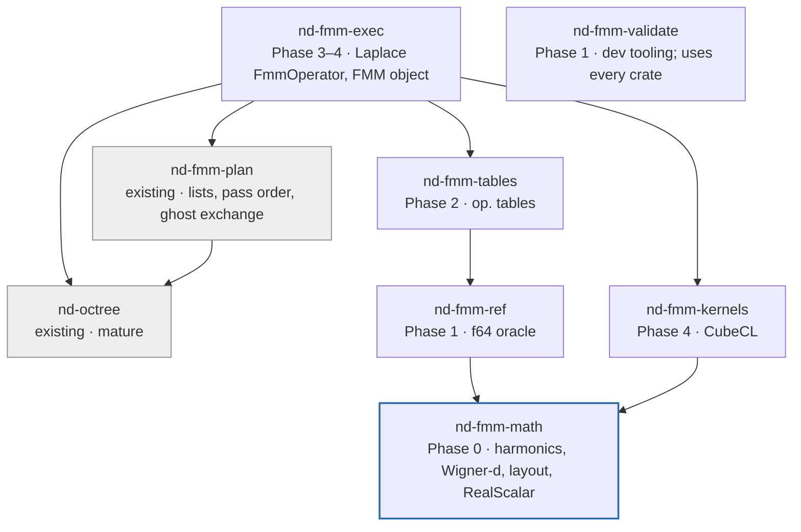

# FMM workspace structure: crates, boundaries and conventions

As of 2026-09-29; revised the same day after reading the `octree` and `fmm-plan` sources.

Add six new crates to the existing workspace, created phase by phase rather than all at
once. The existing `nd-fmm-plan` crate is the integration layer. It already owns the
interaction lists, the pass order and the ghost exchange on top of `nd-octree`. The new
Laplace crates plug into it through its `FmmOperator` trait, so the planned octree adapter
(`nd-fmm-tree`) and most of the planned distribution crate (`nd-fmm-dist`) are no longer
needed. Only `fmm-math` (plus fixture tooling) is needed for Phase 0.

This document refines Section 5 of the design document
(`docs/design/laplace-fmm-plan.md`) into concrete crates for
[tbetcke/fmm](https://github.com/tbetcke/fmm).

## 1. Starting point

The repository is a Cargo workspace with two crates, both carrying their own
`CLAUDE.md`, and GitHub Actions CI at the root.

| Item | What it is | State |
| --- | --- | --- |
| `Cargo.toml` (root) | virtual workspace manifest: `members = ["fmm-plan", "octree"]`, `resolver = "2"`; no `[workspace.package]`, no `[workspace.dependencies]`, no `default-members` | in place, minimal |
| `Cargo.lock` (root) | committed | in place |
| `octree/` (package `nd-octree`, lib `nd_octree`, 0.1.1-dev) | distributed, adaptive, 2:1-balanced Morton octree; topology only | fairly mature |
| `fmm-plan/` (package `nd-fmm-plan`, lib `nd_fmm_plan`, 0.1.0-dev) | FMM topology and data flow: interaction lists, ghost exchange, distributed pass order | early; API unstable, partly unimplemented; renamed from `fmm-plan` on 2026-09-29 |
| `CLAUDE.md` per crate | agent instructions; both require `cargo fmt --all` after Rust edits | in place; partly stale since the merge into one workspace (Section 6) |
| root `CLAUDE.md` | workspace-wide rules | added with these documents |
| `.github/workflows/` | CI, see below | in place |
| `LICENSE-MIT`, `LICENSE-APACHE` | dual licence | in place |

Both existing crates declare their package fields and dependencies directly and point
`repository` at their former standalone repositories (`nd-project/octree` and
`nd-project/nd-plan`). `nd-fmm-plan` writes its licence as `"MIT / Apache-2.0"` (the
deprecated form) and has a `codeberg.com.com` typo in `homepage`.

**CI as it runs today** (`run-tests.yml`, on pull requests to `main`, from the root):

- Installs `libclang-dev cmake libfftw3-dev libopenblas-dev openmpi-bin libopenmpi-dev`.
- Runs `cargo fmt -- --check`, `cargo clippy -- -D warnings`,
  `cargo clippy --examples -- -D warnings`, `RUST_MIN_STACK=8388608 cargo test` and
  `cargo doc --no-deps`.
- Consequences: clippy does not cover test targets (no `--all-targets`); docs are not
  built with `-D warnings`; nothing runs on more than one MPI rank.
- Weekly jobs: `run-examples` runs `cargo templated-examples NPROCESSES 3` (only
  `nd-octree` registers templated examples); `run-dependency-checks` runs `cargo upgrades`.

Two conventions follow from what is there and are adopted below: directory names without
prefix, package names with the `nd-` prefix (directory `octree`, package `nd-octree`;
directory `fmm-plan`, package `nd-fmm-plan`), and a `CLAUDE.md` in every crate.

### 1.1 What the existing crates provide

Checked against the sources. Line references are to the state on 2026-09-29.

**`nd-octree`** is a topology library. It stores keys, ownership and neighbour relations.
It stores no points and no application data.

- **Keys.** `MortonKey = u64`.
  - Bits 0–14 hold the level; the next 48 bits hold the interleaved position; bit 63 marks
    an invalid key. Root is the valid key `0`.
  - Levels 0–16 (`DEEPEST_LEVEL = 16`).
  - Child index is `4x + 2y + z` (`morton::child_index`).
  - Sorting raw keys gives Morton order, with ancestors before descendants.
  - There is no integer box index of any kind. Keys live in `Vec<MortonKey>` and
    `HashMap<MortonKey, _>`.
- **Tree.** Adaptive, complete, linear and 2:1 balanced across all 26 directions.
  - Refinement stops at `max_level` or at `max_fine_keys` keys per box, so a leaf at
    `max_level` can hold more.
  - `Octree::leaf_keys()` gives the owned leaves in Morton order.
  - `Octree::all_keys()` is a `HashMap<MortonKey, KeyType>` over leaves, interiors,
    replicated `Global` coarse keys and ghosts.
  - `KeyType` is `LocalLeaf`, `LocalInterior`, `Global`, `GhostLeaf(rank)` or
    `GhostInterior(rank)`.
  - Nodes are not grouped by level.
- **Relatives.** In `nd_octree::morton`: `parent`, `children`, `siblings`, same-level
  `neighbours` (26), `key_in_direction`, `ancestor_at_level`, `is_ancestor`.
  `Octree::neighbour_map()` gives neighbours of non-ghost keys. **No U, V, W or X lists.**
- **Geometry.**
  - `PhysicalBox` is `[xmin, ymin, zmin, xmax, ymax, zmax]`. It derives no `Clone` or
    `Copy`; use `coordinates()`.
  - `morton::physical_box(key, &domain)` gives a key's box.
  - There is no centre or half-width helper.
  - `compute_global_bounding_box` (collective) pads the domain to a cube, so every box on
    a level is a cube of the same size.
  - Points are rlst `[3, n]` arrays of `f64`, one point per column.
  - `points_to_morton` bins points into level-16 keys, but the octree never stores,
    sorts or permutes points.
- **Distribution.** Uses rsmpi (`mpi` 0.8.2) and rlst 0.8 distributed tools directly.
  - `Octree<'o, C: CommunicatorCollectives>` borrows its communicator. MPI is required,
    also on one rank.
  - Construction is collective. It computes the coarse tree, replicates it on every
    rank, and partitions it into contiguous Morton blocks.
  - The ghost layer exchanges **keys only**: a one-cell, same-level halo.
  - `OctreeOptions::with_ghost_children(true)` also replicates the children of bordering
    interior boxes, which the V- and W-lists need.

**`nd-fmm-plan`** plans the topology and data flow of an FMM on a concrete
`nd_octree::Octree`. Kernel arithmetic is deliberately kept out of it.

- **`InteractionManager::new(&octree)`** computes the U, V, W and X lists locally, with no
  collectives.
  - The lists are `HashMap<MortonKey, Vec<MortonKey>>`, one entry for every non-ghost key.
    Entries are sorted, deduplicated and routinely ghosts.
  - The tree must be built with `with_ghost_children(true)`.
  - `V_LIST_DIRECTIONS: [[i64; 3]; 316]` lists the M2L offsets.
  - `v_list_by_direction(level)` groups the (target, source) pairs of a level by offset
    `index(target) − index(source)`.
- **`FmmOperator`** trait: associated `type Value: Equivalence + Copy + Default`.
  - Sizes: `multipole_size(level)`, `local_size(level)`, `source_size()`, `target_size()`.
  - All eight operators (`p2m`, `m2m`, `m2l`, `p2l`, `l2l`, `l2p`, `m2p`, `p2p`) act on
    **one pair of boxes**, given only by their Morton keys.
  - Each operator accumulates into flat slices.
  - Geometry is the implementation's job, derived from the key.
- **`FmmEvaluator`** implements the whole distributed pass order in `evaluate()`:
  1. Source exchange for U and X ghosts.
  2. Local P2M and M2M.
  3. Global upward pass: coarse-tree multipoles are gathered to all ranks, and `Global`
     keys are recomputed on every rank.
  4. Multipole exchange for V and W ghosts.
  5. Downward pass: L2L, then M2L over V, then P2L over X.
  6. Leaves: L2P, then M2P over W, then P2P over U and self.
- **`LevelData<T>`** stores one flat buffer per level with `chunk_size(level)` values per
  key; key k occupies `data[l][pos·size .. (pos+1)·size]`.
  - A level's multipoles are therefore already a column-major
    `multipole_size × nboxes` matrix.
  - Column positions follow insertion order (partly `HashMap` order), not Morton order.
- **`FmmGhostCommunicator<T>`** holds one rlst `GhostCommunicator` per level
  (neighbourhood collectives) over host buffers with a fixed chunk size per level.
- **Limits stated in the crate (`src/fmm.rs`, "Future extensions"):**
  - source and target data have a fixed size per leaf;
  - operators are applied one pair at a time;
  - there is no batching per level or per V-list direction;
  - there is no overlap of exchange and computation;
  - there is no device-resident data.
- **`IndexFmm`** is a test operator. It propagates leaf indices (`Value = u32`) and so
  checks the whole distributed compute graph exactly.

## 2. Workspace layout

The new crates form a strict layering with `nd-fmm-math` at the bottom. `nd-fmm-exec` is
the only new crate that sees `nd-fmm-plan`, the octree and MPI; CubeCL is reached only
through `nd-fmm-kernels`. Arrows mean "depends on"; shaded boxes are existing crates.



`nd-fmm-math`, `nd-fmm-ref` and `nd-fmm-tables` stay free of MPI and of the octree, so
Phases 0 to 2 build and test without an MPI runtime. `nd-fmm-exec` inherits the MPI
requirement from `nd-fmm-plan` and `nd-octree`.

## 3. Crate specifications

Each crate has one job and a public surface small enough to describe in a few lines. Only
`fmm-kernels` depends on CubeCL, and only `fmm-exec` depends on `nd-fmm-plan`.

| Directory | Package | Created in | Purpose | Depends on |
| --- | --- | --- | --- | --- |
| `fmm-math` | `nd-fmm-math` | Phase 0 | Legendre functions, real solid harmonics and gradients, Wigner-d, index layout, scalar trait | `num-traits` |
| `fmm-ref` | `nd-fmm-ref` | Phase 1 | f64 reference operators (direct O(p⁴) and rotation O(p³)), P2P, direct-sum oracle | `nd-fmm-math`, `rayon` (optional) |
| `fmm-tables` | `nd-fmm-tables` | Phase 2 | M2M/L2L (8 octants each), M2L (316 offsets, symmetry classes), rotation tables, versioned cache, later SVD compression | `nd-fmm-ref`, `faer`, a binary serialiser |
| `fmm-exec` | `nd-fmm-exec` | Phase 3 (host), Phase 4 (device) | `impl FmmOperator` for Laplace, box geometry from Morton keys, user-facing FMM object, M2L strategy selection | `nd-fmm-plan`, `nd-octree`, `mpi`, `nd-fmm-tables`, `nd-fmm-kernels` (feature `gpu`), `rayon` |
| `fmm-kernels` | `nd-fmm-kernels` | Phase 4 | all `#[cube]` kernels; runtime-generic | `cubecl` (pinned), CubeCL matmul crate, `nd-fmm-math` (constants only) |
| `fmm-validate` | `nd-fmm-validate` (`publish = false`) | Phase 1 | error norms, point distributions, accuracy sweeps, benchmarks | all of the above, as dev tooling |

Dropped after scouting:

- **`fmm-tree`.** It was to implement a `TreeView` trait for the octree types. There is
  no such trait: `nd-fmm-plan` works on `nd_octree::Octree` directly.
- **`fmm-dist`.** Ghost exchange of sources and multipoles already exists in
  `FmmEvaluator`. What remains of Phase 5 is multi-rank validation of the Laplace
  operator, plus overlap of communication and computation. The overlap belongs in
  `nd-fmm-plan`.

Outside the crates, Phase 0 also adds these folders:

- `docs/CONVENTIONS.md`;
- `tools/fixtures/`, the fixture generator (see `docs/phase0/`);
- `spikes/cubecl-gemm/`, excluded from the default workspace members so CI does not build
  CubeCL.

### 3.1 Public surface per crate

**`nd-fmm-math`**

- `trait RealScalar` is implemented for `f32` and `f64`. It is the only float bound used
  across the new crates. It must not require `mpi::Equivalence`, so that the math crate
  stays MPI-free; `nd-fmm-exec` adds that bound where it meets `FmmOperator::Value`.
- `struct Layout { p }` provides `len()`, `idx(n, m)`, `nm(i)` and iteration by degree.
- These functions write into caller-provided slices and do not allocate:
  - `legendre::table(p, cos_theta, out)`
  - `harmonics::regular(p, x, out)`
  - `harmonics::irregular(p, x, out)`
  - `harmonics::regular_grad(p, x, out)`
- `wigner::d_blocks(p, beta, out)` gives the per-degree real rotation blocks. Phase 0
  task T5 names this `rotation::blocks`.
- `CONVENTION_VERSION: u32` is bumped whenever a convention in `CONVENTIONS.md` changes.

**`nd-fmm-ref`**

- Free functions `p2m`, `m2m`, `m2l`, `l2l`, `l2p`, `p2l` and `m2p` over plain slices.
  They live in `direct` and `rotation` modules with identical signatures.
- `p2p(sources, charges, targets, out)` and `direct_sum(...)`, both with optional
  gradients.

**`nd-fmm-tables`**

- `M2mTables` and `L2lTables` hold 8 matrices each, indexed by `morton::child_index`
  (4x + 2y + z).
- `M2lTables` holds 316 offsets, keyed by the same `[i64; 3]` offsets and sign as
  `nd_fmm_plan::interaction_manager::V_LIST_DIRECTIONS` (target − source), with optional
  symmetry maps.
- `RotationTables`.
- `TableCache::load_or_build(p, precision)`, keyed by p, precision and
  `CONVENTION_VERSION`.

**`nd-fmm-exec`**

- `LaplaceOperator<T>: FmmOperator<Value = T>` holds the tables and the domain.
  - It derives each box's centre and half-width from `morton::decode` and the cubic
    domain: r_l = side / 2^(l+1).
  - It rejects a non-cubic domain.
- `FmmBuilder` (p, precision, strategy, backend) wraps `InteractionManager` and
  `FmmEvaluator`. `Fmm::evaluate(charges) -> Output` returns potentials and optional
  gradients, and applies 1/(4π) once (CONVENTIONS §3.1).
- `enum M2lStrategy { Dense, Compressed, Rotation, Auto }`, and a host backend (rayon)
  that runs Phase 3 without any GPU.

**`nd-fmm-kernels`**

- One module per operator. Kernels are generic over `R: Runtime` and the float type, with
  p as a comptime parameter.
- Backend features `cuda`, `hip`, `wgpu` and `cpu`, forwarded by `nd-fmm-exec`.

**`nd-fmm-validate`** is specified when its phase starts; only its boundary is fixed now.

## 4. How `nd-fmm-plan` and the octree connect

`nd-fmm-plan` decides *what* to compute and *when*: interaction lists, pass order, ghost
exchange and the global coarse levels. The new crates decide *how*, for the Laplace
kernel. The seam is `FmmOperator`, which already exists; no new tree trait is needed.

| Concern | Owner | Status |
| --- | --- | --- |
| Tree construction, partitioning, ghost keys | `nd-octree` | exists |
| U, V, W, X lists; V-list grouping by offset | `nd-fmm-plan` (`InteractionManager`) | exists |
| Pass order, level loop, which lists feed which operator | `nd-fmm-plan` (`FmmEvaluator`) | exists |
| Ghost exchange of sources and multipoles, global coarse levels | `nd-fmm-plan` (`FmmEvaluator`, `FmmGhostCommunicator`) | exists; host buffers only |
| Variable-size source and target data per leaf | `nd-fmm-plan` | **missing; blocks Phase 3** |
| Batched operator hooks (per level, per octant, per V-list offset) | `nd-fmm-plan` (interface) | **missing; blocks Phase 4 GEMM path** |
| Overlap of exchange with local work; device-resident buffers | `nd-fmm-plan` | missing; Phase 4–5 |
| Box geometry from keys, M2L strategies, device buffers, 1/(4π) | `nd-fmm-exec` | new |
| Operator math and kernels | `nd-fmm-math` … `nd-fmm-kernels` | new |

Why the two gaps matter:

- **Fixed size per leaf.** `source_size()` is one number for every leaf, but particle
  counts per leaf vary. Padding every leaf to the largest one is possible, but leaves at
  `max_level` have no occupancy bound. So a real FMM needs per-leaf offsets, which means
  CSR-style `LevelData` for sources and targets.
- **One pair at a time.** The per-pair interface with `HashMap` lookups is right for
  correctness and fine for a CPU reference path. It rules out batched GEMM:
  - M2L needs one call per (level, offset), with gathered column indices from
    `v_list_by_direction`.
  - M2M and L2L need one call per (level, octant).

Both extensions are general, not Laplace-specific, and are listed as future work in
`nd-fmm-plan` itself. So they are `nd-fmm-plan` tasks, done on that crate's terms, with
`IndexFmm` extended to cover them.

Phases 0 to 2 depend on none of this, because they never touch a tree.

## 5. Cross-cutting conventions

Every new crate follows the same template, so Claude Code can create one from a single
instruction and every crate looks the same to a reviewer. The existing crates keep their
own manifests and rules; they are not migrated to the template as a side effect of
another task.

### 5.1 Rules

| Topic | Rule |
| --- | --- |
| Naming | directory `fmm-<name>`, package `nd-fmm-<name>`, library name `nd_fmm_<name>` |
| Edition and versions | Rust 2024; edition, licence and repository inherited from a new `[workspace.package]` (none exists yet) |
| Dependencies | declared once in `[workspace.dependencies]`, used with `.workspace = true`; `cubecl` pinned to an exact version there; `mpi` and `rlst` at the versions the existing crates use (0.8.2, 0.8.0) when a new crate needs them |
| Precision | all numeric code generic over `T: RealScalar` (from `nd-fmm-math`); no `f64` hard-coding outside tests and table building. Does not apply to `nd-fmm-plan`, whose `FmmOperator::Value` is deliberately generic (its `IndexFmm` uses `u32`) |
| Allocation | kernels and hot loops write into caller-provided slices; allocation only in constructors and plan building |
| Errors | `thiserror` enums in public APIs; panics only for violated internal invariants (`debug_assert!`) |
| Unsafe | none outside `nd-fmm-kernels`; each unsafe block carries a `// SAFETY:` comment |
| Docs | every public item documented; operator functions cite the equation they implement in `docs/CONVENTIONS.md` |
| Tests | unit tests in-crate; property tests with `proptest`; fixtures under `<crate>/fixtures/`, small and committed |
| MPI tests | only in crates that depend on MPI (`nd-fmm-exec` and later): one MPI-initialising test per test executable, as in `nd-octree` and `nd-fmm-plan`; run tests with `RUST_MIN_STACK=8388608`; multi-rank runs by hand (on macOS with `--mca btl_tcp_if_include lo0 --mca oob_tcp_if_include lo0`) |
| Formatting and lints | `cargo fmt` after every edit; `cargo clippy --workspace --all-targets -- -D warnings` locally (stricter than CI, which omits `--all-targets`) |
| CI | the root GitHub Actions workflow runs fmt, clippy, tests and docs for default members on CPU and one rank; GPU tests are run locally and never block CI |

### 5.2 Root `Cargo.toml` additions

The current root manifest has only `members` and `resolver = "2"`. Phase 0 adds:

```toml
[workspace]
resolver = "2"   # keep; moving to "3" (MSRV-aware resolution) is a separate decision
members = ["octree", "fmm-plan", "fmm-math", "spikes/cubecl-gemm"]
# New: without default-members every member is built; the spike must be excluded
# so CI never builds CubeCL.
default-members = ["octree", "fmm-plan", "fmm-math"]

# New. Only new crates inherit from it; octree/ and fmm-plan/ keep their own fields.
[workspace.package]
edition = "2024"
license = "MIT OR Apache-2.0"
repository = "https://github.com/tbetcke/fmm"

[workspace.dependencies]
num-traits = "0.2"
thiserror = "2"
proptest = "1"
approx = "0.5"
serde_json = "1"
# Added when their phases start:
# cubecl = { version = "=<pinned>", default-features = false }
# faer = "<version>"
# rayon = "1"
# mpi = { version = "0.8.2", features = ["derive"] }   # Phase 3, match existing crates
nd-fmm-math = { path = "fmm-math" }
```

### 5.3 Per-crate `CLAUDE.md` template

Workspace-wide rules (working agreement, formatting, CI and workspace checks, build
environment, MPI) live only in the root `CLAUDE.md`; a crate file holds only what is
specific to the crate, so shared rules cannot drift apart.

```markdown
# nd-fmm-<name>

Purpose: <one sentence from the structure document>.
Phase and components: <e.g. Phase 0, C0.2 and C0.3>.

## Rules
- Read docs/CONVENTIONS.md before changing any formula; never change a convention here.
- Generic over T: RealScalar; no allocation in hot paths.
- Before finishing: `cargo clippy -p nd-fmm-<name> --all-targets -- -D warnings`
  and `cargo test -p nd-fmm-<name>` must pass.

## Allowed dependencies
<list; anything else needs a note in the PR>

## Test oracle
<what this crate is checked against: fixtures, identities, nd-fmm-ref>
```

## 6. Order of creation and open questions

Create a crate only when its phase starts; an empty crate adds build time and review
noise without testing anything.

| Phase | Crates, folders and tasks in existing crates |
| --- | --- |
| 0 | `fmm-math`, `docs/CONVENTIONS.md`, `tools/fixtures/`, `spikes/cubecl-gemm/`, root `CLAUDE.md` |
| 1 | `fmm-ref`, `fmm-validate` |
| 2 | `fmm-tables` |
| 3 | before: variable-size leaf data in `nd-fmm-plan`; then `fmm-exec` (host backend, per-pair `FmmOperator`) |
| 4 | before: batched operator hooks in `nd-fmm-plan`; then `fmm-kernels` and the device backend in `fmm-exec` |
| 5 | multi-rank validation of `fmm-exec`; exchange/compute overlap in `nd-fmm-plan` (no new crate) |

### Answered by scouting

- [x] Does the octree expose U, V, W and X lists? No. It gives only same-level neighbours
      and parent/child helpers. `nd-fmm-plan`'s `InteractionManager` builds all four lists.
- [x] What box identifier is used? `MortonKey = u64` everywhere, with `HashMap` lookups
      and no integer box index. Per-level contiguous positions exist only inside
      `nd-fmm-plan`'s `LevelData`.
- [x] Does `nd-fmm-plan` own the pass order? Yes: `FmmEvaluator::evaluate`, generic over
      `FmmOperator`.
- [x] Does the distributed layer wrap MPI? Both crates use rsmpi and rlst directly.
      `nd-fmm-plan` already exchanges sources and multipoles, so no `nd-fmm-dist` is
      needed.

### Still open

- [ ] Who designs variable-size leaf data and batched operator hooks in `nd-fmm-plan`, and
      does the per-pair `FmmOperator` stay as the reference path next to them?
- [ ] Column order within a level's `LevelData` follows insertion (partly `HashMap`)
      order. Should it be Morton order, for reproducible floating-point sums and
      cache-friendly gathers?
- [ ] Box geometry conventions are used by the tables but are not in
      `docs/CONVENTIONS.md`. Propose adding them as a new section before Phase 2,
      together with a `CONVENTION_VERSION` decision:
  - child octant index 4x + 2y + z;
  - M2L offset sign (target − source, in units of the box width);
  - the shift vector c_target − c_source = 2 r_l · offset.
- [x] Stale crate `CLAUDE.md` files from the pre-workspace era were updated on
      2026-09-29. They now describe workspace membership, the root CI commands, the
      committed root `Cargo.lock`, and rlst as a crates.io dependency.
- [x] Root `CLAUDE.md` asks for `cargo test --workspace`. With MPI crates in the
      workspace, that needs a working MPI runtime and `RUST_MIN_STACK=8388608`, as in CI.
      Stated in root `CLAUDE.md` since Phase 0 T1.
- [ ] Check that the `nd-fmm-*` names are free on crates.io if you plan to publish.
- [x] Hosting: Codeberg's members voted in July 2026 for Terms of Use changes that
      discourage projects "written and maintained with heavy use of LLMs"
      ([Codeberg blog](https://blog.codeberg.org/protecting-our-floss-commons-from-llms.html)).
      The repository moved to [tbetcke/fmm](https://github.com/tbetcke/fmm) on
      2026-09-29, and CI now runs on GitHub Actions.
